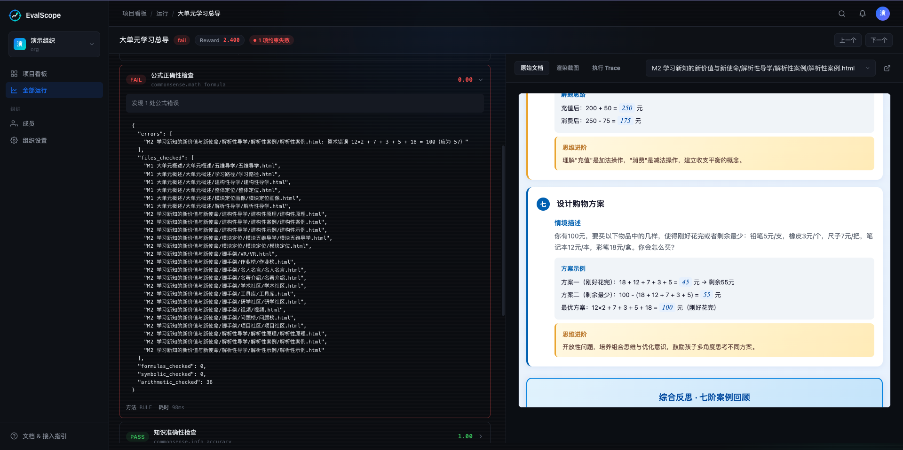
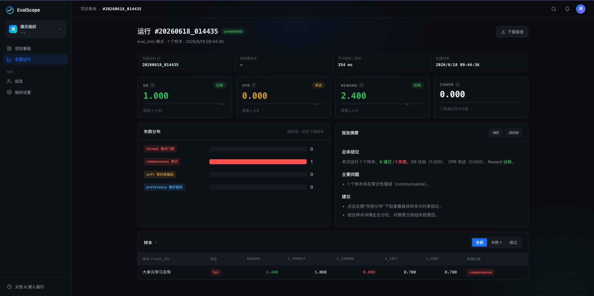

# agent-eval

[](https://github.com/domonic18/ai-eval-scope/actions/workflows/ci.yml)
[](./LICENSE)
[](https://www.python.org/)
[](https://docs.astral.sh/ruff/)

Agent 能力评估系统 — 基于 Agent-Driven 架构的评测框架。

以课件生成为切入点，支持代码生成、RAG、对话等多类 Agent 评估。

## 安装

```bash
git clone https://github.com/domonic18/ai-eval-scope.git && cd agent-eval-system
uv sync                      # 基础安装
uv sync --extra dev          # 开发依赖
uv sync --extra llm          # LLM 依赖（可选）
```

环境要求：Python 3.11+、[uv](https://docs.astral.sh/uv/)

> 评估器代码在 `evaluator/` 子目录（自包含，对称 `web/` 可观测平台）。
> 所有 `uv run` / `agent-eval` 命令需从 `evaluator/` 执行，或用 `make` 目标自动切换。

## 使用

### 示例：评估课件产出物

以项目自带的 `samples/大单元学习总导/`（HTML 课件目录）为例：

```bash
cd evaluator

# ① 打包（自动遍历目录，task-id 取目录名"大单元学习总导"）
uv run agent-eval pack \
  --source-dir ../samples/大单元学习总导/

# ② 评估
uv run agent-eval eval \
  --package-dir ../workspace/packages/大单元学习总导/ \
  --rule-set agent_eval/assets/rules/default_rule_set.yaml

# ③ 查看报告
cat ../workspace/runs/*/reports/summary.md
```

不配置 LLM 时，Rule-based 评估器（格式门控 + 常识阶段的规则/事实/公式检查）正常运行；LLM Judge 评估器（质量阶段）自动降级为 `score=0.7`，逻辑一致性评估器降级为规则匹配；多模态视觉评估（`vision.quality`）需配置视觉模型，未配置时跳过。

### pack 命令

```bash
cd evaluator

# 指定目录（task-id 自动取目录名）
uv run agent-eval pack --source-dir /path/to/output/

# 指定文件
uv run agent-eval pack --files doc1.md --files doc2.html

# 自定义任务信息
uv run agent-eval pack --source-dir /path/to/output/ \
  --task-id math_001 --task-title "方程" --task-subject math

# 打包并验证
uv run agent-eval pack --source-dir /path/to/output/ --validate
```

### eval 命令

```bash
cd evaluator

# 最简模式（无 LLM；llm_config 自动从 agent_eval/assets/configs/ 发现）
uv run agent-eval eval \
  --package-dir ../workspace/packages/math_001 \
  --rule-set agent_eval/assets/rules/default_rule_set.yaml

# 含 LLM Judge（--llm-config 省略时自动查找 CWD 或包内配置）
uv run agent-eval eval \
  --package-dir ../workspace/packages/math_001 \
  --rule-set agent_eval/assets/rules/default_rule_set.yaml \
  --llm-provider deepseek_judge
```

### LLM 配置（可选）

```bash
cd evaluator
cp agent_eval/assets/configs/llm_config.example.yaml agent_eval/assets/configs/llm_config.yaml
# 编辑填入 API Key（支持 ${DEEPSEEK_API_KEY} 语法，值从 .env 读取）
# CLI 自动发现此文件，无需 --llm-config
```

### 其他命令

| 命令 | 说明 |
|------|------|
| `agent-eval run` | 执行被测 Agent（ExecutionAgent 驱动），生成 ExecutionPackage |
| `agent-eval pipeline` | 完整流水线：执行被测 Agent → 评估 → 生成报告 |
| `agent-eval upload` | 把历史运行的评估结果回填到可观测平台（API Key 摄取） |
| `agent-eval dataset {download,list}` | 评测数据集下载与索引（详见 [10 数据集下载设计](./docs/arch/10数据集下载设计.md)） |
| `agent-eval knowledge {convert,extract,merge,audit,list}` | 知识库构建管道（详见 [11 知识点完善管道系统设计](./docs/arch/11知识点完善管道系统设计.md)） |
| `agent-eval version` | 显示版本信息 |

均需在 `evaluator/` 下执行：`cd evaluator && uv run agent-eval <command> --help`。

### 输出

评估完成后查看 `workspace/` 目录（默认在 `WORKSPACE_DIR`，缺省 `./workspace`）：

- `runs/{id}/results/{task}/report.md` — 任务报告（人类可读）
- `runs/{id}/reports/summary.md` — 聚合报告（DR/CPR/Reward）
- `cache/evaluation_cache.json` — 跨运行缓存

## 可观测平台

项目内置仿 Langfuse 的多租户可观测平台（`web/`），可视化追踪评估运行、管理项目与 API Key、下钻指标与样本。本地一键启动：

```bash
cp .env.example .env          # 填入 DB / 对象存储 / 安全密钥
make docker-up                # 启动 postgres + minio + web
```

平台界面预览：






## 开发

```bash
make test        # 运行测试（= cd evaluator && uv run pytest）
make test-cov    # 覆盖率报告
make lint        # 代码检查
make format      # 格式化
```

或直接用 uv（从 evaluator/）：

```bash
uv run pytest tests/ -v
uv run pytest tests/ -v --cov=agent_eval --cov-report=term-missing
uv run ruff format agent_eval/ tests/ && uv run ruff check --fix agent_eval/ tests/
```

## 贡献

欢迎提交 Issue 和 Pull Request！开发流程、提交规范、PR 流程见 [CONTRIBUTING.md](./CONTRIBUTING.md)。

## 致谢

本项目在评测数据集下载、数据集索引等设计上参考了 [OpenCompass](https://github.com/open-compass/opencompass)，部分数据集的 HuggingFace / ModelScope 来源元数据（`evaluator/agent_eval/assets/datasets/dataset_index.yaml`）移植自 OpenCompass。感谢 OpenCompass 团队优秀的开源工作。

## License

[MIT](./LICENSE)
