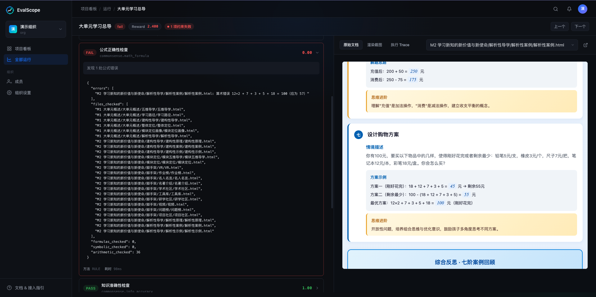
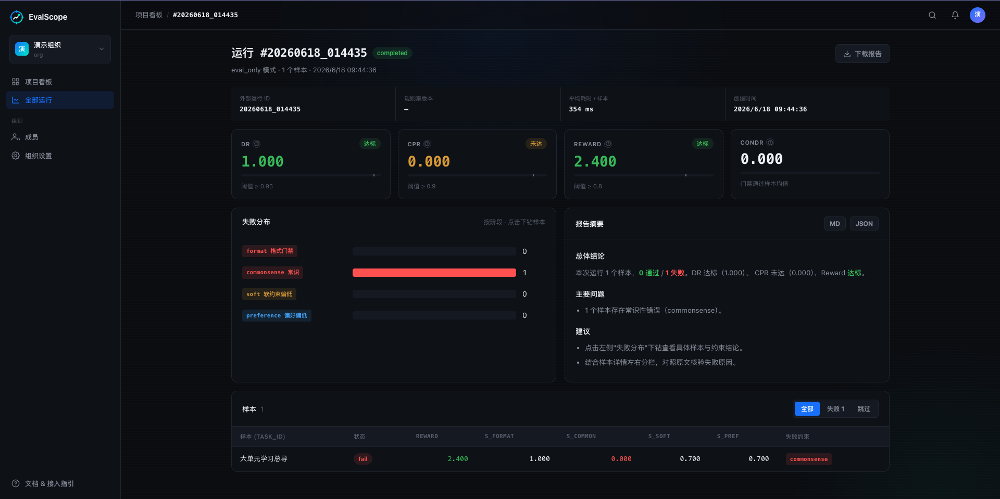

# agent-eval

[](https://github.com/domonic18/ai-eval-scope/actions/workflows/ci.yml)
[](./LICENSE)
[](https://www.python.org/)
[](https://docs.astral.sh/ruff/)

Agent 能力评估系统 — 基于 Agent-Driven 架构的评测框架。

以课件生成为切入点，支持代码生成、RAG、对话等多类 Agent 评估。

## 核心特性

- **数据驱动场景抽象**：聚合策略、指标定义、评估器集合全来自场景包配置（YAML），不写死任何场景
- **场景可插拔**：新增场景只需写包（manifest + policy + rules + prompts + 可选专属评估器），无需改代码（见 [场景扩展指南](./docs/arch/14场景扩展指南.md)）
- **多模态评估**：格式门控 + LLM Judge + 视觉截图评估（Playwright headless Chromium）
- **可观测平台**：仿 Langfuse 的多租户平台，可视化运行/趋势/指标/样本详情 + Webhook 回调
- **第三方对接**：HTTP API + MCP 工具 + Webhook 推送，无需安装 Python SDK

## 架构概览

```
┌──────────────────────────────────────────────────────────────────────┐
│                        agent-eval-system                            │
├─────────────────┬──────────────────────┬───────────────────────────┤
│   evaluator/    │       web/           │       executor/            │
│  (Python CLI)   │  (TS 可观测平台)     │  (Python SCF/Worker)       │
│                 │                      │                           │
│ • 场景包 + CLI  │ • React 前端         │ • 从 DB 认领 job           │
│ • 评估引擎      │ • Express 后端       │ • 拉取场景包               │
│ • LLM Judge     │ • PostgreSQL         │ • 执行评估                 │
│ • 视觉评估      │ • MinIO / COS        │ • 结果回流 + Webhook       │
│ • observability │ • API Key 鉴权       │                           │
│ • package CLI   │ • 多租户隔离         │                           │
└─────────────────┴──────────────────────┴───────────────────────────┘
         │                │                        │
         └────────────────┴────────────────────────┘
                          │
                    共享 PostgreSQL（eval_jobs + runs + samples + scenarios）
```

## 已内置场景

| 场景 | 描述 | 指标 |
|------|------|------|
| **courseware** | 课件质量评估（HTML/MD） | document_rate / constraint_pass_rate / soft / pref / reward |
| **code** | 代码生成质量评估（.py） | delivery_rate / correctness / style / reward |

新增自己的场景（RAG / 对话 / 自定义）见 [场景扩展指南](./docs/arch/14场景扩展指南.md)。

## 安装

```bash
git clone https://github.com/domonic18/ai-eval-scope.git && cd agent-eval-system/evaluator
uv sync                      # 基础安装
uv sync --extra dev          # 开发依赖
uv sync --extra llm          # LLM 依赖（可选）
```

环境要求：Python 3.11+、[uv](https://docs.astral.sh/uv/)

> 评估器代码在 `evaluator/` 子目录（自包含，对称 `web/` 可观测平台）。
> 所有 `uv run` / `agent-eval` 命令需从 `evaluator/` 执行，或用 `make` 目标自动切换。

## 使用

### 示例：评估课件产出物

以项目自带的 `samples/大单元学习总导/`（HTML 课件目录）为例：

```bash
cd evaluator

# ① 打包（自动遍历目录，task-id 取目录名"大单元学习总导"）
uv run agent-eval pack \
  --source-dir ../samples/大单元学习总导/ \
  --output-dir workspace/packages

# ② 评估
uv run agent-eval eval \
  --package-dir workspace/packages/大单元学习总导/ \
  --rule-set agent_eval/assets/rules/coursework-quality.yaml

# ③ 查看报告
cat workspace/runs/*/reports/summary.md
```

不配置 LLM 时，Rule-based 评估器（格式门控 + 常识阶段的规则/事实/公式检查）正常运行；LLM Judge 评估器（质量阶段）自动降级为 `score=0.7`，逻辑一致性评估器降级为规则匹配；多模态视觉评估（`vision.quality`）需配置视觉模型，未配置时跳过。

### pack 命令

```bash
cd evaluator

# 指定目录（task-id 自动取目录名）
uv run agent-eval pack --source-dir /path/to/output/

# 指定文件
uv run agent-eval pack --files doc1.md --files doc2.html

# 自定义任务信息
uv run agent-eval pack --source-dir /path/to/output/ \
  --task-id math_001 --task-title "方程" --task-subject math

# 打包并验证
uv run agent-eval pack --source-dir /path/to/output/ --validate
```

### eval 命令

```bash
cd evaluator

# 最简模式（无 LLM；未配置 LLM 时 LLM 评估器自动降级）
uv run agent-eval eval \
  --package-dir ../workspace/packages/math_001 \
  --rule-set agent_eval/assets/rules/default_rule_set.yaml

# 含 LLM Judge（配置好后无需任何额外参数）
uv run agent-eval eval \
  --package-dir ../workspace/packages/math_001 \
  --rule-set agent_eval/assets/rules/default_rule_set.yaml
```

### LLM 配置（可选，交互式向导）

```bash
uv run agent-eval models login   # 选提供商 → 输入 api-key → 选各角色模型
uv run agent-eval models test    # 连通性验证
uv run agent-eval models list    # 查看（key 脱敏）
```

保存于 `~/.agent_eval/llm.json`（0600 权限，不入 git）。云端 executor 则在平台
`/admin` 按角色配置，运行时经 API Key 拉取——两套形态互不感知。

### 其他命令

| 命令 | 说明 |
|------|------|
| `agent-eval run` | 执行被测 Agent（ExecutionAgent 驱动），生成 ExecutionPackage |
| `agent-eval pipeline` | 完整流水线：执行被测 Agent → 评估 → 生成报告 |
| `agent-eval upload` | 把历史运行的评估结果回填到可观测平台（API Key 摄取） |
| `agent-eval dataset {download,list}` | 评测数据集下载与索引（详见 [10 数据集下载设计](./docs/arch/10数据集下载设计.md)） |
| `agent-eval knowledge {convert,extract,merge,audit,list}` | 知识库构建管道（详见 [11 知识点完善管道系统设计](./docs/arch/11知识点完善管道系统设计.md)） |
| `agent-eval version` | 显示版本信息 |

均需在 `evaluator/` 下执行：`cd evaluator && uv run agent-eval <command> --help`。

### 输出

评估完成后查看 `workspace/` 目录（默认在 `WORKSPACE_DIR`，缺省 `./workspace`）：

- `runs/{id}/results/{task}/report.md` — 任务报告（人类可读）
- `runs/{id}/reports/summary.md` — 聚合报告（DR/CPR/Reward）
- `cache/evaluation_cache.json` — 跨运行缓存

### 新增评估场景

系统是**场景无关 + 数据驱动**的——聚合策略、指标定义、评估器集合全来自场景包配置，不写死任何场景。除内置的课件（courseware）外，已内置 **代码生成（code）** 场景作为可运行范例（含专属 `code.correctness`/`code.style` LLM Judge，经 `entry_points` 随包加载）。

新增自己的场景（RAG / 对话 / 自定义）见 [场景扩展指南](./docs/arch/14场景扩展指南.md)：写包（清单 + 指标策略 + 规则集 + 提示词），声明 `entry_points`（如需专属评估器），导入即可端到端评估。

## 可观测平台

项目内置仿 Langfuse 的多租户可观测平台（`web/`），可视化追踪评估运行、管理项目与 API Key、下钻指标与样本。

**特性**：场景化指标动态渲染 · Webhook 回调（HMAC 签名 + 投递历史 + 详情查看）· MCP 工具接入 · 跨运行趋势对比 · 多场景支持。

本地一键启动：

```bash
cp .env.example .env          # 填入 DB / 对象存储 / 安全密钥
make docker-up                # 启动 postgres + minio + web
```

平台界面预览：






## 开发

```bash
make test        # 运行测试（= cd evaluator && uv run pytest）
make test-cov    # 覆盖率报告
make lint        # 代码检查
make format      # 格式化
```

或直接用 uv（从 evaluator/）：

```bash
uv run pytest tests/ -v
uv run pytest tests/ -v --cov=agent_eval --cov-report=term-missing
uv run ruff format agent_eval/ tests/ && uv run ruff check --fix agent_eval/ tests/
```

## 贡献

欢迎提交 Issue 和 Pull Request！开发流程、提交规范、PR 流程见 [CONTRIBUTING.md](./CONTRIBUTING.md)。

## 致谢

本项目在评测数据集下载、数据集索引等设计上参考了 [OpenCompass](https://github.com/open-compass/opencompass)，部分数据集的 HuggingFace / ModelScope 来源元数据（`evaluator/agent_eval/assets/datasets/dataset_index.yaml`）移植自 OpenCompass。感谢 OpenCompass 团队优秀的开源工作。

## License

[MIT](./LICENSE)
