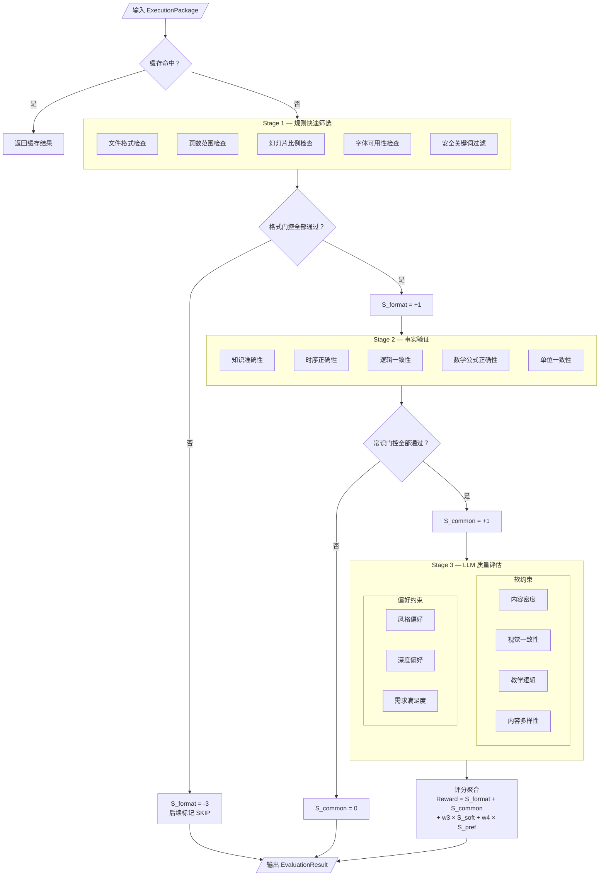
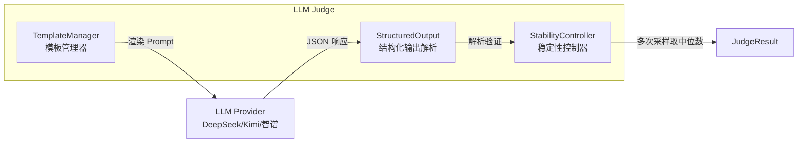
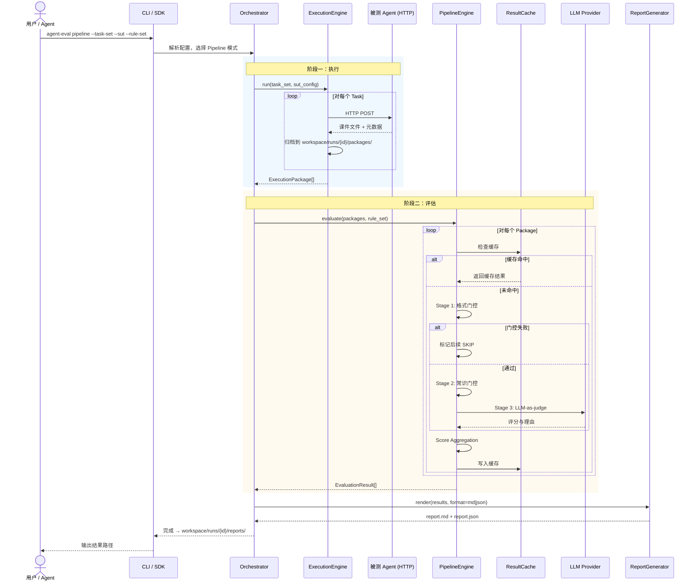

# Agent 能力评估系统架构设计

> 本文档基于 [02 Agent能力评估系统需求规格说明书.md](../requirement/02%20Agent能力评估系统需求规格说明书.md) 和 [01课件生成评估体系规划.md](../requirement/01课件生成评估体系规划.md)，对通用 Agent 评估系统进行完整架构设计，涵盖模块边界、核心抽象、数据模型、管线引擎、评估器体系、配置方案、目录结构与部署架构。

---

## 一、设计目标与约束

### 1.1 设计目标

| 目标 | 说明 |
|------|------|
| **执行-评估解耦** | 执行引擎与评估引擎独立运行、独立演进，通过标准化数据包交互 |
| **通用可扩展** | 以课件生成为切入点，架构上支持代码生成、RAG、对话等多类 Agent 评估 |
| **Agent 优先** | CLI / Python SDK 为首要接口，便于 Claude Code 等工具调用 |
| **规则即配置** | 评估规则以声明式 YAML 描述，支持 Agent 自动生成与人类校对 |
| **模型无关** | LLM-as-judge 通过 Provider 抽象层接入，支持 DeepSeek / Anthropic 协议 / OpenAI 协议 |
| **级联短路** | 低成本检查在前，失败即终止，避免不必要的 LLM 调用 |
| **离线优先** | 前期以批量离线评估为主，接口与数据流预留流式扩展空间 |

### 1.2 架构约束

- **技术栈**：Python 3.11+
- **部署形态**：前期为 CLI 工具 + 可选本地 REST API；中期 FastAPI 服务；远期 SaaS 化
- **SUT 接入**：以 HTTP API 为主（LangGraph / Hermes），保留 CLI/本地进程扩展点
- **数据存储**：前期以文件系统（YAML/JSON/workspace 目录）为主；远期引入数据库
- **认证授权**：本阶段不考虑，设计时避免过度侵入

---

## 二、总体架构

### 2.1 逻辑架构图

```
┌─────────────────────────────────────────────────────────────────────────────┐
│                              接入层 (Access Layer)                          │
│                                                                             │
│  ┌───────────────┐  ┌───────────────┐  ┌───────────────┐  ┌─────────────┐  │
│  │  CLI (P0)     │  │ Python SDK(P0)│  │ REST API (P1) │  │ Web UI (P2) │  │
│  │  agent-eval   │  │  agent_eval   │  │  FastAPI      │  │  React/Vue  │  │
│  └───────────────┘  └───────────────┘  └───────────────┘  └─────────────┘  │
└─────────────────────────────────────────────────────────────────────────────┘
                                       │
                                       ▼
┌─────────────────────────────────────────────────────────────────────────────┐
│                          编排调度层 (Orchestrator)                           │
│                                                                             │
│  · 解析 task_set / rule_set / sut_config                                    │
│  · 选择运行模式：run-only / eval-only / pipeline                            │
│  · 调度 ExecutionEngine → 生成 ExecutionPackage                             │
│  · 调度 EvaluationEngine → 生成 EvaluationResult                            │
│  · 调用 ReportGenerator 输出 Markdown / JSON / HTML 报告                    │
└─────────────────────────────────────────────────────────────────────────────┘
           │                                      │
           ▼                                      ▼
┌────────────────────────────┐      ┌────────────────────────────────────────┐
│      执行引擎               │      │              评估引擎                   │
│   ExecutionEngine          │      │         EvaluationEngine               │
│                            │      │                                        │
│  ┌──────────────────────┐  │      │  ┌────────────────────────────────────┐│
│  │ TaskSet Loader       │  │      │  │ RuleSet Loader & Validator         ││
│  │ 任务集加载与构建      │  │      │  │ 规则集加载、校验、渲染              ││
│  └──────────────────────┘  │      │  └────────────────────────────────────┘│
│  ┌──────────────────────┐  │      │  ┌────────────────────────────────────┐│
│  │ SUTDriver            │  │      │  │ Evaluator Registry                 ││
│  │ · HTTPDriver (默认)  │  │      │  │ 评估器注册中心                      ││
│  │ · CLIDriver (扩展)   │  │      │  │                                    ││
│  │ · PluginDriver       │  │      │  │  ┌────────────────────────────┐    ││
│  └──────────────────────┘  │      │  │  │ RuleEvaluator             │    ││
│  ┌──────────────────────┐  │      │  │  │ LLMJudgeEvaluator        │    ││
│  │ Result Collector     │  │      │  │  │ FactCheckEvaluator       │    ││
│  │ · 输出文件归档       │  │      │  │  │ VisionEvaluator(multimod) │    ││
│  │ · 执行日志记录       │  │      │  │  │ CustomEvaluator (plugin)  │    ││
│  │ · 过程指标统计       │  │      │  │  └────────────────────────────┘    ││
│  └──────────────────────┘  │      │  └────────────────────────────────────┘│
│                            │      │  ┌────────────────────────────────────┐│
│                            │      │  │ Cascade Controller (级联控制器)     ││
│                            │      │  │ · Stage 门控与短路                  ││
│                            │      │  │ · 缓存检查与写入                   ││
│                            │      │  └────────────────────────────────────┘│
│                            │      │  ┌────────────────────────────────────┐│
│                            │      │  │ Score Aggregator (评分聚合器)       ││
│                            │      │  │ · Reward 公式                      ││
│                            │      │  │ · DR / CPR / CondR 计算            ││
│                            │      │  └────────────────────────────────────┘│
└────────────────────────────┘      └────────────────────────────────────────┘
           │                                      │
           └──────────────┬───────────────────────┘
                          ▼
┌─────────────────────────────────────────────────────────────────────────────┐
│                          基础设施层 (Infrastructure)                         │
│                                                                             │
│  ┌──────────────┐  ┌──────────────┐  ┌──────────────┐  ┌────────────────┐  │
│  │ LLM Provider │  │ RuleManager  │  │ ReportGen    │  │ Storage        │  │
│  │ 多协议模型   │  │ 规则CRUD/    │  │ Markdown/    │  │ 文件系统/      │  │
│  │ 统一抽象     │  │ 生成/校验    │  │ JSON/HTML    │  │ 对象存储       │  │
│  └──────────────┘  └──────────────┘  └──────────────┘  └────────────────┘  │
│  ┌──────────────┐  ┌──────────────┐  ┌──────────────┐                       │
│  │ ConfigLoader │  │ Cache        │  │ Logger       │                       │
│  │ 配置加载     │  │ 结果缓存     │  │ 结构化日志   │                       │
│  └──────────────┘  └──────────────┘  └──────────────┘                       │
└─────────────────────────────────────────────────────────────────────────────┘
```

### 2.2 模块职责

| 模块 | 职责 | 关键抽象 |
|------|------|----------|
| **Orchestrator** | 命令解析、模式选择、引擎编排、报告生成 | `Pipeline`, `RunMode` |
| **ExecutionEngine** | 加载任务集、驱动 SUT、采集结果、统计过程指标 | `TaskSet`, `SUTDriver`, `ExecutionPackage` |
| **EvaluationEngine** | 加载规则集、级联控制、调度评估器、聚合评分 | `PipelineEngine`, `PipelineStage`, `EvaluatorRegistry` |
| **RuleManagement** | 规则 CRUD、模板管理、Agent 自动生成、版本管理 | `RuleSet`, `RuleGenerator`, `RuleSchema` |
| **LLMProvider** | 统一封装不同协议的大模型客户端 | `LLMClient`, `ProviderConfig`, `LLMClientFactory` |
| **ReportGenerator** | 生成 Markdown / JSON / HTML 报告 | `ReportRenderer`, `MetricsReport` |
| **Infra** | 配置加载、缓存、日志、存储 | `ConfigLoader`, `ResultCache`, `Storage` |

---

## 三、核心数据模型

### 3.1 枚举与状态

```python
class EvalStatus(str, Enum):
    """评估状态"""
    PASS = "pass"           # 通过
    FAIL = "fail"           # 未通过
    SKIP = "skip"           # 跳过（前置阶段失败导致）
    ERROR = "error"         # 执行异常

class ConstraintTier(str, Enum):
    """约束层级 — 决定失败惩罚和短路行为"""
    HARD_GATE = "hard_gate"       # 硬性门控，失败终止（格式约束）
    HARD_SCORE = "hard_score"     # 硬性评分，失败归零（常识约束）
    SOFT = "soft"                 # 软约束，归一化得分
    PREFERENCE = "preference"     # 偏好约束，归一化得分

class EvalMethod(str, Enum):
    """评估方法类型"""
    RULE = "rule"                 # 规则检查
    FACT_VERIFY = "fact_verify"   # 事实验证（知识库对比）
    MATH_VERIFY = "math_verify"   # 数学公式验证
    LLM_JUDGE = "llm_judge"       # LLM-as-judge
    LLM_CONSISTENCY = "llm_consistency"  # LLM 一致性检查
    VISION = "vision"             # 多模态视觉评估
```

### 3.2 评估结果模型

```python
@dataclass
class ConstraintResult:
    """单项约束检查结果"""
    constraint_id: str                        # 如 "format.slide_count"
    name: str                                 # 可读名称
    tier: ConstraintTier                      # 约束层级
    status: EvalStatus                        # 通过/失败/跳过/异常
    score: float = 0.0                        # 该项得分（归一化后）
    raw_score: float | None = None            # 原始得分（未归一化）
    reason: str = ""                          # 判定理由
    details: dict = field(default_factory=dict)
    duration_ms: float = 0.0

@dataclass
class StageResult:
    """一个阶段（Stage）的评估结果"""
    stage_id: str                             # "format" | "commonsense" | "quality"
    status: EvalStatus
    constraint_results: list[ConstraintResult] = field(default_factory=list)
    duration_ms: float = 0.0
    gate_passed: bool = True                  # 是否通过门控
    category_score: float = 0.0

@dataclass
class SampleResult:
    """单个样本的完整评估结果"""
    sample_id: str
    status: EvalStatus
    stage_results: dict[str, StageResult] = field(default_factory=dict)
    s_format: float = 0.0
    s_common: float = 0.0
    s_soft: float = 0.0
    s_pref: float = 0.0
    reward: float = 0.0
    total_duration_ms: float = 0.0
    llm_calls: int = 0
    token_usage: int = 0

@dataclass
class SampleScore:
    """单个样本的评分卡 — 对应 Reward 公式"""
    s_format: float      # 全通过=+1，任一失败=-3
    s_common: float      # 全通过=+1，任一失败=0
    s_soft: float        # 各子项归一化 [0,1] 后加权平均
    s_pref: float        # 各子项归一化 [0,1] 后加权平均

    @property
    def reward(self, w3: float = 1.0, w4: float = 1.0) -> float:
        return self.s_format + self.s_common + w3 * self.s_soft + w4 * self.s_pref

@dataclass
class MetricsReport:
    """评估指标报告 — 一批样本的汇总"""
    total_samples: int = 0
    dr: float = 0.0            # Delivery Rate
    cpr: float = 0.0           # Commonsense Pass Rate
    avg_reward: float = 0.0
    cond_r: float = 0.0        # Conditional Reward
    avg_time_ms: float = 0.0
    reward_distribution: list[float] = field(default_factory=list)
    failure_breakdown: dict[str, int] = field(default_factory=dict)
```

---

## 四、管线引擎设计

### 4.1 三阶段级联架构

```
输入 ExecutionPackage
       ↓
  ┌─────────────┐
  │ Stage 1      │  Rule-based 快速筛选（低成本）
  │ 格式/安全    │  文件有效性 · 页数 · 尺寸 · 安全关键词
  └──────┬──────┘
         │ 通过？
         ├── 否 → 记录失败，终止后续（S_format = -3）
         ↓ 是
  ┌─────────────┐
  │ Stage 2      │  事实验证（中成本）
  │ 常识约束     │  知识点对比 · 公式验证 · 时序检查 · 逻辑一致性
  └──────┬──────┘
         │ 通过？
         ├── 否 → 标记知识错误（S_common = 0）
         ↓ 是
  ┌─────────────┐
  │ Stage 3      │  LLM-as-judge 质量评估（高成本）
  │ 质量评估     │  教学适用性 · 视觉质量 · 偏好满足 · 多媒体质量
  └──────┬──────┘
         ↓
  ┌─────────────┐
  │ 评分聚合     │  Reward = S_format + S_common + w3×S_soft + w4×S_pref
  │              │  输出 DR / CPR / Reward / CondR / Time
  └─────────────┘
```



### 4.2 PipelineEngine 核心类

```python
class PipelineEngine:
    """
    评估管线引擎 — 编排整个评估流程的核心调度器。

    职责：
    1. 加载管线配置（从 YAML）
    2. 实例化各阶段评估器
    3. 按级联顺序执行评估
    4. 管理短路逻辑和结果缓存
    5. 调用评分聚合器生成最终结果
    """

    def __init__(self, config_path: str, registry: EvaluatorRegistry):
        self.config = ConfigLoader.load(config_path)
        self.registry = registry
        self.stages: list[PipelineStage] = []
        self.cache = ResultCache()
        self._build_stages()

    def _build_stages(self) -> None:
        """根据配置构建评估阶段"""
        for stage_conf in self.config.stages:
            evaluators = [
                self.registry.create(eval_conf.name, eval_conf.params)
                for eval_conf in stage_conf.evaluators
            ]
            self.stages.append(PipelineStage(
                stage_id=stage_conf.id,
                evaluators=evaluators,
                short_circuit_policy=stage_conf.short_circuit_policy,
            ))

    def evaluate_sample(self, sample, context: dict) -> SampleResult:
        """评估单个样本"""
        # 1. 检查缓存
        cache_key = self._compute_cache_key(sample, context)
        cached = self.cache.get(cache_key)
        if cached is not None:
            return cached

        result = SampleResult(sample_id=context["sample_id"])

        # 2. 逐阶段执行，短路终止
        for stage in self.stages:
            stage_result = stage.execute(sample, context)
            result.stage_results[stage.stage_id] = stage_result
            if not stage_result.gate_passed:
                self._mark_remaining_stages_skipped(result, stage.stage_id)
                break

        # 3. 评分聚合
        score = self.score_aggregator.aggregate(result)
        result.s_format = score.s_format
        result.s_common = score.s_common
        result.s_soft = score.s_soft
        result.s_pref = score.s_pref
        result.reward = score.reward

        # 4. 写入缓存
        self.cache.put(cache_key, result)
        return result

    def evaluate_batch(self, samples: list, contexts: list[dict]) -> MetricsReport:
        """批量评估 — 返回指标报告"""
        results = [self.evaluate_sample(s, c) for s, c in zip(samples, contexts)]
        return self.metrics_calculator.compute(results)
```

### 4.3 PipelineStage 阶段执行器

```python
class PipelineStage:
    """单个评估阶段的执行器，管理该阶段内所有 Evaluator 的执行。"""

    def __init__(self, stage_id: str, evaluators: list[BaseEvaluator],
                 short_circuit_policy: str = "fail_fast"):
        self.stage_id = stage_id
        self.evaluators = evaluators
        self.short_circuit_policy = short_circuit_policy  # "fail_fast" | "continue_all"

    def execute(self, sample, context: dict) -> StageResult:
        stage_result = StageResult(stage_id=self.stage_id, status=EvalStatus.PASS)
        gate_passed = True

        for evaluator in self.evaluators:
            constraint_result = evaluator.evaluate(sample, context)
            stage_result.constraint_results.append(constraint_result)

            if (evaluator.tier in (ConstraintTier.HARD_GATE, ConstraintTier.HARD_SCORE)
                    and constraint_result.status == EvalStatus.FAIL):
                gate_passed = False
                if self.short_circuit_policy == "fail_fast":
                    break

        stage_result.gate_passed = gate_passed
        stage_result.status = EvalStatus.PASS if gate_passed else EvalStatus.FAIL
        return stage_result
```

---

## 五、评估器体系

### 5.1 评估器注册中心

借鉴 OpenCompass 的 `@ICL_EVALUATORS.register_module()` 注册器模式：

```python
class EvaluatorRegistry:
    """评估器注册中心 — 管理所有可用评估器的注册与实例化。"""

    def __init__(self):
        self._registry: dict[str, type[BaseEvaluator]] = {}

    def register(self, evaluator_id: str):
        """装饰器：注册评估器类"""
        def decorator(cls: type[BaseEvaluator]):
            self._registry[evaluator_id] = cls
            return cls
        return decorator

    def create(self, evaluator_id: str, params: dict = None) -> BaseEvaluator:
        """工厂方法：根据 ID 创建评估器实例"""
        if evaluator_id not in self._registry:
            raise ValueError(f"未注册的评估器: {evaluator_id}")
        evaluator = self._registry[evaluator_id]()
        if params:
            evaluator.setup(params)
        return evaluator

# 全局注册中心实例
registry = EvaluatorRegistry()
```

使用示例：

```python
@registry.register("format.slide_count")
class SlideCountEvaluator(BaseEvaluator):
    evaluator_id = "format.slide_count"
    name = "页数范围检查"
    tier = ConstraintTier.HARD_GATE
    method = EvalMethod.RULE

    def evaluate(self, sample, context) -> ConstraintResult:
        constraints = context["constraints"]
        min_slides = constraints.get("min_slides", 5)
        max_slides = constraints.get("max_slides", 30)
        actual = sample.slide_count
        passed = min_slides <= actual <= max_slides
        return ConstraintResult(
            constraint_id=self.evaluator_id,
            name=self.name,
            tier=self.tier,
            status=EvalStatus.PASS if passed else EvalStatus.FAIL,
            score=1.0 if passed else 0.0,
            reason=f"实际{actual}页，要求[{min_slides},{max_slides}]",
        )
```

### 5.2 评估器基类

```python
class BaseEvaluator(ABC):
    """评估器抽象基类"""
    evaluator_id: str = ""
    name: str = ""
    tier: ConstraintTier = ConstraintTier.SOFT
    method: EvalMethod = EvalMethod.RULE

    @abstractmethod
    def evaluate(self, sample, context: dict) -> ConstraintResult:
        ...

    def setup(self, params: dict) -> None:
        self.params = params
```

### 5.3 评估器分类体系

#### 格式约束（4 项）— HARD_GATE

| evaluator_id | 名称 | 方法 | 检查逻辑 |
|---|---|---|---|
| `format.response_format` | 文件格式检查 | RULE | 解析文件头/扩展名 |
| `format.slide_count` | 页数范围检查 | RULE | 计数与约束范围对比 |
| `format.aspect_ratio` | 幻灯片比例检查 | RULE | 宽高比判定 |
| `format.font_availability` | 字体可用性检查 | RULE | 字体白名单对比 |

**评分**：全部通过 → S_format = +1，任一失败 → S_format = -3

#### 常识约束（5 项）— HARD_SCORE

| evaluator_id | 名称 | 方法 | 检查逻辑 |
|---|---|---|---|
| `commonsense.info_accuracy` | 知识准确性 | FACT_VERIFY | 与权威知识库逐条对比 |
| `commonsense.chronological_order` | 时序正确性 | RULE | 事件时序排列检查 |
| `commonsense.logical_consistency` | 逻辑一致性 | LLM_CONSISTENCY | LLM 检查前后自洽 |
| `commonsense.math_formula` | 数学公式正确性 | MATH_VERIFY | 符号化验证 |
| `commonsense.unit_consistency` | 单位一致性 | RULE | 物理量单位检查 |

**评分**：全部通过 → S_common = +1，任一失败 → S_common = 0

#### 软约束（4 项）— SOFT

| evaluator_id | 名称 | 方法 | 默认权重 |
|---|---|---|---|
| `soft.content_density` | 内容密度 | RULE | 0.25 |
| `soft.visual_consistency` | 视觉一致性 | RULE | 0.25 |
| `soft.teaching_logic` | 教学逻辑 | LLM_JUDGE | 0.25 |
| `soft.content_diversity` | 内容多样性 | LLM_JUDGE | 0.25 |

**评分**：每项归一化到 [0, 1]，加权平均得 S_soft

#### 偏好约束（3 项）— PREFERENCE

| evaluator_id | 名称 | 方法 | 默认权重 |
|---|---|---|---|
| `pref.style_preference` | 风格偏好 | LLM_JUDGE | 0.33 |
| `pref.depth_preference` | 深度偏好 | LLM_JUDGE | 0.33 |
| `pref.request_fulfillment` | 需求满足度 | LLM_JUDGE | 0.34 |

**评分**：每项归一化到 [0, 1]，加权平均得 S_pref

---

## 六、LLM Judge 模块

### 6.1 架构



### 6.2 Prompt 模板管理

```python
@dataclass
class JudgeTemplate:
    template_id: str
    name: str
    dimensions: list[JudgeDimension]
    system_prompt: str
    user_prompt_template: str         # 支持 {variable} 变量替换
    output_schema: dict               # JSON Schema 约束输出格式
    temperature: float = 0.0
    seed: int = 42
    num_samples: int = 3              # 采样次数（取中位数）
```

### 6.3 结构化输出与稳定性

- **结构化输出**：Prompt 中声明 JSON Schema → LLM 返回 JSON → Schema 验证 → 不符合则重试（最多 3 次）
- **稳定性控制**：温度 ≈ 0 + 固定 seed → N 次独立评估取中位数 → 标准差 > 阈值标记"低置信度"

### 6.4 LLM Provider 抽象层

```python
class LLMClient(ABC):
    @abstractmethod
    def chat(self, messages: list[Message], **kwargs) -> str: ...

class DeepSeekClient(LLMClient): ...           # DeepSeek 原生
class AnthropicCompatClient(LLMClient): ...    # Kimi / 智谱 / MiniMax (Anthropic 协议)
class OpenAICompatClient(LLMClient): ...       # OpenAI 协议兼容

class LLMClientFactory:
    @staticmethod
    def create(config: ProviderConfig) -> LLMClient: ...
```

配置示例：

```yaml
llm:
  default: deepseek_judge
  providers:
    deepseek_judge:
      provider: deepseek
      model: deepseek-chat
      api_key: ${DEEPSEEK_API_KEY}
      base_url: https://api.deepseek.com/v1
    kimi_vision:
      provider: anthropic
      model: kimi-2.6
      api_key: ${KIMI_API_KEY}
      base_url: https://api.moonshot.cn/v1
```

---

## 七、评分聚合与指标计算

### 7.1 Reward 公式

```
Reward = S_format + S_common + w3 × S_soft + w4 × S_pref
```

| 符号 | 含义 | 计算方式 |
|------|------|----------|
| S_format | 格式约束得分 | 通过=+1，失败=-3 |
| S_common | 常识约束得分 | 通过=+1，失败=0 |
| S_soft | 软约束得分 | 各子项归一化 [0,1] 后加权平均 |
| S_pref | 偏好约束得分 | 各子项归一化 [0,1] 后加权平均 |

### 7.2 核心指标

| 指标 | 含义 | 计算 |
|------|------|------|
| DR (Delivery Rate) | 格式约束全通过率 | 格式通过数 / 总数 |
| CPR (Commonsense Pass Rate) | 常识约束全通过率 | 常识通过数 / 总数 |
| Reward | 全样本平均 Reward | Σ reward / n |
| CondR (Conditional Reward) | 通过门控样本的 Reward 均值 | 通过门控的 reward 均值 |
| Time | 平均完成时间 | Σ duration / n |

---

## 八、数据包规范

### 8.1 执行包（ExecutionPackage）

```
workspace/
└── runs/{run_id}/packages/{task_id}/
    ├── manifest.json          # 数据包元信息
    ├── task.json              # 原始任务定义
    ├── output/                # SUT 输出物
    │   ├── courseware.pptx
    │   └── assets/
    ├── trace.json             # 调用轨迹
    ├── metrics.json           # 过程指标
    └── metadata.json          # SUT 与环境元信息
```

### 8.2 评估结果包（EvaluationResult）

```
workspace/
└── runs/{run_id}/results/{task_id}/
    ├── manifest.json          # 评估元信息
    ├── rule_results.json      # 每条规则的判定结果
    ├── scores.json            # 聚合得分
    ├── evidence/              # 证据目录
    ├── report.md              # 人类可读报告
    └── report.json            # Agent 消费报告
```

---

## 九、项目目录结构

### 9.1 总体分层

借鉴 OpenCompass、LangChain、pytest 等开源项目的目录实践，采用**源码包 / 配置资产 / 工作空间 / 测试**四层分离：

```
agent-eval-system/
│
├── pyproject.toml                       # 项目元数据与依赖
├── README.md
├── Makefile                             # 常用命令快捷入口
│
├── agent_eval/                          # ═══ 核心源码包 ═══
│   ├── __init__.py
│   │
│   ├── core/                            # · 核心抽象与数据模型
│   │   ├── __init__.py
│   │   ├── models.py                    #   Pydantic 模型：Task, Rule, Package, Result
│   │   ├── types.py                     #   枚举：EvalStatus, ConstraintTier, EvalMethod
│   │   └── exceptions.py               #   自定义异常
│   │
│   ├── orchestrator/                    # · 编排调度
│   │   ├── __init__.py
│   │   ├── pipeline.py                  #   Pipeline 编排入口
│   │   └── modes.py                     #   RunMode: run-only / eval-only / full
│   │
│   ├── execution/                       # · 执行引擎
│   │   ├── __init__.py
│   │   ├── engine.py                    #   ExecutionEngine 主类
│   │   ├── driver.py                    #   SUTDriver / HTTPDriver / CLIDriver
│   │   ├── collectors.py               #   ResultCollector 输出采集
│   │   ├── metrics.py                   #   MetricRecorder 过程指标
│   │   └── builders.py                  #   TaskSetBuilder 任务集构建工具
│   │
│   ├── evaluation/                      # · 评估引擎
│   │   ├── __init__.py
│   │   ├── engine.py                    #   PipelineEngine 管线引擎
│   │   ├── stage.py                     #   PipelineStage 阶段执行器
│   │   ├── cascade.py                   #   CascadeController 级联控制
│   │   ├── aggregator.py               #   ScoreAggregator 评分聚合
│   │   ├── metrics.py                   #   MetricsCalculator 指标计算
│   │   ├── registry.py                  #   EvaluatorRegistry 注册中心
│   │   └── evaluators/                  #   评估器实现
│   │       ├── __init__.py
│   │       ├── base.py                  #     BaseEvaluator 抽象基类
│   │       ├── rule_evaluator.py        #     RuleEvaluator (Rule-based)
│   │       ├── llm_judge.py             #     LLMJudgeEvaluator
│   │       ├── fact_check.py            #     FactCheckEvaluator
│   │       ├── vision.py                #     VisionEvaluator (多模态)
│   │       └── plugins/                 #     自定义评估器插件目录
│   │           └── __init__.py
│   │
│   ├── rules/                           # · 规则管理
│   │   ├── __init__.py
│   │   ├── loader.py                    #   RuleSet 加载
│   │   ├── validator.py                 #   JSON Schema 校验
│   │   ├── generator.py                 #   RuleGenerator (Agent 自动生成)
│   │   ├── patcher.py                   #   RulePatcher (Agent 自动修改)
│   │   └── templates.py                 #   RuleTemplate 模板管理
│   │
│   ├── llm/                             # · LLM Provider 抽象层
│   │   ├── __init__.py
│   │   ├── client.py                    #   LLMClient 抽象接口
│   │   ├── factory.py                   #   LLMClientFactory
│   │   ├── providers/
│   │   │   ├── __init__.py
│   │   │   ├── deepseek.py              #     DeepSeek (OpenAI 兼容)
│   │   │   ├── anthropic_compat.py      #     Anthropic 协议 (Kimi/智谱/MiniMax)
│   │   │   └── openai_compat.py         #     OpenAI 协议通用
│   │   ├── judge/                       #   LLM Judge 子模块
│   │   │   ├── __init__.py
│   │   │   ├── template_manager.py      #     Prompt 模板管理
│   │   │   ├── structured_output.py     #     结构化输出解析
│   │   │   └── stability.py             #     稳定性控制 (多次采样)
│   │   └── prompts/                     #   内置 Prompt 模板
│   │       ├── teaching_logic.txt
│   │       └── visual_quality.txt
│   │
│   ├── reporting/                       # · 报告生成
│   │   ├── __init__.py
│   │   ├── renderer.py                  #   ReportRenderer 抽象
│   │   ├── markdown.py                  #   Markdown 报告
│   │   ├── json_report.py              #   JSON 报告
│   │   └── templates/                   #   报告模板
│   │       ├── report_md.jinja2
│   │       └── report_html.jinja2       #   (P2) HTML 报告模板
│   │
│   ├── storage/                         # · 存储抽象
│   │   ├── __init__.py
│   │   ├── local.py                     #   本地文件系统存储
│   │   └── cache.py                     #   ResultCache 结果缓存
│   │
│   └── config/                          # · 配置加载
│       ├── __init__.py
│       └── loader.py                    #   YAML/JSON 配置加载
│
├── assets/                              # ═══ 配置与资产 ═══
│   │
│   ├── schemas/                         # · JSON Schema 定义
│   │   ├── rule_set_schema.json         #   规则集校验 Schema
│   │   ├── task_set_schema.json         #   任务集校验 Schema
│   │   └── sut_config_schema.json       #   SUT 配置校验 Schema
│   │
│   ├── rules/                           # · 默认规则集
│   │   ├── courseware/                  #   课件生成场景规则
│   │   │   ├── format_constraints.yaml
│   │   │   ├── commonsense_constraints.yaml
│   │   │   ├── soft_constraints.yaml
│   │   │   └── preference_constraints.yaml
│   │   └── _default.yaml               #   默认管线配置入口
│   │
│   ├── tasks/                           # · 默认任务集模板
│   │   └── courseware/
│   │       ├── format_test.yaml
│   │       └── subject_coverage.yaml
│   │
│   ├── prompts/                         # · Prompt 模板库
│   │   ├── pedagogical_logic.yaml
│   │   ├── visual_quality.yaml
│   │   ├── style_preference.yaml
│   │   └── content_diversity.yaml
│   │
│   └── knowledge/                       # · 知识库与参考数据
│       └── courseware/
│           └── physics_v2.json
│
├── workspace/                           # ═══ 运行时工作空间 ═══
│   │
│   ├── runs/                            # · 每次运行的输出
│   │   └── {run_id}/                    #   如 20260608_143000
│   │       ├── run_manifest.json        #     运行元信息
│   │       ├── packages/                #     执行包 (ExecutionPackage)
│   │       │   ├── {task_id}/
│   │       │   │   ├── manifest.json
│   │       │   │   ├── task.json
│   │       │   │   ├── output/
│   │       │   │   ├── trace.json
│   │       │   │   ├── metrics.json
│   │       │   │   └── metadata.json
│   │       │   └── ...
│   │       ├── results/                 #     评估结果 (EvaluationResult)
│   │       │   ├── {task_id}/
│   │       │   │   ├── manifest.json
│   │       │   │   ├── rule_results.json
│   │       │   │   ├── scores.json
│   │       │   │   ├── evidence/
│   │       │   │   ├── report.md
│   │       │   │   └── report.json
│   │       │   └── ...
│   │       └── reports/                 #     聚合报告
│   │           ├── summary.md
│   │           ├── summary.json
│   │           └── summary.html         #   (P2)
│   │
│   ├── cache/                           # · LLM 调用缓存
│   │   └── llm_responses.db
│   │
│   └── .gitignore                       #   workspace 内容不入版本控制
│
├── tests/                               # ═══ 测试体系 ═══
│   │
│   ├── conftest.py                      # · 全局 pytest fixtures
│   │
│   ├── unit/                            # · 单元测试
│   │   ├── __init__.py
│   │   ├── test_models.py               #   数据模型测试
│   │   ├── test_registry.py             #   注册中心测试
│   │   ├── test_aggregator.py           #   评分聚合测试
│   │   ├── test_metrics.py              #   指标计算测试
│   │   ├── test_cascade.py              #   级联控制测试
│   │   ├── test_rule_loader.py          #   规则加载测试
│   │   ├── test_rule_validator.py       #   规则校验测试
│   │   ├── test_llm_client.py           #   LLM 客户端测试
│   │   └── test_report.py              #   报告生成测试
│   │
│   ├── integration/                     # · 集成测试
│   │   ├── __init__.py
│   │   ├── test_execution_pipeline.py   #   执行引擎端到端
│   │   ├── test_eval_pipeline.py        #   评估管线端到端
│   │   ├── test_full_pipeline.py        #   完整流水线端到端
│   │   └── test_llm_provider.py         #   LLM Provider 真实调用测试
│   │
│   ├── evaluators/                      # · 评估器专项测试
│   │   ├── __init__.py
│   │   ├── test_format_evaluators.py
│   │   ├── test_commonsense_evaluators.py
│   │   ├── test_soft_evaluators.py
│   │   ├── test_preference_evaluators.py
│   │   └── test_vision_evaluator.py
│   │
│   ├── e2e/                             # · 端到端场景测试 (P1)
│   │   ├── __init__.py
│   │   ├── test_cli_commands.py         #   CLI 命令完整流程
│   │   ├── test_sdk_api.py              #   SDK 调用完整流程
│   │   └── test_courseware_scenario.py  #   课件生成评估场景
│   │
│   ├── golden/                          # · 黄金样本测试（回归基准）
│   │   ├── golden_samples/              #   标准课件样本
│   │   │   ├── valid_courseware.pptx
│   │   │   ├── invalid_format.docx
│   │   │   └── knowledge_error.pptx
│   │   ├── expected_results/            #   预期评估结果
│   │   │   ├── valid_courseware.json
│   │   │   └── invalid_format.json
│   │   └── test_golden_regression.py    #   回归测试脚本
│   │
│   ├── fixtures/                        # · 测试固件
│   │   ├── mock_sut_server.py           #   模拟被测 Agent HTTP 服务
│   │   ├── mock_llm_provider.py         #   模拟 LLM Provider
│   │   ├── sample_tasks/                #   测试任务集
│   │   │   └── test_tasks.yaml
│   │   ├── sample_rules/                #   测试规则集
│   │   │   └── test_rules.yaml
│   │   └── sample_packages/             #   测试执行包
│   │       └── test_package/
│   │
│   └── __init__.py
│
├── docs/                                # ═══ 文档 ═══
│   ├── requirement/                     # · 需求文档
│   │   ├── 01课件生成评估体系规划.md
│   │   └── 02 Agent能力评估系统需求规格说明书.md
│   ├── arch/                            # · 架构文档
│   │   └── 01 Agent能力评估系统架构设计.md  #   本文档
│   └── reference/                       # · 参考资料
│
├── cli.py                               # CLI 入口 (typer)
├── sdk.py                               # Python SDK 入口
│
└── .gitignore
```

### 9.2 目录设计说明

| 层级 | 目录 | 说明 |
|------|------|------|
| **源码包** | `agent_eval/` | 纯代码，不含数据/配置。可 pip install |
| **配置资产** | `assets/` | 规则集、任务集、Prompt 模板、Schema、知识库。版本控制 |
| **工作空间** | `workspace/` | 运行时产物：执行包、评估结果、缓存。.gitignore 排除 |
| **测试体系** | `tests/` | unit / integration / evaluators / e2e / golden / fixtures |
| **文档** | `docs/` | 需求、架构、参考 |

### 9.3 测试体系说明

| 层级 | 目录 | 测试范围 | 运行频率 |
|------|------|----------|----------|
| **unit/** | 单元测试 | 每个类/函数的独立逻辑 | 每次提交 |
| **integration/** | 集成测试 | 多模块协作（执行引擎→评估引擎→报告） | 每次提交 |
| **evaluators/** | 评估器测试 | 每个 Evaluator 的判定正确性 | 每次提交 |
| **e2e/** | 端到端测试 | CLI/SDK 完整流程 | 合并前 |
| **golden/** | 黄金回归 | 标准样本的评估结果是否稳定 | 每日/每次规则变更 |
| **fixtures/** | 测试固件 | Mock 服务、样本数据 | 被引用时 |

**黄金样本回归测试**是评估框架的核心质量保障：维护一组标准课件样本，每次代码或规则变更后自动运行评估，对比结果与预期是否一致，确保框架本身的评估行为稳定可靠。

### 9.4 Workspace 生命周期

```
workspace/                    # .gitignore 排除
├── runs/                     # 按运行 ID 组织
│   ├── 20260608_143000/      # 一次完整运行
│   ├── 20260609_090000/      # 另一次运行
│   └── ...
└── cache/                    # 跨运行共享缓存

# CLI 使用：
agent-eval pipeline --output workspace/runs/20260608_143000 ...
agent-eval eval --input workspace/runs/20260608_143000/packages --output workspace/runs/20260608_143000/results ...
```

Workspace 的设计原则：
- **按运行 ID 隔离**：每次运行生成独立子目录，互不干扰
- **可追溯**：从运行 ID 可回溯到具体的执行包、评估结果、报告
- **可复用**：历史运行包可用于重新评估（仅评估模式）
- **可清理**：Workspace 不入版本控制，可安全删除历史运行

---

## 十、关键流程时序

### 10.1 完整流水线时序



### 10.2 仅执行 / 仅评估

参见需求文档中的模式说明，执行引擎和评估引擎可独立调用，分别输出到 `workspace/runs/{id}/packages/` 和 `workspace/runs/{id}/results/`。

---

## 十一、配置 Schema

### 11.1 管线配置（pipeline.yaml）

```yaml
pipeline:
  name: courseware-eval-v1
  version: "1.0"
  description: "课件生成Agent标准评估管线"

  reward_weights:
    w3: 1.0
    w4: 1.0

  stages:
    - id: format
      name: "格式约束检查"
      short_circuit_policy: fail_fast
      evaluators:
        - name: format.response_format
          params:
            allowed_formats: ["pptx", "pdf"]
        - name: format.slide_count
          params:
            min_slides: 5
            max_slides: 30
        - name: format.aspect_ratio
          params:
            allowed_ratios: ["16:9", "4:3"]
        - name: format.font_availability
          params:
            whitelist: ["微软雅黑", "宋体", "Arial", "Calibri"]

    - id: commonsense
      name: "常识约束检查"
      short_circuit_policy: fail_fast
      evaluators:
        - name: commonsense.info_accuracy
          params:
            knowledge_base: "assets/knowledge/courseware/physics_v2.json"
        - name: commonsense.chronological_order
        - name: commonsense.logical_consistency
          params:
            llm_provider: deepseek_judge
        - name: commonsense.math_formula
        - name: commonsense.unit_consistency

    - id: quality
      name: "质量评估"
      short_circuit_policy: continue_all
      evaluators:
        - name: soft.content_density
          weight: 0.25
        - name: soft.visual_consistency
          weight: 0.25
        - name: soft.teaching_logic
          params:
            template_id: pedagogical_logic
          weight: 0.25
        - name: soft.content_diversity
          params:
            template_id: content_diversity
          weight: 0.25
        - name: pref.style_preference
          params:
            template_id: style_preference
          weight: 0.33
        - name: pref.depth_preference
          params:
            template_id: depth_preference
          weight: 0.33
        - name: pref.request_fulfillment
          params:
            template_id: request_fulfillment
          weight: 0.34

  thresholds:
    DR: 0.95
    CPR: 0.90
    reward: 0.70
```

---

## 十二、技术选型

| 用途 | 推荐库 | 说明 |
|------|--------|------|
| CLI 框架 | `typer` | 现代 Python CLI，支持类型注解 |
| 配置校验 | `pydantic` v2 | 数据模型、配置加载、YAML/JSON 解析 |
| HTTP 客户端 | `httpx` | 异步 HTTP，支持超时/重试 |
| 文件解析 | `python-pptx`, `pypdf` | 课件文件内容提取 |
| 模板渲染 | `jinja2` | Prompt 模板、报告模板 |
| 缓存 | `diskcache` | 本地文件级缓存，避免重复 LLM 调用 |
| 日志 | `structlog` | 结构化日志，便于 Agent 解析 |
| 测试 | `pytest` + `pytest-cov` | 单元/集成/端到端测试 |
| Mock | `respx` (httpx mock) + `pytest-mock` | HTTP 服务模拟 |

---

## 十三、部署架构演进

### 13.1 前期：本地 CLI

```
用户机器 / CI Runner
    ├─ agent-eval CLI
    ├─ 被测 Agent HTTP 服务（本地/远程）
    ├─ LLM API (DeepSeek / Kimi / ...)
    └─ workspace/ (本地文件系统)
```

### 13.2 中期：REST API 服务

```
┌──────────────┐    HTTP     ┌──────────────────┐
│  用户 / CI   │────────────▶│  agent-eval API  │
│  (CLI/SDK)   │             │  FastAPI 服务    │
└──────────────┘             └──────────────────┘
                                     │
          ┌──────────────────────────┼──────────────────────┐
          ▼                          ▼                      ▼
   ┌─────────────┐           ┌─────────────┐        ┌─────────────┐
   │  被测 Agent  │           │  LLM API    │        │  本地存储    │
   │  HTTP 服务   │           │  DeepSeek   │        │  workspace/ │
   └─────────────┘           └─────────────┘        └─────────────┘
```

### 13.3 远期：SaaS 化

- 对象存储（S3 / OSS）替代本地 workspace
- 数据库（PostgreSQL）存储运行记录与规则版本
- 消息队列（Redis / RabbitMQ）异步评估
- Web UI (React/Vue) 提供可视化界面
- 多租户隔离、认证授权

---

## 十四、关键设计决策

| 决策点 | 选择 | 理由 |
|--------|------|------|
| 执行-评估交互方式 | 文件系统数据包（workspace/） | 简单、可审计、便于复用历史结果 |
| SUT 默认驱动 | HTTPDriver | 当前被测 Agent 主要是 HTTP 服务 |
| 规则格式 | YAML + JSON Schema | 人类可读、Agent 易解析、支持注释 |
| LLM 接入 | Provider 抽象层 | 屏蔽协议差异，支持 DeepSeek / Anthropic / OpenAI |
| 级联策略 | fail_fast (默认) + continue_all (质量阶段) | 低成本筛除 + 高质量阶段收集完整诊断 |
| 评估器注册 | 装饰器 + 全局 Registry | 类型安全、IDE 友好、配置驱动选择 |
| 缓存策略 | 基于输入 Hash 的本地缓存 | 降低 LLM 调用成本，workspace/cache/ 统一管理 |
| 报告格式 | Markdown + JSON | 分别服务人类审阅与 Agent 消费 |
| 测试体系 | unit / integration / evaluators / e2e / golden | 多层次保障框架自身质量 |
| 目录分层 | 源码 / 资产 / workspace / 测试 四层分离 | 职责清晰、可扩展、workspace 不入版本控制 |

---

## 十五、扩展点总览

| 扩展需求 | 需要改代码？ | 扩展方式 |
|----------|-------------|----------|
| 新增格式约束检查项 | 否 | 写新 Evaluator + YAML 注册 |
| 新增 LLM 评估维度 | 否 | 写新 Prompt 模板 + 新 Evaluator |
| 调整约束权重 | 否 | 修改 pipeline.yaml |
| 调整 Reward 公式权重 | 否 | 修改 reward_weights 配置 |
| 新增评估方法类型 | 是 | 扩展 EvalMethod + 新 BaseEvaluator 子类 |
| 接入新 LLM 厂商 | 是 | 实现 LLMClient 接口 |
| 新增报告格式 | 是 | 在 ReportRenderer 中增加格式分支 |
| 新增门控阶段 | 否 | pipeline.yaml 中增加 stage |
| 新增 Agent 评估场景 | 否 | 新建规则集 + 任务集 + Prompt 模板 |
| 新增 SUT 驱动方式 | 是 | 实现 SUTDriver 接口 |

---

## 十六、与现有文档的关系

| 文档 | 关系 |
|------|------|
| [02 Agent能力评估系统需求规格说明书.md](../requirement/02%20Agent能力评估系统需求规格说明书.md) | 上游输入，本文档据此进行架构设计 |
| [01课件生成评估体系规划.md](../requirement/01课件生成评估体系规划.md) | 指标体系来源，定义评估维度和公式 |
| ~~02pipeline架构设计.md~~ | 已整合到本文档第四至六章，原文件可归档删除 |

---

## 十七、版本记录

| 版本 | 日期 | 变更内容 |
|------|------|----------|
| v0.1 | 2026-06-08 | 初始版本，基于需求规格说明书完成高层架构设计 |
| v1.0 | 2026-06-08 | 重构：整合 02pipeline 架构精华；重构目录结构（四层分离 + workspace + 完整测试体系）；补充级联评估详细设计、评估器分类体系、配置 Schema |
