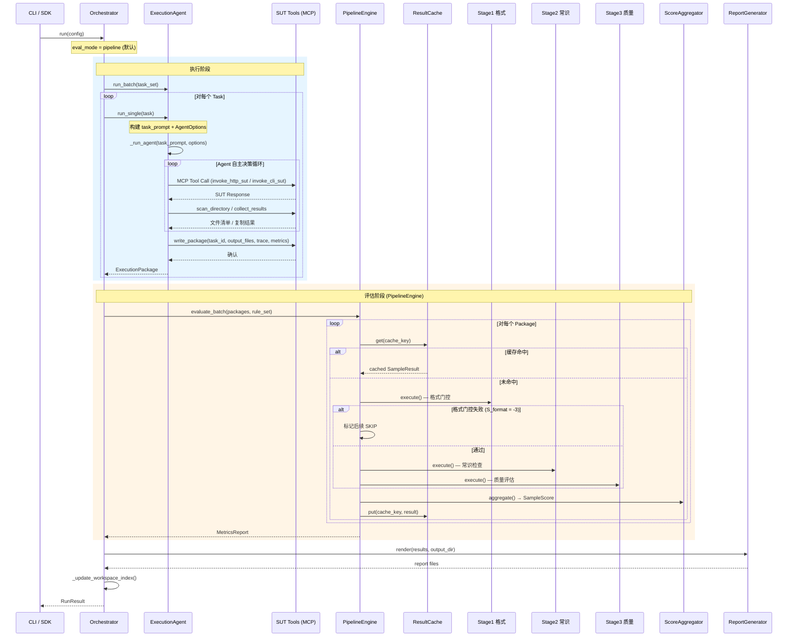
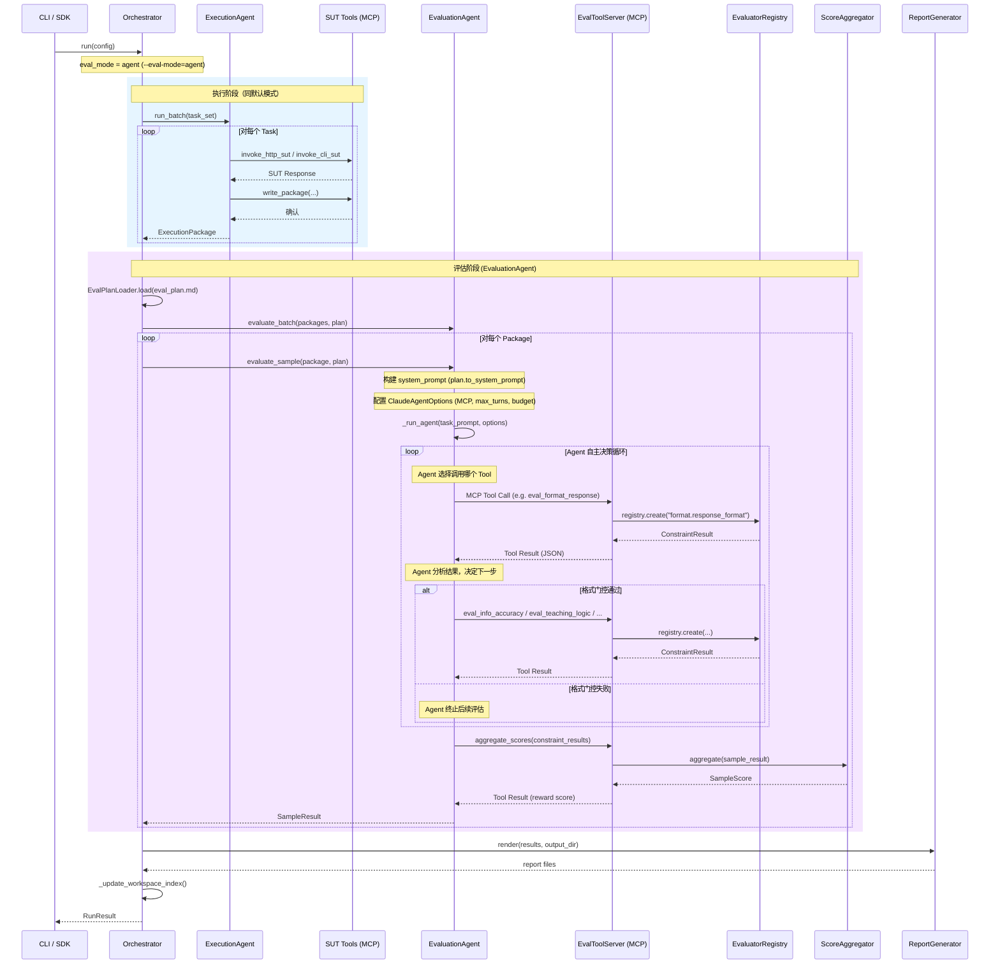

# 编排调度层设计

> 本文档详细阐述编排调度层的设计，包括 Orchestrator（统一编排器）、ExecutionAgent（执行 Agent）、评估双模式（PipelineEngine 默认 + EvaluationAgent 可选）以及 Agent Hooks。属于 [01 整体架构设计](./01整体架构设计.md) §二中"编排调度层"的详细展开。

---

## 一、职责边界

编排调度层负责**评测流程的端到端编排**，协调执行与评估两个阶段：

| 组件 | 职责 | 不负责 |
|------|------|--------|
| **Orchestrator** | 加载配置、初始化组件、协调执行阶段与评估阶段、生成报告 | 不直接与 SUT 交互、不直接执行评估逻辑 |
| **ExecutionAgent** | 基于 claude-agent-sdk 端到端驱动执行：理解任务、调用 SUT、采集结果 | 不执行评估逻辑 |
| **PipelineEngine** | 评估默认模式：固定级联管线，Stage1→Stage2→Stage3，确定性高 | 不实现具体评估逻辑（委托给 Evaluator） |
| **EvaluationAgent** | 评估可选模式：读取 Markdown 评测计划，Agent 自适应评估 | 仅在 `--eval-mode=agent` 时使用，不实现评估逻辑（委托给 EvalToolServer） |

**核心设计原则**：

- **执行 Agent 化**：ExecutionAgent 理解任务描述，智能构建请求、调用 SUT、处理异常，而非硬编码的模板渲染
- **评估确定性优先**：PipelineEngine 为默认评估模式，固定级联流程，无额外 token 消耗
- **评估 Agent 可选**：EvaluationAgent 用于复杂自适应场景，需显式指定 `--eval-mode=agent`

---

## 二、Orchestrator — 统一编排器

### 2.1 设计理念

Orchestrator 是评测流程的**唯一入口**，负责：

1. 加载评测配置（任务集、规则集、评测计划等）
2. 初始化 ExecutionAgent、评估引擎、报告生成器
3. 按 RunMode 协调执行阶段与评估阶段
4. 生成报告并更新 Workspace 索引

### 2.2 运行模式

| 模式 | 触发方式 | 编排流程 |
|------|----------|----------|
| **pipeline** | `agent-eval pipeline` | ExecutionAgent 执行 → 评估引擎评估 → 报告 |
| **run-only** | `agent-eval run` | 仅 ExecutionAgent 执行 → 写入 ExecutionPackage |
| **eval-only** | `agent-eval eval` | 从 workspace 加载 ExecutionPackage → 评估引擎评估 → 报告 |

评估阶段进一步由 `--eval-mode` 控制评估引擎模式：

| 评估模式 | 触发方式 | 说明 |
|----------|----------|------|
| **pipeline**（默认） | `--eval-mode=pipeline` 或省略 | PipelineEngine 固定级联，确定性高，无额外 token |
| **agent** | `--eval-mode=agent` | EvaluationAgent 自适应评估，用于复杂场景 |

### 2.3 架构总览

```
Orchestrator
├── Execution Phase: ExecutionAgent (claude-agent-sdk)
│   ├── system_prompt: "你是评测执行 Agent"
│   ├── SUT Tools (MCP):
│   │   ├── invoke_http_sut - 调用 HTTP SUT
│   │   ├── invoke_cli_sut - 调用 CLI SUT
│   │   ├── scan_directory - 扫描目录
│   │   ├── collect_results - 收集执行结果
│   │   └── write_package - 写入 ExecutionPackage
│   └── Reads: task_set.yaml, sut_config.yaml
│
├── Evaluation Phase (dual mode):
│   ├── PipelineEngine (default) — PipelineStage cascade
│   │   ├── Stage 1: Format (HARD_GATE)
│   │   ├── Stage 2: Commonsense (HARD_SCORE)
│   │   └── Stage 3: Quality (SOFT/PREFERENCE)
│   └── EvaluationAgent (optional) — Markdown plan driven
│       └── EvalToolServer (MCP) — evaluators as tools
│
└── Report Phase: ReportGenerator + IndexUpdater
```

### 2.4 核心类

```python
class Orchestrator:
    """
    统一编排器。

    职责：
    1. 加载评测配置（任务集、规则集、评测计划）
    2. 初始化 ExecutionAgent + 评估引擎
    3. 按 RunMode 协调执行阶段与评估阶段
    4. 生成报告 + 更新 Workspace 索引
    """

    def __init__(self, execution_agent: ExecutionAgent,
                 pipeline_engine: PipelineEngine,
                 evaluation_agent: EvaluationAgent | None,
                 report_generator: ReportGenerator,
                 registry: EvaluatorRegistry):
        self.execution_agent = execution_agent
        self.pipeline_engine = pipeline_engine
        self.evaluation_agent = evaluation_agent
        self.report_gen = report_generator
        self.registry = registry

    async def run(self, config: RunConfig) -> RunResult:
        # 1. 执行阶段
        if config.mode == RunMode.RUN_ONLY:
            packages = await self.execution_agent.run_batch(config.task_set)
            return RunResult(packages=packages)

        elif config.mode == RunMode.EVAL_ONLY:
            packages = self._load_packages(config.package_dir)
        else:  # PIPELINE
            packages = await self.execution_agent.run_batch(config.task_set)

        # 2. 评估阶段（双模式）
        if config.eval_mode == EvalMode.AGENT and self.evaluation_agent:
            # 可选模式：EvaluationAgent 自适应评估
            plan = EvalPlanLoader.load(config.eval_plan_path)
            results = await self.evaluation_agent.evaluate_batch(packages, plan)
        else:
            # 默认模式：PipelineEngine 确定性级联
            results = self.pipeline_engine.evaluate_batch(packages, config.rule_set)

        # 3. 报告阶段
        self.report_gen.render(results, config.output_dir)
        self._update_workspace_index(config, results)

        return RunResult(packages=packages, results=results)

    def _load_packages(self, package_dir: Path) -> list[ExecutionPackage]:
        """从 workspace 加载已有的 ExecutionPackage。"""
        ...

    def _update_workspace_index(self, config: RunConfig, results):
        """评估完成后更新 workspace 索引，供 Web Portal 读取。"""
        ...
```

---

## 三、ExecutionAgent — 执行 Agent

### 3.1 设计理念

ExecutionAgent 是执行阶段的**智能核心**，基于 `claude-agent-sdk` 构建。与传统的模板渲染 + HTTP 调用不同，ExecutionAgent：

- **理解任务描述**：Agent 读取 Task 的 `input` 字段，理解学科、年级、知识点等语义
- **智能构建请求**：根据任务语义动态构建 SUT 请求，而非固定模板渲染
- **自适应处理异常**：Agent 可根据 SUT 响应动态调整策略（重试、降级等）
- **采集并归档结果**：Agent 调用 SUT Tools 采集输出，写入标准 ExecutionPackage

**与原 ExecutionEngine 的对比**：

| 维度 | 原 ExecutionEngine | ExecutionAgent |
|------|-------------------|----------------|
| 执行方式 | SUTDriver 硬编码调用 | Agent 理解任务，智能调用 |
| 请求构建 | Jinja2 模板渲染 | Agent 根据语义动态构建 |
| 异常处理 | 固定重试策略 | Agent 根据错误类型自适应处理 |
| SUT 交互 | HTTPDriver / CLIDriver | SUT Tools (MCP) |
| 结果采集 | ResultCollector 固定逻辑 | Agent 按需采集 |
| 可扩展性 | 需新增 Driver 类 | 新增 SUT Tool 即可 |

### 3.2 SUT Tools (MCP)

ExecutionAgent 通过 MCP Tools 与被测系统交互。所有 SUT 能力包装为 MCP Tools：

#### 3.2.1 工具列表

| Tool 名称 | 说明 | 输入 | 输出 |
|-----------|------|------|------|
| `invoke_http_sut` | 调用 HTTP SUT | `url`, `method`, `headers`, `body` | HTTP 响应（状态码、body、耗时） |
| `invoke_cli_sut` | 调用 CLI SUT | `command`, `args`, `timeout` | 执行结果（stdout、stderr、退出码） |
| `scan_directory` | 扫描目录结构 | `directory_path`, `file_patterns` | 文件清单 + 目录层级 |
| `collect_results` | 收集执行结果 | `source_path`, `output_path` | 复制的文件列表 |
| `write_package` | 写入 ExecutionPackage | `task_id`, `output_files`, `trace`, `metrics` | 确认信息 |

#### 3.2.2 Tool 实现模式

每个 Tool 使用 `claude-agent-sdk` 的 `@tool` 装饰器定义：

```python
from claude_agent_sdk import tool, create_sdk_mcp_server

@tool("invoke_http_sut", "调用 HTTP SUT，发送请求并返回响应", {
    "url": {"type": "string", "description": "请求 URL"},
    "method": {"type": "string", "enum": ["GET", "POST", "PUT"],
               "description": "HTTP 方法", "default": "POST"},
    "headers": {"type": "object", "description": "请求头"},
    "body": {"type": "object", "description": "请求体 (JSON)"},
    "timeout": {"type": "number", "description": "超时秒数", "default": 120},
})
async def invoke_http_sut(args):
    """调用 HTTP SUT，支持超时与重试。"""
    import httpx
    async with httpx.AsyncClient(timeout=args.get("timeout", 120)) as client:
        response = await client.request(
            method=args.get("method", "POST"),
            url=args["url"],
            headers=args.get("headers", {}),
            json=args.get("body", {}),
        )
    return {"content": [{"type": "text", "text": json.dumps({
        "status_code": response.status_code,
        "body": response.text[:10000],  # 截断避免过长
        "duration_ms": response.elapsed.total_seconds() * 1000,
    })}]}

@tool("invoke_cli_sut", "调用 CLI SUT，执行命令并返回输出", {
    "command": {"type": "string", "description": "要执行的命令"},
    "args": {"type": "array", "items": {"type": "string"},
             "description": "命令行参数"},
    "timeout": {"type": "number", "description": "超时秒数", "default": 120},
})
async def invoke_cli_sut(args):
    """调用 CLI SUT。"""
    import asyncio
    cmd = [args["command"]] + args.get("args", [])
    proc = await asyncio.create_subprocess_exec(
        *cmd, stdout=asyncio.subprocess.PIPE, stderr=asyncio.subprocess.PIPE)
    stdout, stderr = await asyncio.wait_for(
        proc.communicate(), timeout=args.get("timeout", 120))
    return {"content": [{"type": "text", "text": json.dumps({
        "exit_code": proc.returncode,
        "stdout": stdout.decode()[:10000],
        "stderr": stderr.decode()[:5000],
    })}]}

@tool("scan_directory", "扫描目录结构，返回文件清单和层级信息", {
    "directory_path": {"type": "string", "description": "目标目录路径"},
    "file_patterns": {"type": "array", "items": {"type": "string"},
                      "description": "文件匹配模式，如 ['*.html', '*.htm']"},
})
async def scan_directory(args):
    """扫描目录结构。"""
    from agent_eval.execution.collector import DirectoryCollector
    collector = DirectoryCollector(
        Path(args["directory_path"]),
        args.get("file_patterns", ["*.html", "*.htm"]))
    manifest = collector.collect()
    return {"content": [{"type": "text",
                         "text": json.dumps(asdict(manifest),
                                            ensure_ascii=False, indent=2)}]}

@tool("collect_results", "收集执行结果，将文件复制到指定目录", {
    "source_path": {"type": "string", "description": "源文件或目录路径"},
    "output_path": {"type": "string", "description": "目标目录路径"},
})
async def collect_results(args):
    """收集执行结果文件。"""
    import shutil
    source = Path(args["source_path"])
    output = Path(args["output_path"])
    output.mkdir(parents=True, exist_ok=True)
    copied = []
    if source.is_file():
        shutil.copy2(source, output / source.name)
        copied.append(str(output / source.name))
    else:
        for f in source.rglob("*"):
            if f.is_file():
                rel = f.relative_to(source)
                dest = output / rel
                dest.parent.mkdir(parents=True, exist_ok=True)
                shutil.copy2(f, dest)
                copied.append(str(dest))
    return {"content": [{"type": "text", "text": json.dumps({
        "copied_files": copied, "total": len(copied),
    })}]}

@tool("write_package", "写入 ExecutionPackage，记录执行轨迹和过程指标", {
    "task_id": {"type": "string", "description": "任务 ID"},
    "output_dir": {"type": "string", "description": "输出目录路径"},
    "output_files": {"type": "array", "items": {"type": "string"},
                     "description": "输出文件列表"},
    "trace": {"type": "object", "description": "执行轨迹（请求、响应、耗时）"},
    "metrics": {"type": "object", "description": "过程指标"},
})
async def write_package(args):
    """写入 ExecutionPackage。"""
    output_dir = Path(args["output_dir"])
    output_dir.mkdir(parents=True, exist_ok=True)
    # 写入 trace.json
    (output_dir / "trace.json").write_text(
        json.dumps(args.get("trace", {}), ensure_ascii=False, indent=2))
    # 写入 metrics.json
    (output_dir / "metrics.json").write_text(
        json.dumps(args.get("metrics", {}), ensure_ascii=False, indent=2))
    # 写入 metadata.json
    metadata = {
        "task_id": args["task_id"],
        "output_files": args.get("output_files", []),
        "created_at": datetime.now().isoformat(),
    }
    (output_dir / "metadata.json").write_text(
        json.dumps(metadata, ensure_ascii=False, indent=2))
    return {"content": [{"type": "text", "text": json.dumps({
        "status": "ok", "package_dir": str(output_dir),
    })}]}
```

### 3.3 SUT Tool Server 构建

```python
class SUTToolServer:
    """
    SUT 工具 MCP 服务。

    将 HTTP/CLI 调用、目录扫描、结果采集等 SUT 交互能力
    包装为 claude-agent-sdk 可调用的 MCP Tools。
    """

    def __init__(self, sut_config: dict = None):
        self.sut_config = sut_config or {}

    def to_mcp_server(self):
        """构建 MCP Server 实例，供 ExecutionAgent 使用。"""
        return create_sdk_mcp_server(
            name="sut-tools",
            version="1.0.0",
            tools=[
                invoke_http_sut,
                invoke_cli_sut,
                scan_directory,
                collect_results,
                write_package,
            ],
        )

    def get_tool_names(self) -> list[str]:
        """返回所有工具的 MCP 命名（用于 allowed_tools 配置）。"""
        return [
            "mcp__sut-tools__invoke_http_sut",
            "mcp__sut-tools__invoke_cli_sut",
            "mcp__sut-tools__scan_directory",
            "mcp__sut-tools__collect_results",
            "mcp__sut-tools__write_package",
        ]
```

### 3.4 ExecutionAgent 核心类

```python
from claude_agent_sdk import (
    query, ClaudeAgentOptions,
    AssistantMessage, TextBlock, ToolUseBlock
)

class ExecutionAgent:
    """
    基于 Claude Agent SDK 的执行 Agent。

    核心能力：
    - 读取任务描述，理解任务语义
    - 通过 SUT Tools (MCP) 智能调用被测系统
    - 自适应处理异常（重试、降级）
    - 采集结果并写入标准 ExecutionPackage
    """

    def __init__(self, config: AgentConfig, sut_tools: SUTToolServer):
        self.config = config
        self.sut_tools = sut_tools

    async def run_batch(self, task_set: TaskSet) -> list[ExecutionPackage]:
        """批量执行任务集，返回执行包列表。"""
        packages = []
        for task in task_set.tasks:
            pkg = await self.run_single(task)
            packages.append(pkg)
        return packages

    async def run_single(self, task: Task) -> ExecutionPackage:
        """Agent 驱动的单任务执行。"""
        # 1. 构建输出目录
        output_dir = self.config.workspace_dir / "packages" / task.id / "output"
        output_dir.mkdir(parents=True, exist_ok=True)

        # 2. 构建任务消息
        task_prompt = self._build_task_prompt(task, output_dir)

        # 3. 配置 Agent 选项
        options = ClaudeAgentOptions(
            system_prompt=self._system_prompt,
            mcp_servers={"sut-tools": self.sut_tools.to_mcp_server()},
            allowed_tools=self.sut_tools.get_tool_names(),
            max_turns=self.config.max_turns,
            max_budget_usd=self.config.max_budget_usd,
            permission_mode="acceptEdits",
            cwd=str(self.config.workspace_dir),
        )

        # 4. 运行 Agent 循环
        session = await self._run_agent(task_prompt, options)

        # 5. 从 Agent 会话中构建 ExecutionPackage
        return self._build_package(session, task, output_dir)

    @property
    def _system_prompt(self) -> str:
        return """你是评测执行 Agent。你的职责是：

1. 理解任务描述，确定需要执行的操作
2. 使用 invoke_http_sut 或 invoke_cli_sut 调用被测系统
3. 使用 scan_directory 和 collect_results 采集执行结果
4. 使用 write_package 将结果归档为标准 ExecutionPackage

执行规则：
- 仔细阅读任务的 input 字段，理解学科、年级、知识点等语义
- 根据任务描述智能构建 SUT 请求，不要机械套用模板
- 如果 SUT 返回错误，分析原因并决定是否重试
- 确保所有输出文件都被正确收集和归档
- 完成后调用 write_package 记录执行轨迹和过程指标"""

    def _build_task_prompt(self, task: Task, output_dir: Path) -> str:
        """为单个任务构建执行消息。"""
        return f"""请执行以下任务：

## 任务信息
- 任务 ID: {task.id}
- 输入参数: {json.dumps(task.input, ensure_ascii=False, indent=2)}
- 约束条件: {json.dumps(task.constraints, ensure_ascii=False, indent=2)}
- 输出目录: {output_dir}

## SUT 配置
{json.dumps(self.sut_tools.sut_config, ensure_ascii=False, indent=2)}

请调用被测系统，采集输出结果，并使用 write_package 归档到指定目录。"""

    async def _run_agent(self, prompt: str, options: ClaudeAgentOptions) -> AgentSession:
        """运行 Agent 并收集完整会话记录。"""
        session = AgentSession()

        async for message in query(prompt=prompt, options=options):
            session.add_message(message)
            if isinstance(message, AssistantMessage):
                for block in message.content:
                    if isinstance(block, TextBlock):
                        session.reasoning += block.text
                    elif isinstance(block, ToolUseBlock):
                        session.tool_calls.append({
                            "tool": block.name,
                            "input": block.input,
                        })

        return session

    def _build_package(self, session: AgentSession,
                       task: Task, output_dir: Path) -> ExecutionPackage:
        """从 Agent 会话记录构建 ExecutionPackage。"""
        ...
```

### 3.5 AgentSession — 会话记录

```python
@dataclass
class AgentSession:
    """单次 Agent 会话的完整记录。"""
    reasoning: str = ""                          # Agent 自然语言推理过程
    tool_calls: list[dict] = field(default_factory=list)  # 工具调用记录
    turns_used: int = 0                          # 消耗的 turn 数
    cost_usd: float = 0.0                        # 消耗的 USD

    def add_message(self, message):
        """处理并记录 Agent 消息。"""
        ...
```

### 3.6 AgentConfig — Agent 配置

```python
@dataclass
class AgentConfig:
    """ExecutionAgent 的配置。"""
    model: str = "claude-sonnet-4-6"      # Agent 使用的模型
    workspace_dir: Path = Path("workspace")
    max_turns: int = 15                   # 单任务最大 turn 数
    max_budget_usd: float = 0.5           # 单任务最大预算（USD）
    log_dir: Path | None = None           # Agent 日志输出目录
```

### 3.7 预算控制

ExecutionAgent 采用双重预算控制机制：

| 控制维度 | 参数 | 说明 |
|----------|------|------|
| Turn 限制 | `max_turns=15` | 单任务最大交互轮次 |
| 金额限制 | `max_budget_usd=0.5` | 单任务最大 token 消耗 |
| Hook 守卫 | `budget_guard` | 每次工具调用前检查累计成本 |

预算超限时，Agent Hooks（见 §六）自动终止 Agent 循环，返回部分结果。

---

## 四、评估双模式

### 4.1 PipelineEngine（默认模式）

PipelineEngine 是评估流程的**默认编排器**：按级联顺序调度各阶段评估器，管理短路和缓存。评估器的具体实现参见 [04 评估引擎设计](./04评估引擎设计.md)。

#### 4.1.1 级联架构

```
输入 ExecutionPackage
       │
       ▼
  ┌─────────────────────────────────┐
  │ Stage 1: 格式门控 (HARD_GATE)   │  Rule-based，低成本
  │ format.response_format           │
  │ format.document_count            │
  │ format.structure_compliance      │
  │ format.html_validity             │
  │ format.directory_structure       │
  └───────────────┬─────────────────┘
                  │ 全通过 → S_format = +1
                  ├── 任一失败 → S_format = -3，终止后续
                  ▼
  ┌─────────────────────────────────┐
  │ Stage 2: 常识检查 (HARD_SCORE)  │  事实验证，中成本
  │ commonsense.info_accuracy        │
  │ commonsense.chronological_order  │
  │ commonsense.logical_consistency  │
  │ commonsense.math_formula         │
  │ commonsense.unit_consistency     │
  └───────────────┬─────────────────┘
                  │ 全通过 → S_common = +1
                  ├── 任一失败 → S_common = 0，继续后续
                  ▼
  ┌─────────────────────────────────┐
  │ Stage 3: 质量评估 (SOFT/PREF)   │  LLM-as-judge，高成本
  │ soft.content_density             │
  │ soft.visual_consistency          │
  │ soft.teaching_logic              │
  │ soft.content_diversity           │
  │ pref.style_preference            │
  │ pref.depth_preference            │
  │ pref.request_fulfillment         │
  └───────────────┬─────────────────┘
                  ▼
  ┌─────────────────────────────────┐
  │ ScoreAggregator 评分聚合        │  → 详见 04 评估引擎设计 §六
  │ Reward = S_format + S_common    │
  │       + w3 * S_soft + w4 * S_pref│
  └─────────────────────────────────┘
```

#### 4.1.2 PipelineEngine 核心类

```python
class PipelineEngine:
    """评估管线引擎 — 编排级联评估流程。"""

    def __init__(self, config: PipelineConfig, registry: EvaluatorRegistry,
                 aggregator: ScoreAggregator,
                 metrics_calculator: MetricsCalculator):
        self.config = config
        self.registry = registry
        self.aggregator = aggregator
        self.metrics_calculator = metrics_calculator
        self.stages: list[PipelineStage] = []
        self.cache = ResultCache()
        self._build_stages()

    def _build_stages(self) -> None:
        """根据配置构建级联阶段。"""
        for stage_conf in self.config.stages:
            evaluators = [
                self.registry.create(e.name, e.params)
                for e in stage_conf.evaluators
            ]
            self.stages.append(PipelineStage(
                stage_id=stage_conf.id,
                evaluators=evaluators,
                short_circuit_policy=stage_conf.short_circuit_policy,
            ))

    def evaluate_sample(self, sample, context: dict) -> SampleResult:
        """评估单个样本。"""
        # 1. 缓存检查
        cache_key = self._compute_cache_key(sample, context)
        cached = self.cache.get(cache_key)
        if cached is not None:
            return cached

        result = SampleResult(sample_id=context["sample_id"])

        # 2. 逐阶段执行，短路终止
        for stage in self.stages:
            stage_result = stage.execute(sample, context)
            result.stage_results[stage.stage_id] = stage_result
            if not stage_result.gate_passed:
                self._mark_remaining_skipped(result, stage.stage_id)
                break

        # 3. 评分聚合
        score = self.aggregator.aggregate(result)
        result.s_format = score.s_format
        result.s_common = score.s_common
        result.s_soft = score.s_soft
        result.s_pref = score.s_pref
        result.reward = score.reward

        self.cache.put(cache_key, result)
        return result

    def evaluate_batch(self, packages: list,
                       rule_set: RuleSet = None) -> MetricsReport:
        """批量评估所有样本。"""
        results = []
        for pkg in packages:
            context = self._build_context(pkg, rule_set)
            results.append(self.evaluate_sample(pkg, context))
        return self.metrics_calculator.compute(results)

    def _compute_cache_key(self, sample, context: dict) -> str:
        """计算缓存 Key。"""
        import hashlib
        content = str(sample) + json.dumps(context, sort_keys=True)
        return hashlib.sha256(content.encode()).hexdigest()

    def _mark_remaining_skipped(self, result: SampleResult,
                                 failed_stage_id: str) -> None:
        """将失败阶段之后的阶段标记为 SKIP。"""
        remaining = False
        for stage in self.stages:
            if remaining:
                result.stage_results[stage.stage_id] = StageResult(
                    stage_id=stage.stage_id,
                    status=EvalStatus.SKIP,
                    gate_passed=False,
                )
            if stage.stage_id == failed_stage_id:
                remaining = True
```

#### 4.1.3 PipelineStage — 阶段执行器

```python
class PipelineStage:
    """单阶段执行器，管理该阶段内所有 Evaluator 的执行与门控判定。"""

    def __init__(self, stage_id: str, evaluators: list[BaseEvaluator],
                 short_circuit_policy: str = "fail_fast"):
        self.stage_id = stage_id
        self.evaluators = evaluators
        self.short_circuit_policy = short_circuit_policy

    def execute(self, sample, context: dict) -> StageResult:
        """执行该阶段所有评估器。"""
        stage_result = StageResult(stage_id=self.stage_id, status=EvalStatus.PASS)
        gate_passed = True

        for evaluator in self.evaluators:
            constraint_result = evaluator.evaluate(sample, context)
            stage_result.constraint_results.append(constraint_result)

            if (evaluator.tier in (ConstraintTier.HARD_GATE, ConstraintTier.HARD_SCORE)
                    and constraint_result.status == EvalStatus.FAIL):
                gate_passed = False
                if self.short_circuit_policy == "fail_fast":
                    break

        stage_result.gate_passed = gate_passed
        stage_result.status = EvalStatus.PASS if gate_passed else EvalStatus.FAIL
        return stage_result
```

#### 4.1.4 PipelineConfig — 管线配置

```python
@dataclass
class StageConfig:
    """单个阶段的配置。"""
    id: str                                # "format" | "commonsense" | "quality"
    evaluators: list[EvaluatorConfig]
    short_circuit_policy: str = "fail_fast"  # "fail_fast" | "continue"

@dataclass
class EvaluatorConfig:
    """评估器配置。"""
    name: str                              # 评估器 ID，如 "format.response_format"
    params: dict = {}                      # 评估器参数

@dataclass
class PipelineConfig:
    """管线配置。"""
    stages: list[StageConfig]
```

**默认三阶段配置**：

```yaml
# pipeline.yaml
stages:
  - id: format
    short_circuit_policy: fail_fast
    evaluators:
      - name: format.response_format
      - name: format.document_count
        params: { min_documents: 1, max_documents: 20 }
      - name: format.structure_compliance
      - name: format.html_validity
      - name: format.directory_structure

  - id: commonsense
    short_circuit_policy: fail_fast
    evaluators:
      - name: commonsense.info_accuracy
      - name: commonsense.chronological_order
      - name: commonsense.logical_consistency
      - name: commonsense.math_formula
      - name: commonsense.unit_consistency

  - id: quality
    short_circuit_policy: continue
    evaluators:
      - name: soft.content_density
      - name: soft.visual_consistency
      - name: soft.teaching_logic
        params: { template_id: pedagogical_logic }
      - name: soft.content_diversity
      - name: pref.style_preference
      - name: pref.depth_preference
      - name: pref.request_fulfillment
```

### 4.2 EvaluationAgent（可选模式）

EvaluationAgent 是评估阶段的**可选高级模式**，仅在指定 `--eval-mode=agent` 时使用。它基于 `claude-agent-sdk` 构建，适用于需要 Agent 自适应决策的复杂评估场景。

#### 4.2.1 适用场景

| 场景 | 推荐模式 | 原因 |
|------|----------|------|
| 标准课件生成评估 | **PipelineEngine** | 流程固定，确定性高，无额外 token |
| 需要动态调整评估策略 | **EvaluationAgent** | Agent 可根据中间结果调整后续评估 |
| 多维度交叉评估 | **EvaluationAgent** | Agent 可处理维度间的复杂关联 |
| 大批量简单评估 | **PipelineEngine** | 确定性管线效率更高 |

#### 4.2.2 核心类

```python
class EvaluationAgent:
    """
    基于 Claude Agent SDK 的评测 Agent（可选模式）。

    核心能力：
    - 读取 Markdown 评测计划作为 system_prompt
    - 通过 EvalToolServer (MCP) 调用评估器
    - 自主决策评估顺序和短路策略
    - 输出自然语言推理链 + 结构化评分
    """

    def __init__(self, config: AgentConfig, eval_tools: EvalToolServer):
        self.config = config
        self.eval_tools = eval_tools

    async def evaluate_batch(self, packages: list,
                             plan: EvalPlan) -> list[SampleResult]:
        """批量评测所有样本。"""
        results = []
        for pkg in packages:
            result = await self.evaluate_sample(pkg, plan)
            results.append(result)
        return results

    async def evaluate_sample(self, package,
                              plan: EvalPlan) -> SampleResult:
        """Agent 驱动的单样本评测。"""
        # 1. 构建 system prompt（从 Markdown 计划转换）
        system_prompt = plan.to_system_prompt()

        # 2. 构建任务消息（包含样本内容描述）
        task_prompt = plan.build_eval_prompt(package)

        # 3. 配置 Agent 选项
        options = ClaudeAgentOptions(
            system_prompt=system_prompt,
            mcp_servers={"eval-tools": self.eval_tools.to_mcp_server()},
            allowed_tools=self.eval_tools.get_tool_names(),
            max_turns=plan.max_turns or 30,
            max_budget_usd=plan.budget_usd or 1.0,
            permission_mode="acceptEdits",
            cwd=str(package.output_dir),
        )

        # 4. 运行 Agent 循环
        session = await self._run_agent(task_prompt, options)

        # 5. 从 Agent 会话中提取结构化结果
        return self._extract_result(session, package)

    async def _run_agent(self, prompt: str,
                         options: ClaudeAgentOptions) -> AgentSession:
        """运行 Agent 并收集完整会话记录。"""
        session = AgentSession()

        async for message in query(prompt=prompt, options=options):
            session.add_message(message)
            if isinstance(message, AssistantMessage):
                for block in message.content:
                    if isinstance(block, TextBlock):
                        session.reasoning += block.text
                    elif isinstance(block, ToolUseBlock):
                        session.tool_calls.append({
                            "tool": block.name,
                            "input": block.input,
                        })

        return session

    def _extract_result(self, session: AgentSession,
                        package) -> SampleResult:
        """从 Agent 会话记录中提取结构化评估结果。"""
        # Agent 的最终文本输出包含结构化评分
        # 工具调用记录包含每个评估器的 ConstraintResult
        ...
```

#### 4.2.3 EvalToolServer — 评估器 MCP 工具服务

EvalToolServer 将现有的 17 个评估器 + 聚合器包装为 `claude-agent-sdk` 可调用的 MCP Tools。这是 Agent 与评估基础设施之间的**桥梁**。

**工具分类**：

| 类别 | Tool 数量 | 说明 |
|------|----------|------|
| 格式评估器 (HARD_GATE) | 5 | eval_format_response, eval_format_doc_count, eval_structure_compliance, eval_html_validity, eval_directory_structure |
| 常识评估器 (HARD_SCORE) | 5 | eval_info_accuracy, eval_chronological_order, eval_logical_consistency, eval_math_formula, eval_unit_consistency |
| 软约束评估器 (SOFT) | 4 | eval_content_density, eval_visual_consistency, eval_teaching_logic, eval_content_diversity |
| 偏好评估器 (PREFERENCE) | 3 | eval_style_preference, eval_depth_preference, eval_request_fulfillment |
| 辅助工具 | 3 | scan_directory, aggregate_scores, compute_metrics |

**Tool 实现模式**：

```python
from claude_agent_sdk import tool, create_sdk_mcp_server

def _to_tool_result(result: ConstraintResult) -> dict:
    """将 ConstraintResult 转换为 MCP Tool 返回格式。"""
    return {"content": [{"type": "text", "text": json.dumps({
        "constraint_id": result.constraint_id,
        "status": result.status.value,
        "score": result.score,
        "tier": result.tier.value,
        "reason": result.reason,
        "details": result.details,
        "duration_ms": result.duration_ms,
    }, ensure_ascii=False)}]}

@tool("eval_format_response", "检查文件格式是否为有效的 HTML 或 Markdown", {
    "sample_path": {"type": "string", "description": "待评估的文件路径"},
    "expected_formats": {"type": "array", "items": {"type": "string"},
                         "description": "预期格式列表，如 ['html', 'htm']"},
})
async def eval_format_response(args):
    evaluator = registry.create("format.response_format")
    result = evaluator.evaluate(load_sample(args["sample_path"]),
                                {"expected_formats": args.get("expected_formats")})
    return _to_tool_result(result)

@tool("aggregate_scores", "将各项约束检查结果聚合为最终 Reward Score", {
    "constraint_results": {"type": "array", "items": {"type": "object"},
                           "description": "各项评估器的 ConstraintResult 列表"},
})
async def aggregate_scores(args):
    aggregator = ScoreAggregator()
    sample_result = _build_sample_result(args["constraint_results"])
    score = aggregator.aggregate(sample_result)
    return {"content": [{"type": "text", "text": json.dumps({
        "s_format": score.s_format,
        "s_common": score.s_common,
        "s_soft": score.s_soft,
        "s_pref": score.s_pref,
        "reward": score.reward,
    })}]}
```

**EvalToolServer 构建**：

```python
class EvalToolServer:
    """
    评估器 MCP 工具服务。

    将 17 个评估器 + 聚合器 + 目录扫描器包装为
    claude-agent-sdk 可调用的 MCP Tools。
    """

    def __init__(self, registry: EvaluatorRegistry,
                 aggregator: ScoreAggregator,
                 calculator: MetricsCalculator):
        self.registry = registry
        self.aggregator = aggregator
        self.calculator = calculator

    def to_mcp_server(self):
        """构建 MCP Server 实例，供 EvaluationAgent 使用。"""
        return create_sdk_mcp_server(
            name="eval-tools",
            version="1.0.0",
            tools=[
                # 格式 (5)
                eval_format_response, eval_format_doc_count,
                eval_structure_compliance, eval_html_validity,
                eval_directory_structure,
                # 常识 (5)
                eval_info_accuracy, eval_chronological_order,
                eval_logical_consistency, eval_math_formula,
                eval_unit_consistency,
                # 软约束 (4)
                eval_content_density, eval_visual_consistency,
                eval_teaching_logic, eval_content_diversity,
                # 偏好 (3)
                eval_style_preference, eval_depth_preference,
                eval_request_fulfillment,
                # 辅助 (3)
                scan_directory, aggregate_scores, compute_metrics,
            ],
        )
```

#### 4.2.4 Markdown 评测计划

Markdown 评测计划是 EvaluationAgent 执行评测的**核心指令**。完整的评测计划格式参见 [07 配置规范](./07配置规范.md)。

```markdown
---
plan_id: courseware-v2
version: "1.0"
target: 课件生成 Agent
max_turns: 30
budget_usd: 1.0
---

# 课件生成质量评测计划

## 评测背景
评估课件生成 Agent 输出的 HTML 文档集质量...

## 评测策略

### 阶段一：格式门控（HARD_GATE）
1. `eval_format_response` → 检查文件格式
2. `eval_format_doc_count` → 检查文档数量
...

### 阶段二：常识检查（HARD_SCORE）
...

### 阶段三：质量评估（SOFT + PREFERENCE）
...

### 最终评分
调用 `aggregate_scores` 计算 Reward

## 阈值
- DR >= 0.95
- CPR >= 0.90
- Reward >= 0.70
```

**EvalPlan 数据模型**：

```python
@dataclass
class EvalPlan:
    """Markdown 评测计划的数据模型。"""
    plan_id: str
    version: str
    target: str
    context: str                         # 评测背景（自然语言）
    strategy: str                        # 评测策略（自然语言，含阶段描述）
    constraints: list[dict]
    thresholds: dict
    budget: dict
    max_turns: int = 30
    budget_usd: float = 1.0
    raw_markdown: str = ""

    def to_system_prompt(self) -> str:
        """将评测计划转换为 Claude 系统提示。"""
        return f"""你是一个专业的评测 Agent，负责评估 {self.target} 的输出质量。

# 评测背景
{self.context}

# 评测策略
{self.strategy}

# 可用工具
- **格式检查**：eval_format_response, eval_format_doc_count, eval_structure_compliance, eval_html_validity, eval_directory_structure
- **常识检查**：eval_info_accuracy, eval_chronological_order, eval_logical_consistency, eval_math_formula, eval_unit_consistency
- **质量评估**：eval_content_density, eval_visual_consistency, eval_teaching_logic, eval_content_diversity
- **偏好评估**：eval_style_preference, eval_depth_preference, eval_request_fulfillment
- **辅助工具**：scan_directory, aggregate_scores, compute_metrics

# 约束条件
{self._format_constraints()}

# 阈值目标
{self._format_thresholds()}

# 执行规则
1. 严格按评测策略中的阶段顺序执行
2. 每次调用评估器后，必须分析结果再决定下一步
3. hard_gate 约束任一失败 → 立即终止后续评估，标记 S_format = -3
4. hard_score 约束失败 → 记录但继续，标记 S_common = 0
5. 所有检查完成后调用 aggregate_scores 聚合评分
6. 在最终结果中提供自然语言推理说明"""

    def build_eval_prompt(self, package) -> str:
        """为单个样本构建评测任务消息。"""
        return f"""请评估以下样本：

## 样本信息
- 样本 ID: {package.task_id}
- 输出目录: {package.output_dir}
- 输出文件: {package.output_files}

请按照评测策略逐步执行评估。"""
```

---

## 五、两种评估模式对比

| 维度 | PipelineEngine（默认） | EvaluationAgent（可选） |
|------|----------------------|------------------------|
| 触发方式 | 默认，或 `--eval-mode=pipeline` | `--eval-mode=agent` |
| 执行策略 | 固定 Stage1→Stage2→Stage3 级联 | Agent 读取 Markdown 计划，自主决策 |
| 短路控制 | 代码 `if gate_passed: break` | Agent 理解失败原因，智能判断 |
| 评估器调用 | 代码循环遍历列表 | Agent 通过 MCP Tools 选择性调用 |
| 确定性 | 高（纯代码逻辑） | 中（依赖 Agent 推理） |
| Token 消耗 | 无（纯代码执行） | 有（Agent 推理 + 工具调用） |
| 策略适应性 | 不支持（需改代码） | Agent 可根据中间结果动态调整 |
| 可观测性 | 结构化日志 | 自然语言推理链 + 工具调用记录 |
| 扩展性 | 需改代码 + 改配置 | 修改 Markdown 计划即可 |
| 适用场景 | 标准评估（绝大多数情况） | 复杂自适应评估场景 |

**设计原则**：评分聚合始终由 ScoreAggregator（确定性代码）执行，无论哪种评估模式。PipelineEngine 是默认且推荐的评估方式。

---

## 六、Agent Hooks — 监控与安全

### 6.1 设计理念

通过 `claude-agent-sdk` 的 Hooks 机制实现 Agent 过程的监控和安全控制。Hooks 同时适用于 ExecutionAgent 和 EvaluationAgent。

### 6.2 Hook 实现

```python
from claude_agent_sdk import HookMatcher

async def log_tool_calls(input_data, tool_use_id, context):
    """记录所有工具调用用于审计。"""
    logger.info("tool_call", tool=input_data["tool_name"],
                input_keys=list(input_data["tool_input"].keys()))
    return {}

async def budget_guard(input_data, tool_use_id, context):
    """预算超限保护。"""
    if context.get("cost_usd", 0) > context.get("budget_usd", float("inf")):
        return {"hookSpecificOutput": {
            "hookEventName": "PreToolUse",
            "permissionDecision": "deny",
            "permissionDecisionReason": "预算已超限，终止执行",
        }}
    return {}

async def safety_check(input_data, tool_use_id, context):
    """安全检查：防止危险操作。"""
    tool_name = input_data.get("tool_name", "")
    tool_input = input_data.get("tool_input", {})
    # 阻止删除操作
    if "rm" in str(tool_input).lower() and "write" not in tool_name:
        return {"hookSpecificOutput": {
            "hookEventName": "PreToolUse",
            "permissionDecision": "deny",
            "permissionDecisionReason": "禁止删除操作",
        }}
    return {}

AGENT_HOOKS = {
    "PreToolUse": [
        HookMatcher(matcher="", hooks=[log_tool_calls, budget_guard, safety_check]),
    ],
}
```

### 6.3 Agent 会话日志

每次 Agent 会话的完整记录保存到 `workspace/runs/{run_id}/agent_logs/`：

```
agent_logs/
├── execution/                          # ExecutionAgent 日志
│   └── {task_id}/
│       ├── session.json                # AgentSession 完整记录
│       ├── reasoning.md                # Agent 推理过程
│       └── tool_calls.json             # 工具调用记录
└── evaluation/                         # EvaluationAgent 日志（可选模式）
    └── {task_id}/
        ├── session.json                # AgentSession 完整记录
        ├── reasoning.md                # Agent 推理过程
        ├── tool_calls.json             # 工具调用记录
        └── constraint_results.json     # 评估器返回的约束结果
```

### 6.4 结构化日志要求

**无论使用何种模式（Agent / Pipeline），系统必须输出结构化日志。**

| 要求 | 说明 |
|------|------|
| **JSON Lines 格式** | 所有日志为 JSON Lines（structlog + JSON renderer），可被 ELK/Grafana 等工具直接消费 |
| **完整追踪链** | 每条日志包含 `run_id`、`task_id`、`trace_id`，支持全链路追踪 |
| **模式无关** | Pipeline 模式和 Agent 模式输出的最终数据包结构一致，仅 Agent 模式额外产出 `agent_logs/` |
| **Pipeline 模式日志** | PipelineEngine 每个 Stage 的评估结果、缓存命中、短路判定均为结构化输出 |
| **Agent 模式日志** | ExecutionAgent/EvaluationAgent 的每次 Tool 调用、决策、成本均为结构化输出（详见 [03执行引擎设计](./03执行引擎设计.md) §七a） |

**日志格式对齐**：

| 数据 | Pipeline 模式 | Agent 模式 | 格式一致 |
|------|-------------|-----------|---------|
| ExecutionPackage | ExecutionEngine 生成 | ExecutionAgent 生成 | **一致** |
| EvaluationResult | PipelineEngine 生成 | EvaluationAgent 生成 | **一致** |
| MetricsReport | MetricsCalculator 计算 | MetricsCalculator 计算 | **一致** |
| agent_logs/ | 无 | SessionLogger 写入 | Agent 模式额外产出 |

---

## 七、缓存策略

| 项目 | 说明 |
|------|------|
| 粒度 | 样本级（整个课件评估结果） |
| Key | `SHA256(sample_content + plan_id + rule_set_version)` |
| 存储 | `workspace/cache/`，跨运行共享 |
| 失效 | 输入内容、评测计划版本、规则集版本任一变化 |
| PipelineEngine | 每次评估前检查缓存，命中则跳过全部 Stage |
| EvaluationAgent | Agent 系统提示（评测计划内容）在多样本间可利用 prompt caching |
| ExecutionAgent | 执行结果不缓存（SUT 每次调用结果可能不同） |

---

## 八、时序图

### 8.1 默认模式（PipelineEngine）



### 8.2 可选模式（EvaluationAgent）



---

## 九、版本记录

| 版本 | 日期 | 变更内容 |
|------|------|----------|
| v1.0 | 2026-06-08 | 按架构层次拆分，从原总览文档独立；PipelineEngine + PipelineStage 级联架构 |
| v1.1 | 2026-06-08 | Orchestrator 新增 _update_workspace_index 方法 |
| v2.0 | 2026-06-09 | Agent-First 架构重构：EvaluationAgent (claude-agent-sdk) + EvalToolServer (MCP) + Markdown 评测计划 |
| **v3.0** | **2026-06-09** | **架构调整：新增 ExecutionAgent（claude-agent-sdk 端到端驱动执行）+ SUT Tools (MCP)；评估改为双模式（PipelineEngine 默认 + EvaluationAgent 可选）；恢复 PipelineEngine + PipelineStage 级联架构为默认评估模式；新增 §五 两种模式对比；更新时序图区分默认/可选模式** |
