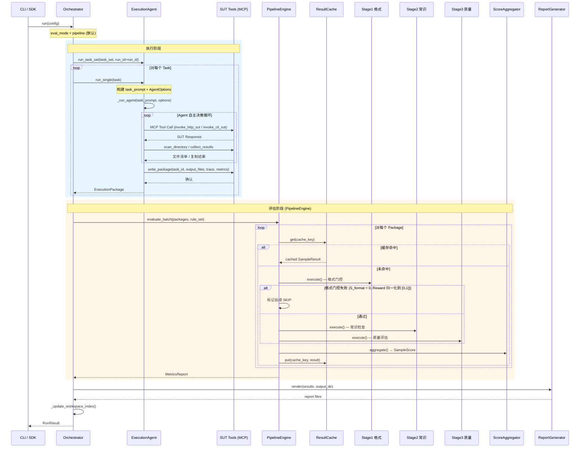

# 编排调度层设计

> 本文档详细阐述编排调度层的设计，包括 Orchestrator（统一编排器）、ExecutionAgent（执行 Agent）以及 PipelineEngine（固定级联评估）。属于 [01 整体架构设计](./01整体架构设计.md) §二中"编排调度层"的详细展开。

---

## 一、职责边界

编排调度层负责**评测流程的端到端编排**，协调执行与评估两个阶段：

| 组件 | 职责 | 不负责 |
|------|------|--------|
| **Orchestrator** | 加载配置、初始化组件、协调执行阶段与评估阶段、生成报告 | 不直接与 SUT 交互、不直接执行评估逻辑 |
| **ExecutionAgent** | 基于 DeepAgents（Python）端到端驱动执行：理解任务、调用 SUT、采集结果 | 不执行评估逻辑 |
| **PipelineEngine** | 评估引擎：固定级联管线，Stage1→Stage2→Stage3，确定性高 | 不实现具体评估逻辑（委托给 Evaluator） |

**核心设计原则**：

- **执行 Agent 化**：ExecutionAgent 理解任务描述，智能构建请求、调用 SUT、处理异常，而非硬编码的模板渲染
- **评估确定性优先**：PipelineEngine 为唯一评估模式，固定级联流程，结果可复现
- **LLM-as-judge 内建于管线**：质量/偏好等评估通过 `LLM_JUDGE` 评估方法实现，无需额外的 EvaluationAgent

---

## 二、Orchestrator — 统一编排器

### 2.1 设计理念

Orchestrator 是评测流程的**唯一入口**，负责：

1. 加载评测配置（任务集、规则集、管线配置等）
2. 初始化 ExecutionAgent、评估引擎、报告生成器
3. 按 RunMode 协调执行阶段与评估阶段
4. 生成报告并更新 Workspace 索引

### 2.2 运行模式

| 模式 | 触发方式 | 编排流程 |
|------|----------|----------|
| **pipeline** | `agent-eval pipeline` | ExecutionAgent 执行 → PipelineEngine 评估 → 报告（单 run_id 贯通） |
| **run-only** | `agent-eval run` | 仅 ExecutionAgent 执行 → 写入 ExecutionPackage |
| **eval-only** | `agent-eval eval` | 从 workspace 加载 ExecutionPackage → PipelineEngine 评估 → 报告 |

评估阶段统一由 **PipelineEngine** 执行，按规则集（rule_set）中声明的 `cascade` 进行 Stage1→Stage2→Stage3 级联评估。

run / pipeline 的高频参数概览：`--package <场景包引用>`（考卷任务集与 SUT 配置一次从包内解析，W1）、`--task <选择表达式>`（精确 ID / glob / 序号与 ID 范围 / `!排除`）、`--sut-name`（多被测系统时必选）、`--llm-role` / `--max-turns`（执行侧模型角色与轮次上限）；eval/pipeline 另有 `--upload/--no-upload`（结果上报可观测平台）。完整清单见 [CLI 使用教程](../guide/CLI使用教程.md)。

### 2.3 架构总览

```
cli/_stages.py（run/pipeline 阶段编排）
├── Execution Phase: ExecutionAgent (DeepAgents)
│   ├── system_prompt: 来自 assets/configs/execution_agent_prompts.yaml（v4.6.5 资产化）
│   ├── Channel: AgentProtocolChannel — Agent Protocol 语义工具面:
│   │   ├── agent_run / agent_run_stream   - 提交并等待 / 流式执行
│   │   ├── create_thread / run_on_thread  - 会话线程与续跑
│   │   ├── cancel_run / get_agent_info    - 取消与能力自检
│   │   └── scan_directory / read_file / list_files / collect_results /
│   │       write_package                  - 目录扫描、文件读取与产出落包
│   │       （invoke_http_sut / invoke_cli_sut 为预留工具，不排期）
│   └── Reads: 包内 task_sets/*.yaml + sut_configs/*.yaml（或显式路径）
│
├── Evaluation Phase:
│   └── PipelineEngine — PipelineStage cascade（orchestrator.eval_packages）
│       ├── Stage 1: Format (HARD_GATE)
│       ├── Stage 2: Commonsense (HARD_SCORE)
│       └── Stage 3: Quality (SOFT/PREFERENCE, LLM_JUDGE)
│
└── Report Phase: ReportGenerator + 运行清单登记 + ResultSink 上报（可选）
```

### 2.4 核心编排

> **实现口径（Sprint 9 收敛后）**：run / pipeline 的命令级编排收敛在 `cli/_stages.py` 的共享阶段函数；评估批量编排在 `orchestrator/orchestrator.py` 的 `eval_packages()`（云端 executor 复用同一入口）。本节按此描述。

**共享阶段函数**（`agent_eval/cli/_stages.py`）：

```python
def resolve_run_inputs(args) -> RunInputs:
    """解析执行输入：--package 场景包引用 → 包内 task_sets/ 与 sut_configs/；
    或显式 --task-set/--sut-config 路径。唯一 SUT 自动选中，多系统要求 --sut-name。"""

def execute_stage(run_inputs) -> RunOutcome:
    """执行阶段：create_channel(sut)（当前唯一 AgentProtocolChannel）→
    AgentProtocolToolServer → ExecutionAgent.run_task_set → 逐任务产出执行包
    （归位 runs/{run_id}/packages/{task_id}）→ 写 run_manifest.json（mode=run|pipeline）。"""

def evaluate_stage(ctx) -> EvalOutcome:
    """评估阶段：resolve_eval_inputs（规则集解析：包内名或路径）、CapabilityResolver、
    PipelineEngine 固定级联评估 → 结果写 runs/{run_id}/results/ 与 reports/。"""

def finalize_eval(...) -> None:
    """收尾：trace 刷新、摘要打印、SUT 身份回填、平台上报（--upload 时经 ResultSink）。"""

def write_run_manifest(...) -> None:
    """运行清单登记：mode/package_ref/task_set/sut/llm_role/packages[] + 执行包内容指纹。"""
```

`pipeline` 命令即按序复用上述函数：一次解析包 → `execute_stage` → `evaluate_stage`（复用同一 `runs/{run_id}/` 目录）→ `finalize_eval`。

**评估编排入口**（`orchestrator/orchestrator.py::eval_packages`）：

```python
class Orchestrator:
    """
    批量评估编排器（eval-only 与 executor 云端链路共用）。

    职责：
    1. 批量加载 ExecutionPackage
    2. PipelineEngine 固定级联评估（含能力降级/strict 控制）
    3. 结果聚合：ScoreAggregator / MetricsCalculator（场景化策略）
    4. 报告生成 + 运行清单登记
    """

    def eval_packages(self, package_dirs: list[Path],
                      scenario: ScenarioConfig, ...) -> MetricsReport:
        ...
```

早期版本中"单一 Orchestrator.run() 全模式编排"的伪代码已不再成立——执行与评估的阶段边界以 `_stages.py` 为准，避免本文与实现双份漂移。

---

## 三、ExecutionAgent — 执行 Agent

### 3.1 设计理念

ExecutionAgent 是执行阶段的**智能核心**，基于 **DeepAgents（Python，LangChain 官方开源）**构建（v4.6 底座，详见 [03 执行引擎设计](./03执行引擎设计.md) §3.2；Claude Agent SDK 已弃用——闭源/仅 Anthropic 协议/耦合模式）。与传统的模板渲染 + HTTP 调用不同，ExecutionAgent：

- **理解任务描述**：Agent 读取 Task 的 `input` 字段，理解学科、年级、知识点等语义
- **智能构建请求**：根据任务语义动态构建 SUT 请求，而非固定模板渲染
- **自适应处理异常**：Agent 可根据 SUT 响应动态调整策略（重试、降级等）
- **采集并归档结果**：Agent 调用 SUT Tools 采集输出，写入标准 ExecutionPackage

**与原 ExecutionEngine 的对比**：

| 维度 | 原 ExecutionEngine | ExecutionAgent |
|------|-------------------|----------------|
| 执行方式 | SUTDriver 硬编码调用 | Agent 理解任务，智能调用 |
| 请求构建 | Jinja2 模板渲染 | Agent 根据语义动态构建 |
| 异常处理 | 固定重试策略 | Agent 根据错误类型自适应处理 |
| SUT 交互 | HTTPDriver / CLIDriver | SUT Tools (MCP) |
| 结果采集 | ResultCollector 固定逻辑 | Agent 按需采集 |
| 可扩展性 | 需新增 Driver 类 | 新增 SUT Tool 即可 |

### 3.2 SUT Tools (LangChain Tool)

ExecutionAgent 通过 SUTToolServer 提供的 LangChain Tools 与被测系统交互（v4.6：工具为 LangChain Tool 显式绑定，MCP 封装为可选）。协议型被测系统优先使用 Agent Protocol 语义工具面（见 §3.4 与 [03执行引擎设计](./03执行引擎设计.md) §4.0.6），下列通用工具用于文件/目录与产出落包：

#### 3.2.1 工具列表

| Tool 名称 | 说明 | 输入 | 输出 |
|-----------|------|------|------|
| `agent_run` 等（语义工具面 ×6） | 协议系统执行：提交/流式/线程续跑/取消/能力自检 | 由 [03](./03执行引擎设计.md) §4.0.6-b 定义 | run 结果 / SSE 聚合事件 |
| `scan_directory` | 扫描目录结构 | `directory_path`, `file_patterns` | 文件清单 + 目录层级 |
| `read_file` | 读取产出文件内容 | `file_path` | 文本内容（截断） |
| `list_files` | 列出目录内文件 | `directory_path` | 文件名列表 |
| `collect_results` | 收集执行结果 | `source_path`, `output_path` | 复制的文件列表 |
| `write_package` | 写入 ExecutionPackage | `task_id`, `output_files`, `trace`, `metrics` | 确认信息 |
| `invoke_http_sut` / `invoke_cli_sut` | HTTP / CLI 调用（**预留不排期**；逻辑下沉为通道层能力） | — | — |

#### 3.2.2 Tool 实现模式

每个 Tool 使用 LangChain 的 `@tool` 装饰器定义（v4.6：工具为 LangChain Tool 显式绑定，MCP 封装为可选）：

```python
from langchain_core.tools import tool

@tool("invoke_http_sut", "调用 HTTP SUT，发送请求并返回响应", {
    "url": {"type": "string", "description": "请求 URL"},
    "method": {"type": "string", "enum": ["GET", "POST", "PUT"],
               "description": "HTTP 方法", "default": "POST"},
    "headers": {"type": "object", "description": "请求头"},
    "body": {"type": "object", "description": "请求体 (JSON)"},
    "timeout": {"type": "number", "description": "超时秒数", "default": 120},
})
async def invoke_http_sut(args):
    """调用 HTTP SUT，支持超时与重试。"""
    import httpx
    async with httpx.AsyncClient(timeout=args.get("timeout", 120)) as client:
        response = await client.request(
            method=args.get("method", "POST"),
            url=args["url"],
            headers=args.get("headers", {}),
            json=args.get("body", {}),
        )
    return {"content": [{"type": "text", "text": json.dumps({
        "status_code": response.status_code,
        "body": response.text[:10000],  # 截断避免过长
        "duration_ms": response.elapsed.total_seconds() * 1000,
    })}]}

@tool("invoke_cli_sut", "调用 CLI SUT，执行命令并返回输出", {
    "command": {"type": "string", "description": "要执行的命令"},
    "args": {"type": "array", "items": {"type": "string"},
             "description": "命令行参数"},
    "timeout": {"type": "number", "description": "超时秒数", "default": 120},
})
async def invoke_cli_sut(args):
    """调用 CLI SUT。"""
    import asyncio
    cmd = [args["command"]] + args.get("args", [])
    proc = await asyncio.create_subprocess_exec(
        *cmd, stdout=asyncio.subprocess.PIPE, stderr=asyncio.subprocess.PIPE)
    stdout, stderr = await asyncio.wait_for(
        proc.communicate(), timeout=args.get("timeout", 120))
    return {"content": [{"type": "text", "text": json.dumps({
        "exit_code": proc.returncode,
        "stdout": stdout.decode()[:10000],
        "stderr": stderr.decode()[:5000],
    })}]}

@tool("scan_directory", "扫描目录结构，返回文件清单和层级信息", {
    "directory_path": {"type": "string", "description": "目标目录路径"},
    "file_patterns": {"type": "array", "items": {"type": "string"},
                      "description": "文件匹配模式，如 ['*.html', '*.htm']"},
})
async def scan_directory(args):
    """扫描目录结构。"""
    from agent_eval.storage.collector import DirectoryCollector
    collector = DirectoryCollector(
        Path(args["directory_path"]),
        args.get("file_patterns", ["*.html", "*.htm"]))
    manifest = collector.collect()
    return {"content": [{"type": "text",
                         "text": json.dumps(asdict(manifest),
                                            ensure_ascii=False, indent=2)}]}

@tool("collect_results", "收集执行结果，将文件复制到指定目录", {
    "source_path": {"type": "string", "description": "源文件或目录路径"},
    "output_path": {"type": "string", "description": "目标目录路径"},
})
async def collect_results(args):
    """收集执行结果文件。"""
    import shutil
    source = Path(args["source_path"])
    output = Path(args["output_path"])
    output.mkdir(parents=True, exist_ok=True)
    copied = []
    if source.is_file():
        shutil.copy2(source, output / source.name)
        copied.append(str(output / source.name))
    else:
        for f in source.rglob("*"):
            if f.is_file():
                rel = f.relative_to(source)
                dest = output / rel
                dest.parent.mkdir(parents=True, exist_ok=True)
                shutil.copy2(f, dest)
                copied.append(str(dest))
    return {"content": [{"type": "text", "text": json.dumps({
        "copied_files": copied, "total": len(copied),
    })}]}

@tool("write_package", "写入 ExecutionPackage，记录执行轨迹和过程指标", {
    "task_id": {"type": "string", "description": "任务 ID"},
    "output_dir": {"type": "string", "description": "输出目录路径"},
    "output_files": {"type": "array", "items": {"type": "string"},
                     "description": "输出文件列表"},
    "trace": {"type": "object", "description": "执行轨迹（请求、响应、耗时）"},
    "metrics": {"type": "object", "description": "过程指标"},
})
async def write_package(args):
    """写入 ExecutionPackage。"""
    output_dir = Path(args["output_dir"])
    output_dir.mkdir(parents=True, exist_ok=True)
    # 写入 trace.json
    (output_dir / "trace.json").write_text(
        json.dumps(args.get("trace", {}), ensure_ascii=False, indent=2))
    # 写入 metrics.json
    (output_dir / "metrics.json").write_text(
        json.dumps(args.get("metrics", {}), ensure_ascii=False, indent=2))
    # 写入 metadata.json
    metadata = {
        "task_id": args["task_id"],
        "output_files": args.get("output_files", []),
        "created_at": datetime.now().isoformat(),
    }
    (output_dir / "metadata.json").write_text(
        json.dumps(metadata, ensure_ascii=False, indent=2))
    return {"content": [{"type": "text", "text": json.dumps({
        "status": "ok", "package_dir": str(output_dir),
    })}]}
```

### 3.3 SUT Tool Server 构建

```python
class SUTToolServer:
    """
    SUT 工具 MCP 服务。

    将 HTTP/CLI 调用、目录扫描、结果采集等 SUT 交互能力
    包装为 DeepAgents 可调用的 LangChain Tools（v4.6；MCP 封装为可选）。
    """

    def __init__(self, sut_config: dict = None):
        self.sut_config = sut_config or {}

    def to_mcp_server(self):
        """构建 MCP Server 实例，供 ExecutionAgent 使用。"""
        return create_sdk_mcp_server(
            name="sut-tools",
            version="1.0.0",
            tools=[
                invoke_http_sut,
                invoke_cli_sut,
                scan_directory,
                collect_results,
                write_package,
            ],
        )

    def get_tool_names(self) -> list[str]:
        """返回所有工具的 MCP 命名（用于 allowed_tools 配置）。"""
        return [
            "mcp__sut-tools__invoke_http_sut",
            "mcp__sut-tools__invoke_cli_sut",
            "mcp__sut-tools__scan_directory",
            "mcp__sut-tools__collect_results",
            "mcp__sut-tools__write_package",
        ]
```

### 3.4 ExecutionAgent 核心类

```python
from deepagents import DeepAgent                                # [agent] optional extra，惰性导入
from agent_eval.agent.model_bridge import build_chat_model      # llm_config → LangChain ChatModel（双协议桥接）
from agent_eval.agent.session import WorkspaceCheckpointer      # 会话状态外部化落盘


class ExecutionAgent:
    """
    基于 DeepAgents（Python）的执行 Agent（v4.6 底座，见 03 §3.2）。

    核心能力：
    - 读取任务描述，理解任务语义
    - 通过 SUT Tools (MCP) 智能调用被测系统
    - 自适应处理异常（重试、降级）
    - 采集结果并写入标准 ExecutionPackage
    """

    def __init__(self, config: AgentConfig, sut_tools: SUTToolServer):
        self.config = config
        self.sut_tools = sut_tools

    async def run_task_set(
        self, task_set: TaskSet, *, run_id: str | None = None
    ) -> tuple[str, list[ExecutionPackage]]:
        """批量执行任务集（共享 run_id），返回 (run_id, 执行包列表)。

        run_id 可由调用方（CLI `_stages.execute_stage`）注入——用于运行清单登记与外部关联。
        """
        run_id = run_id or generate_run_id()
        packages = [await self.run_task(task, run_id=run_id) for task in task_set.tasks]
        return run_id, packages

    async def run_task(self, task: Task, *, run_id: str | None = None) -> ExecutionPackage:
        """Agent 驱动的单任务执行。

        - 执行包归位：runs/{run_id}/packages/{task_id}/（W7，workspace 分区收敛）
        - 异常路径同样写包（status=failed），保证链路可审计
        """
        # 1. 构建输出目录（run_id 注入包根路径）
        output_dir = (self.config.workspace_dir / "runs" / run_id
                      / "packages" / task.id / "output")
        output_dir.mkdir(parents=True, exist_ok=True)

        # 2. 构建任务消息
        task_prompt = self._build_task_prompt(task, output_dir)

        # 3. 构造 DeepAgents 实例并运行 Agent 循环（工具显式绑定 + 预算回调）
        #    （checkpointer 暂不接入图装配——v4.6.3 决策，见 03 §3.2 底座集成要点）
        agent = DeepAgent(
            model=build_chat_model(self.config.llm_role, self.config.model),  # 双协议模型无关
            tools=self.sut_tools.to_langchain_tools(),          # SUT 工具白名单绑定
            system_prompt=self._system_prompt,                  # YAML 资产渲染，见 §3.3 注
            config={"recursion_limit": self.config.max_turns * 2},
            callbacks=[BudgetGuard(self.config.max_budget_usd)],
        )
        session = await self._run_agent(agent, task_prompt, task)

        # 4. 从 Agent 会话中构建 ExecutionPackage
        return self._build_package(session, task, output_dir)

    @property
    def _system_prompt(self) -> str:
        """System Prompt 自 v4.6.5 起抽离为 YAML 资产（不再 hardcode）。

        来源：agent_eval/assets/configs/execution_agent_prompts.yaml，
        此处仅做变量替换（{tools} 工具清单 / {max_turns} / {max_retries}）。
        模板全文见 [03执行引擎设计](./03执行引擎设计.md) §3.3。
        """
        from agent_eval.config.prompts import load_execution_prompt   # 示意
        return load_execution_prompt(
            tools=self.sut_tools.tool_names(),
            max_turns=self.config.max_turns,
            max_retries=self.config.max_retries,
        )

    def _build_task_prompt(self, task: Task, output_dir: Path) -> str:
        """为单个任务构建执行消息。

        v4.6.3 起尾部附加「确定性转发指令段」——要求 Agent 以固定格式将任务输入
        原样转发给被测系统（修复 agent_run input 格式不一致问题），并声明产出落包要求。
        """
        return f"""请执行以下任务：

## 任务信息
- 任务 ID: {task.id}
- 输入参数: {json.dumps(task.input, ensure_ascii=False, indent=2)}
- 约束条件: {json.dumps(task.constraints, ensure_ascii=False, indent=2)}
- 输出目录: {output_dir}

## SUT 配置
{json.dumps(self.sut_tools.sut_config, ensure_ascii=False, indent=2)}

请调用被测系统，采集输出结果，并使用 write_package 归档到指定目录。"""

    async def _run_agent(self, agent: DeepAgent, prompt: str, task: Task) -> AgentSession:
        """运行 Agent 并收集完整会话记录（LangGraph checkpointer 按 thread_id 持久化）。"""
        session = AgentSession()

        result = await agent.ainvoke(
            {"messages": [{"role": "user", "content": prompt}]},
            config={"configurable": {"thread_id": task.id}},
        )
        # LangChain 消息序列 → AgentSession（AIMessage.tool_calls / usage_metadata）
        session.from_langchain_messages(result["messages"])

        return session

    def _build_package(self, session: AgentSession,
                       task: Task, output_dir: Path) -> ExecutionPackage:
        """从 Agent 会话记录构建 ExecutionPackage。"""
        ...
```

### 3.5 AgentSession — 会话记录

```python
@dataclass
class AgentSession:
    """单次 Agent 会话的完整记录。"""
    reasoning: str = ""                          # Agent 自然语言推理过程
    tool_calls: list[dict] = field(default_factory=list)  # 工具调用记录
    turns_used: int = 0                          # 消耗的 turn 数
    cost_usd: float = 0.0                        # 消耗的 USD

    def add_message(self, message):
        """处理并记录 Agent 消息。"""
        ...
```

### 3.6 AgentConfig — Agent 配置

```python
@dataclass
class AgentConfig:
    """ExecutionAgent 的配置（与 [03执行引擎设计](./03执行引擎设计.md) §六 对齐）。"""
    llm_role: str = "agent"               # 执行侧 LLM 角色（text|vision|agent；未配置回退 text）
    model: str | None = None              # 模型覆盖（缺省取 llm.json 该角色模型；经 model_bridge 双协议桥接）
    workspace_dir: Path = Path("workspace")
    max_turns: int = 20                   # 单任务最大 turn 数
    max_budget_usd: float = 1.0           # 单任务最大预算（USD）
    max_retries: int = 2                  # SUT 调用失败重试次数
    log_dir: Path | None = None           # Agent 日志输出目录（缺省 runs/{run_id}/agent_logs）
```

### 3.7 预算控制

ExecutionAgent 采用双重预算控制机制：

| 控制维度 | 参数 | 说明 |
|----------|------|------|
| Turn 限制 | `max_turns=20`（CLI `--max-turns` 可覆盖） | 单任务最大交互轮次（recursion_limit = max_turns × 2） |
| 金额限制 | `max_budget_usd=1.0` | 单任务最大花费上限（token 成本估算） |
| Hook 守卫 | `budget_guard` | LangGraph 回调 `on_llm_end` 累计成本，超限抛 BudgetExceededError 终止执行并写错误包 |

预算超限时，Agent Hooks（见 §六）自动终止 Agent 循环，返回部分结果。

---

## 四、评估引擎（PipelineEngine）

PipelineEngine 是评估流程的**唯一编排器**：按级联顺序调度各阶段评估器，管理短路和缓存。评估器的具体实现参见 [04 评估引擎设计](./04评估引擎设计.md)。

### 4.1 级联架构

```
输入 ExecutionPackage
       │
       ▼
  ┌─────────────────────────────────┐
  │ Stage 1: 格式门控 (HARD_GATE)   │  Rule-based，低成本
  │ format.response_format           │
  │ format.html_validity             │
  └───────────────┬─────────────────┘
                  │ 全通过 → S_format = +1
                  ├── 任一失败 → S_format = 0，终止后续
                  ▼
  ┌─────────────────────────────────┐
  │ Stage 2: 常识检查 (HARD_SCORE)  │  事实验证，中成本
  │ commonsense.info_accuracy        │
  │ commonsense.chronological_order  │
  │ commonsense.logical_consistency  │
  └───────────────┬─────────────────┘
                  │ 全通过 → S_common = +1
                  ├── 任一失败 → S_common = 0，继续后续
                  ▼
  ┌─────────────────────────────────┐
  │ Stage 3: 质量评估 (SOFT/PREF)   │  LLM-as-judge，高成本
  │ soft.teaching_logic              │
  │ soft.content_diversity           │
  │ pref.style_preference            │
  │ pref.depth_preference            │
  │ pref.request_fulfillment         │
  └───────────────┬─────────────────┘
                  ▼
  ┌─────────────────────────────────┐
  │ ScoreAggregator 评分聚合        │  → 详见 04 评估引擎设计 §六
  │ Reward = S_format + S_common    │
  │       + w3 * S_soft + w4 * S_pref│
  └─────────────────────────────────┘
```

### 4.2 PipelineEngine 核心类

```python
class PipelineEngine:
    """评估管线引擎 — 编排级联评估流程。"""

    def __init__(self, config: PipelineConfig, registry: EvaluatorRegistry,
                 aggregator: ScoreAggregator,
                 metrics_calculator: MetricsCalculator):
        self.config = config
        self.registry = registry
        self.aggregator = aggregator
        self.metrics_calculator = metrics_calculator
        self.stages: list[PipelineStage] = []
        self.cache = ResultCache()
        self._build_stages()

    def _build_stages(self) -> None:
        """根据配置构建级联阶段。"""
        for stage_conf in self.config.stages:
            evaluators = [
                self.registry.create(e.name, e.params)
                for e in stage_conf.evaluators
            ]
            self.stages.append(PipelineStage(
                stage_id=stage_conf.id,
                evaluators=evaluators,
                short_circuit_policy=stage_conf.short_circuit_policy,
            ))

    def evaluate_sample(self, sample, context: dict) -> SampleResult:
        """评估单个样本。"""
        # 1. 缓存检查
        cache_key = self._compute_cache_key(sample, context)
        cached = self.cache.get(cache_key)
        if cached is not None:
            return cached

        result = SampleResult(sample_id=context["sample_id"])

        # 2. 逐阶段执行，短路终止
        for stage in self.stages:
            stage_result = stage.execute(sample, context)
            result.stage_results[stage.stage_id] = stage_result
            if not stage_result.gate_passed:
                self._mark_remaining_skipped(result, stage.stage_id)
                break

        # 3. 评分聚合
        score = self.aggregator.aggregate(result)
        result.s_format = score.s_format
        result.s_common = score.s_common
        result.s_soft = score.s_soft
        result.s_pref = score.s_pref
        result.reward = score.reward

        self.cache.put(cache_key, result)
        return result

    def evaluate_batch(self, packages: list,
                       rule_set: RuleSet = None) -> MetricsReport:
        """批量评估所有样本。"""
        results = []
        for pkg in packages:
            context = self._build_context(pkg, rule_set)
            results.append(self.evaluate_sample(pkg, context))
        return self.metrics_calculator.compute(results)

    def _compute_cache_key(self, sample, context: dict) -> str:
        """计算缓存 Key（W8 起含三层指纹）：

        - 执行包内容指纹：包内产出按「相对路径+内容」聚合的 SHA256 前 8 位
          （manifest.content_hash，随运行清单登记）——包内容不变即缓存命中复用；
        - 规则集版本（rule_set_version）
        - LLM 配置指纹（llm_signature，剔除 api_key 的角色配置摘要）

        任一变化都会使缓存失效重评。
        """
        import hashlib
        content = (sample.package.manifest["content_hash"]
                   + context["rule_set_version"] + context["llm_signature"])
        return hashlib.sha256(content.encode()).hexdigest()

    def _mark_remaining_skipped(self, result: SampleResult,
                                 failed_stage_id: str) -> None:
        """将失败阶段之后的阶段标记为 SKIP。"""
        remaining = False
        for stage in self.stages:
            if remaining:
                result.stage_results[stage.stage_id] = StageResult(
                    stage_id=stage.stage_id,
                    status=EvalStatus.SKIP,
                    gate_passed=False,
                )
            if stage.stage_id == failed_stage_id:
                remaining = True
```

### 4.3 PipelineStage — 阶段执行器

```python
class PipelineStage:
    """单阶段执行器，管理该阶段内所有 Evaluator 的执行与门控判定。"""

    def __init__(self, stage_id: str, evaluators: list[BaseEvaluator],
                 short_circuit_policy: str = "fail_fast"):
        self.stage_id = stage_id
        self.evaluators = evaluators
        self.short_circuit_policy = short_circuit_policy

    def execute(self, sample, context: dict) -> StageResult:
        """执行该阶段所有评估器。"""
        stage_result = StageResult(stage_id=self.stage_id, status=EvalStatus.PASS)
        gate_passed = True

        for evaluator in self.evaluators:
            constraint_result = evaluator.evaluate(sample, context)
            stage_result.constraint_results.append(constraint_result)

            if (evaluator.tier in (ConstraintTier.HARD_GATE, ConstraintTier.HARD_SCORE)
                    and constraint_result.status == EvalStatus.FAIL):
                gate_passed = False
                if self.short_circuit_policy == "fail_fast":
                    break

        stage_result.gate_passed = gate_passed
        stage_result.status = EvalStatus.PASS if gate_passed else EvalStatus.FAIL
        return stage_result
```

### 4.4 PipelineConfig — 管线配置

```python
@dataclass
class StageConfig:
    """单个阶段的配置。"""
    id: str                                # "format" | "commonsense" | "quality"
    evaluators: list[EvaluatorConfig]
    short_circuit_policy: str = "fail_fast"  # "fail_fast" | "continue"

@dataclass
class EvaluatorConfig:
    """评估器配置。"""
    name: str                              # 评估器 ID，如 "format.response_format"
    params: dict = {}                      # 评估器参数

@dataclass
class PipelineConfig:
    """管线配置。"""
    stages: list[StageConfig]
```

**默认三阶段配置**：

```yaml
# pipeline.yaml
stages:
  - id: format
    short_circuit_policy: fail_fast
    evaluators:
      - name: format.response_format
      - name: format.html_validity

  - id: commonsense
    short_circuit_policy: fail_fast
    evaluators:
      - name: commonsense.info_accuracy
      - name: commonsense.chronological_order
      - name: commonsense.logical_consistency

  - id: quality
    short_circuit_policy: continue
    evaluators:
      - name: soft.teaching_logic
        params: { template_id: pedagogical_logic }
      - name: soft.content_diversity
      - name: pref.style_preference
      - name: pref.depth_preference
      - name: pref.request_fulfillment
```


PipelineEngine 是当前唯一的评估编排方式，其设计权衡如下：

| 维度 | 设计选择 | 原因 |
|------|----------|------|
| 执行策略 | 固定 Stage1→Stage2→Stage3 级联 | 结果可复现、易调试、成本可控 |
| 短路控制 | 代码级 `if gate_passed: break` | 格式门控失败立即终止，避免无意义的高成本 LLM 调用 |
| 评估器调用 | 代码循环遍历 RuleSet 中启用的评估器 | 确定性执行，无 Agent 推理开销 |
| LLM 评估 | 通过 `LLM_JUDGE` / `LLM_CONSISTENCY` 评估方法内建 | Stage3 质量/偏好评估直接调用 LLM-as-judge，无需额外 Agent 层 |
| 确定性 | 高（纯代码逻辑 + 固定评分聚合） | 同一输入多次评估结果一致 |
| Token 消耗 | 仅发生在 LLM 评估器内部 | 无额外 Agent 循环开销 |
| 可观测性 | 结构化日志 + 约束结果 | 每个 Stage、每个评估器的输入/输出/耗时均可追溯 |
| 扩展性 | 新增评估器插件 + 规则集配置 | 插件机制见 [04 评估引擎设计](./04评估引擎设计.md) §5.4 |

**设计原则**：评分聚合始终由 `ScoreAggregator`（确定性代码）执行；PipelineEngine 内通过 `LLM_JUDGE` 方法引入 LLM 能力，已覆盖质量/偏好等复杂评估场景，因此不再保留独立的 EvaluationAgent。

---

## 六、Agent Hooks — 监控与安全

### 6.1 设计理念

通过 **LangGraph 回调（callbacks）**实现 Agent 过程的监控和安全控制（v4.6：随 DeepAgents 底座，取代原 Claude SDK Hooks 机制）。回调仅适用于 ExecutionAgent（评估阶段为确定性 PipelineEngine，无需回调）。

### 6.2 回调实现

```python
from agent_eval.agent.callbacks import ToolAuditCallback, BudgetGuard, SafetyGuard

# LangGraph 回调（v4.6）：on_tool_start/end 审计、on_llm_end 预算累计、工具调用前置安全检查
EXECUTION_CALLBACKS = [
    ToolAuditCallback(),      # on_tool_start/on_tool_end → 结构化日志（tool_calls/timing，用于审计）
    BudgetGuard(budget_usd),  # on_llm_end → token/成本累计，超限抛 BudgetExceededError 终止图执行
    SafetyGuard(),            # 工具入参前置检查（禁止删除类危险操作）
]
```

### 6.3 Agent 会话日志

每次 Agent 会话的完整记录保存到 `workspace/runs/{run_id}/agent_logs/`：

```
runs/{run_id}/agent_logs/
├── agent_{task_id}.jsonl               # 每任务一个 JSONL 事件流：
│                                       #   agent_start / tool_call / tool_result /
│                                       #   agent_decision / agent_end / error
└── agent_summary.jsonl                 # 每任务收尾追加一条汇总（turns/tool_calls/cost）
```

### 6.4 结构化日志要求

**系统所有日志均采用结构化输出。**

| 要求 | 说明 |
|------|------|
| **JSON Lines 格式** | 所有日志为 JSON Lines（structlog + JSON renderer），可被 ELK/Grafana 等工具直接消费 |
| **完整追踪链** | 每条日志包含 `run_id`、`task_id`、`trace_id`，支持全链路追踪 |
| **执行阶段日志** | ExecutionAgent 的每次 Tool 调用、决策、成本均为结构化输出（详见 [03执行引擎设计](./03执行引擎设计.md) §七a） |
| **评估阶段日志** | PipelineEngine 每个 Stage 的评估结果、缓存命中、短路判定均为结构化输出 |

**日志数据对齐**：

| 数据 | 产出组件 | 说明 |
|------|----------|------|
| ExecutionPackage | ExecutionAgent | 标准执行包，供评估阶段消费 |
| EvaluationResult | PipelineEngine | 标准评估结果 |
| MetricsReport | MetricsCalculator | 批量指标报告 |
| agent_logs/ | ExecutionAgent | 执行阶段 Agent 会话记录 |

---

## 七、缓存策略

| 项目 | 说明 |
|------|------|
| 粒度 | 样本级（整个课件评估结果） |
| Key | `SHA256(sample_content + rule_set_version + pipeline_version)` |
| 存储 | `workspace/cache/`，跨运行共享 |
| 失效 | 输入内容、规则集版本、管线配置版本任一变化 |
| PipelineEngine | 每次评估前检查缓存，命中则跳过全部 Stage |
| ExecutionAgent | 执行结果不缓存（SUT 每次调用结果可能不同） |

---

## 八、时序图

### 8.1 默认模式（PipelineEngine）


```mermaid
sequenceDiagram
    participant CLI as CLI / SDK
    participant ORC as Orchestrator
    participant EA as ExecutionAgent
    participant SUT as SUT Tools (MCP)
    participant PE as PipelineEngine
    participant Cache as ResultCache
    participant S1 as Stage1 格式
    participant S2 as Stage2 常识
    participant S3 as Stage3 质量
    participant SA as ScoreAggregator
    participant RG as ReportGenerator

    CLI->>ORC: run(config)
    Note over ORC: eval_mode = pipeline (默认)

    rect rgb(230, 245, 255)
        Note over ORC,SUT: 执行阶段
        ORC->>EA: run_task_set(task_set, run_id=run_id)

        loop 对每个 Task
            ORC->>EA: run_single(task)
            Note over EA: 构建 task_prompt + AgentOptions
            EA->>EA: _run_agent(task_prompt, options)

            loop Agent 自主决策循环
                EA->>SUT: MCP Tool Call (invoke_http_sut / invoke_cli_sut)
                SUT-->>EA: SUT Response
                EA->>SUT: scan_directory / collect_results
                SUT-->>EA: 文件清单 / 复制结果
            end

            EA->>SUT: write_package(task_id, output_files, trace, metrics)
            SUT-->>EA: 确认

            EA-->>ORC: ExecutionPackage
        end
    end

    rect rgb(255, 245, 230)
        Note over ORC,SA: 评估阶段 (PipelineEngine)
        ORC->>PE: evaluate_batch(packages, rule_set)

        loop 对每个 Package
            PE->>Cache: get(cache_key)
            alt 缓存命中
                Cache-->>PE: cached SampleResult
            else 未命中
                PE->>S1: execute() — 格式门控
                alt 格式门控失败 (S_format = 0, Reward 归一化到 [0,1])
                    PE->>PE: 标记后续 SKIP
                else 通过
                    PE->>S2: execute() — 常识检查
                    PE->>S3: execute() — 质量评估
                end
                PE->>SA: aggregate() → SampleScore
                PE->>Cache: put(cache_key, result)
            end
        end

        PE-->>ORC: MetricsReport
    end

    ORC->>RG: render(results, output_dir)
    RG-->>ORC: report files
    ORC->>ORC: _update_workspace_index()
    ORC-->>CLI: RunResult
```


## 九、版本记录

| 版本 | 日期 | 变更内容 |
|------|------|----------|
| v1.0 | 2026-06-08 | 按架构层次拆分，从原总览文档独立；PipelineEngine + PipelineStage 级联架构 |
| v1.1 | 2026-06-08 | Orchestrator 新增 _update_workspace_index 方法 |
| v2.0 | 2026-06-09 | Agent-First 架构重构：EvaluationAgent (claude-agent-sdk) + EvalToolServer (MCP) + Markdown 评测计划（该模式后续已移除） |
| v3.0 | 2026-06-09 | 架构调整：新增 ExecutionAgent（claude-agent-sdk 端到端驱动执行）+ SUT Tools (MCP)；PipelineEngine 作为默认评估模式，保留 EvaluationAgent 作为可选；恢复 PipelineEngine + PipelineStage 级联架构（可选模式后续已在 v4.0 移除） |
| **v4.0** | **2026-07-07** | **移除 EvaluationAgent 可选模式；评估统一由 PipelineEngine 执行；LLM-as-judge 通过 `LLM_JUDGE` / `LLM_CONSISTENCY` / `VISION` 评估方法内建于评估器；同步删除 Agent 模式日志、缓存、时序图相关描述** |
| **v4.1** | **2026-08-18** | **执行底座同步切换（随 [03](./03执行引擎设计.md) v4.6）：Claude Agent SDK → DeepAgents（Python）**。更新：§模块职责表、执行流程图、§3.1 ExecutionAgent 定位、§3.2.2 Tool 定义（LangChain `@tool`）、§3.3 SUTToolServer（LangChain Tools，MCP 为可选）、§3.4 核心类（DeepAgent + build_chat_model 双协议桥接 + WorkspaceCheckpointer + BudgetGuard 回调）。弃用理由与选型对比见 03 底座决策。 |
| **v4.2** | **2026-08-27** | **Sprint 8/9 落地同步**：§2.2 补 run/pipeline 参数概览；§2.3 工具面改 Agent Protocol 语义工具 + 7 通用工具（invoke_http/cli_sut 标注预留）；§2.4 重写为实际编排——`cli/_stages.py` 共享阶段函数（resolve_run_inputs / execute_stage / evaluate_stage / finalize_eval / write_run_manifest）+ `orchestrator.eval_packages` 评估入口，弃"单一 Orchestrator.run()"伪代码；§3.2 import 路径修正（storage.collector）；§3.4 签名同步 run_task_set→(run_id, packages)、执行包归位 runs/{run_id}/packages、System Prompt 改 YAML 资产；§3.6 AgentConfig 对齐 03 §六（llm_role/20 轮/1.0 USD）；§6.3 会话日志布局同步 agent_{task_id}.jsonl；§4.2 缓存键补内容指纹+LLM 指纹（W8）。 |
