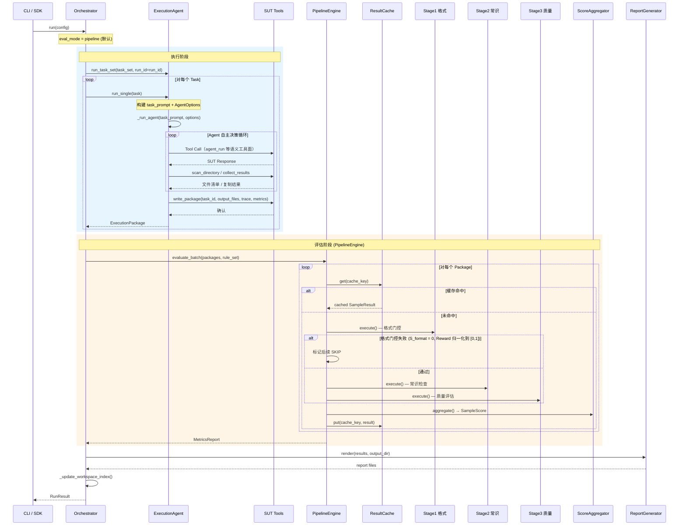

# 编排调度层设计

> 本文档详细阐述编排调度层的设计，包括 Orchestrator（统一编排器）、ExecutionAgent（执行 Agent）以及 PipelineEngine（固定级联评估）。属于 [01 整体架构设计](./01整体架构设计.md) §二中"编排调度层"的详细展开。本文以运行机制阐述为主，实现细节见对应源码与 [03 执行引擎设计](./03执行引擎设计.md)。

---

## 一、职责边界

编排调度层负责**评测流程的端到端编排**，协调执行与评估两个阶段：

| 组件 | 职责 | 不负责 |
|------|------|--------|
| **Orchestrator** | 加载配置、初始化组件、协调执行阶段与评估阶段、生成报告 | 不直接与 SUT 交互、不直接执行评估逻辑 |
| **ExecutionAgent** | 基于 DeepAgents（Python）端到端驱动执行：理解任务、调用 SUT、采集结果 | 不执行评估逻辑 |
| **PipelineEngine** | 评估引擎：固定级联管线，Stage1→Stage2→Stage3，确定性高 | 不实现具体评估逻辑（委托给 Evaluator） |

**核心设计原则**：

- **执行 Agent 化**：ExecutionAgent 理解任务描述，智能构建请求、调用 SUT、处理异常，而非硬编码的模板渲染
- **评估确定性优先**：PipelineEngine 为唯一评估模式，固定级联流程，结果可复现
- **LLM-as-judge 内建于管线**：质量/偏好等评估通过 `LLM_JUDGE` 评估方法实现，无需额外的 EvaluationAgent

---

## 二、Orchestrator — 统一编排器

### 2.1 设计理念

Orchestrator 是评测流程的**唯一入口**，职责构成见 §一「职责边界」；核心是在 RunMode 约束下协调执行阶段与评估阶段（阶段划分与函数落点见 §2.4）。

### 2.2 运行模式

| 模式 | 触发方式 | 编排流程 |
|------|----------|----------|
| **pipeline** | `agent-eval pipeline` | ExecutionAgent 执行 → PipelineEngine 评估 → 报告（单 run_id 贯通） |
| **run-only** | `agent-eval run` | 仅 ExecutionAgent 执行 → 写入 ExecutionPackage |
| **eval-only** | `agent-eval eval` | 从 workspace 加载 ExecutionPackage → PipelineEngine 评估 → 报告 |

评估阶段统一由 **PipelineEngine** 按规则集声明的 `cascade` 级联执行（详见 §四）。

run / pipeline 的高频参数概览：`--package <场景包引用>`（考卷任务集与 SUT 配置一次从包内解析，W1）、`--task <选择表达式>`（精确 ID / glob / 序号与 ID 范围 / `!排除`）、`--sut-name`（多被测系统时必选）、`--llm-role` / `--max-turns`（执行侧模型角色与轮次上限）；eval/pipeline 另有 `--upload/--no-upload`（结果上报可观测平台）。完整清单见 [CLI 使用教程](../guide/CLI使用教程.md)。

### 2.3 架构总览

```
┌───────────────────────────────────────────────────────────────────┐
│                CLI / SDK（run · pipeline · eval）                 │
└────────────────────────────────┬──────────────────────────────────┘
                                 ▼
┌───────────────────────────────────────────────────────────────────┐
│      Orchestrator —— 编排调度（cli/_stages.py 共享阶段函数）       │
│                                                                   │
│   ① resolve_run_inputs     ② execute_stage      ③ evaluate_stage │
│      解析场景包                执行阶段             评估阶段        │
│      （考卷+SUT 配置）      run/pipeline 走      eval/pipeline 走 │
│                                                                   │
│   ④ finalize_eval：trace 刷新 → 摘要打印 → 运行清单 → 上报（可选） │
└─────────────┬────────────────────────────────────┬────────────────┘
              ▼                                    ▼
┌─────────────────────────────┐    ┌─────────────────────────────────┐
│  执行阶段：ExecutionAgent    │    │  评估阶段：PipelineEngine        │
│  （DeepAgents 底座）         │    │  固定级联 · 确定性 · 可复现      │
│                             │    │                                 │
│  理解任务 → 调用 SUT         │    │   Stage1 格式门控（不过即终止）  │
│   → 采集结果 → 写执行包      │    │   Stage2 常识检查               │
│                             │    │   Stage3 质量评估（LLM Judge）  │
│  SUT Tools（LangChain 工具） │    │            │                    │
│  · Agent Protocol 语义面 ×6 │    │            ▼                    │
│    （提交/流式/线程/取消…）   │    │   ScoreAggregator 评分聚合      │
│  · 文件与落包工具 ×5         │    │   （评估器实现详见 04）          │
│    （扫描/读取/采集/写包）    │    │                                 │
└─────────────────────────────┘    └─────────────────────────────────┘
              │                                    │
              └──────────────┬─────────────────────┘
                             ▼
┌───────────────────────────────────────────────────────────────────┐
│   产出：workspace/runs/{run_id}/（执行包 · 评估结果 · 报告 · 日志） │
│   上报：ResultSink → Web 可观测平台（--upload 时，可选）            │
└───────────────────────────────────────────────────────────────────┘
```

三个运行模式的差异只在于走过哪些阶段：**pipeline 全走**（单 run_id 贯通）、**run-only 只走 ②**、**eval-only 只走 ③④**。

### 2.4 核心编排

> **实现口径（Sprint 9 收敛后）**：run / pipeline 的命令级编排收敛在 `cli/_stages.py` 的共享阶段函数；评估批量编排在 `orchestrator/orchestrator.py` 的 `eval_packages()`（云端 executor 复用同一入口）。本节按此描述。

**共享阶段函数**（`agent_eval/cli/_stages.py`）——`pipeline` 命令即按序复用：

| 阶段函数 | 职责 |
|----------|------|
| `resolve_run_inputs` | 解析执行输入：`--package` 场景包引用 → 包内 `task_sets/` 与 `sut_configs/`（或显式路径）；唯一 SUT 自动选中，多系统要求 `--sut-name` |
| `execute_stage` | 执行阶段：创建通道（当前唯一 `AgentProtocolChannel`）→ 工具服务 → `ExecutionAgent.run_task_set` 逐任务产出执行包，归位 `runs/{run_id}/packages/{task_id}` |
| `evaluate_stage` | 评估阶段：规则集解析（包内名或路径）→ 能力解析 → PipelineEngine 固定级联评估 → 结果写 `runs/{run_id}/results/` 与 `reports/` |
| `finalize_eval` | 收尾：trace 刷新、摘要打印、SUT 身份回填、平台上报（`--upload` 时经 ResultSink） |
| `write_run_manifest` | 运行清单登记：mode / package_ref / task_set / sut / packages[] + 执行包内容指纹 |

**批量评估入口**（`orchestrator/orchestrator.py::eval_packages`）：eval-only 与云端 executor 共用，职责为批量加载 ExecutionPackage → PipelineEngine 级联评估（含能力降级 / strict 控制）→ 场景化策略聚合 → 报告生成与运行清单登记。

早期版本中"单一 Orchestrator.run() 全模式编排"的伪代码已不再成立——执行与评估的阶段边界以 `_stages.py` 为准，避免本文与实现双份漂移。

---

## 三、ExecutionAgent — 执行 Agent

### 3.1 设计理念

ExecutionAgent 是执行阶段的**智能核心**，基于 **DeepAgents（Python，LangChain 官方开源）**构建（v4.6 底座，详见 [03 执行引擎设计](./03执行引擎设计.md) §3.2；Claude Agent SDK 已弃用——闭源/仅 Anthropic 协议/耦合模式）。与传统的"模板渲染 + HTTP 调用"不同，它读取 Task 的 `input` 理解任务语义，动态构建 SUT 请求、自适应处理异常，并将产出采集归档为标准 ExecutionPackage。与原 ExecutionEngine 的差异：

| 维度 | 原 ExecutionEngine | ExecutionAgent |
|------|-------------------|----------------|
| 执行方式 | SUTDriver 硬编码调用 | Agent 理解任务，智能调用 |
| 请求构建 | Jinja2 模板渲染 | Agent 根据语义动态构建 |
| 异常处理 | 固定重试策略 | Agent 根据错误类型自适应处理 |
| SUT 交互 | HTTPDriver / CLIDriver | SUT Tools (MCP) |
| 结果采集 | ResultCollector 固定逻辑 | Agent 按需采集 |
| 可扩展性 | 需新增 Driver 类 | 新增 SUT Tool 即可 |

### 3.2 SUT Tools (LangChain Tool)

ExecutionAgent 通过 SUTToolServer 提供的 LangChain Tools 与被测系统交互（v4.6：工具为 LangChain Tool 显式绑定，MCP 封装为可选）。协议型被测系统优先使用 Agent Protocol 语义工具面（见 §3.4 与 [03执行引擎设计](./03执行引擎设计.md) §4.0.6），下列通用工具用于文件/目录与产出落包：

#### 3.2.1 工具列表

| Tool 名称 | 说明 | 输入 | 输出 |
|-----------|------|------|------|
| `agent_run` 等（语义工具面 ×6） | 协议系统执行：提交/流式/线程续跑/取消/能力自检 | 由 [03](./03执行引擎设计.md) §4.0.6-b 定义 | run 结果 / SSE 聚合事件 |
| `scan_directory` | 扫描目录结构 | `directory_path`, `file_patterns` | 文件清单 + 目录层级 |
| `read_file` | 读取产出文件内容 | `file_path` | 文本内容（截断） |
| `list_files` | 列出目录内文件 | `directory_path` | 文件名列表 |
| `collect_results` | 收集执行结果 | `source_path`, `output_path` | 复制的文件列表 |
| `write_package` | 写入 ExecutionPackage | `task_id`, `output_files`, `trace`, `metrics` | 确认信息 |
| `invoke_http_sut` / `invoke_cli_sut` | HTTP / CLI 调用（**预留不排期**；逻辑下沉为通道层能力） | — | — |

#### 3.2.2 Tool 实现约定

全部工具定义在 `agent_eval/agent/sut_tools.py`，统一约定：

- 以 LangChain `@tool` 装饰器声明，带类型化入参 schema（Agent 据此自主填参）
- 返回值统一为 JSON 文本，长输出**截断**（正文 10k / stderr 5k），避免撑爆上下文
- 文件类工具内部复用 `DirectoryCollector` 等既有组件，不重复实现
- 工具语义与消息面定义见 [03执行引擎设计](./03执行引擎设计.md) §4.0.6

### 3.3 SUT Tool Server 构建

`SUTToolServer`（同模块）承担**工具白名单**职责：按 SUT 类型装配工具集合，经 `to_langchain_tools()` 显式绑定给 DeepAgents 实例；工具命名与 allowed_tools 约束同见 [03](./03执行引擎设计.md)。

### 3.4 ExecutionAgent 执行机制

实现位于 `agent_eval/agent/execution_agent.py`。单任务执行（`run_task`）分五步：

1. **建输出目录**：`runs/{run_id}/packages/{task_id}/output`（run_id 由 CLI `execute_stage` 注入，用于运行清单登记与外部关联）
2. **构建任务消息**：任务信息（ID / 输入 / 约束 / 输出目录）+ SUT 配置，尾部附加**确定性转发指令段**——要求 Agent 以固定格式将任务输入原样转发给被测系统（v4.6.3，修复 `agent_run` input 格式不一致问题），并声明产出落包要求
3. **装配 DeepAgent 实例**：
   - 模型：`build_chat_model(llm_role, model)` 双协议桥接（`agent/model_bridge.py`，模型无关）
   - 工具：SUT Tools 白名单绑定
   - System Prompt：**YAML 资产**（`assets/configs/execution_agent_prompts.yaml`，v4.6.5 起 no hardcode），仅做 `{tools}` / `{max_turns}` / `{max_retries}` 变量替换，模板全文见 [03](./03执行引擎设计.md) §3.3
   - 预算：`recursion_limit = max_turns × 2` + `BudgetGuard` 回调（见 §3.7）；会话 checkpointer 暂不接入图装配（v4.6.3 决策，见 03 §3.2）
4. **执行 Agent 循环**：`thread_id = task.id` 发起调用，LangChain 消息序列回填 `AgentSession`（推理文本、工具调用、token 用量）
5. **构建 ExecutionPackage**：从会话记录归档产出；**异常路径同样写包（status=failed）**，保证链路可审计

批量入口 `run_task_set` 即共享 run_id 逐任务调用 `run_task`，返回 `(run_id, 执行包列表)`。

### 3.5 AgentSession — 会话记录

单次 Agent 会话的完整记录（`agent/session.py`），是从"Agent 跑了一遍"到"可评估数据包"的中间结构：

| 字段 | 含义 |
|------|------|
| `reasoning` | Agent 自然语言推理过程 |
| `tool_calls` | 工具调用记录（含入参 / 结果 / 耗时） |
| `turns_used` | 消耗的 turn 数 |
| `cost_usd` | 消耗的 USD |

### 3.6 AgentConfig — Agent 配置

ExecutionAgent 的配置（与 [03执行引擎设计](./03执行引擎设计.md) §六 对齐）：

| 字段 | 缺省 | 含义 |
|------|------|------|
| `llm_role` | `"agent"` | 执行侧 LLM 角色（text / vision / agent；未配置回退 text） |
| `model` | `None` | 模型覆盖（缺省取 llm.json 该角色模型，经 model_bridge 双协议桥接） |
| `workspace_dir` | `workspace` | 工作区根目录 |
| `max_turns` | `20` | 单任务最大 turn 数 |
| `max_budget_usd` | `1.0` | 单任务最大预算（USD） |
| `max_retries` | `3` | SUT 调用失败重试次数 |
| `log_dir` | `None` | Agent 日志目录（缺省 `runs/{run_id}/agent_logs`） |

### 3.7 预算控制

预算由 §3.6 的两个参数控制：`max_turns`（CLI `--max-turns` 可覆盖，对应 `recursion_limit = max_turns × 2`）与 `max_budget_usd`。超限经 `BudgetGuard` 回调终止 Agent 循环并写错误包、返回部分结果——机制见 §6.2。

---

## 四、评估引擎（PipelineEngine）

PipelineEngine 是评估流程的**唯一编排器**：按级联顺序调度各阶段评估器，管理短路和缓存。评估器的具体实现参见 [04 评估引擎设计](./04评估引擎设计.md)。

### 4.1 级联架构

```
输入 ExecutionPackage
       │
       ▼
  ┌─────────────────────────────────┐
  │ Stage 1: 格式门控 (HARD_GATE)   │  Rule-based，低成本
  │ format.response_format           │
  │ format.html_validity             │
  └───────────────┬─────────────────┘
                  │ 全通过 → S_format = +1
                  ├── 任一失败 → S_format = 0，终止后续
                  ▼
  ┌─────────────────────────────────┐
  │ Stage 2: 常识检查 (HARD_SCORE)  │  事实验证，中成本
  │ commonsense.info_accuracy        │
  │ commonsense.chronological_order  │
  │ commonsense.logical_consistency  │
  └───────────────┬─────────────────┘
                  │ 全通过 → S_common = +1
                  ├── 任一失败 → S_common = 0，继续后续
                  ▼
  ┌─────────────────────────────────┐
  │ Stage 3: 质量评估 (SOFT/PREF)   │  LLM-as-judge，高成本
  │ soft.teaching_logic              │
  │ soft.content_diversity           │
  │ pref.style_preference            │
  │ pref.depth_preference            │
  │ pref.request_fulfillment         │
  └───────────────┬─────────────────┘
                  ▼
  ┌─────────────────────────────────┐
  │ ScoreAggregator 评分聚合        │  → 详见 04 评估引擎设计 §六
  │ Reward = S_format + S_common    │
  │       + w3 * S_soft + w4 * S_pref│
  └─────────────────────────────────┘
```

### 4.2 评估流程与缓存

PipelineEngine（实现位于 `agent_eval/evaluation/engine.py`）对单个样本的评估流程：

1. **缓存检查**：按三层指纹计算缓存 Key——执行包内容指纹（包内产出按「相对路径+内容」聚合的 SHA256，随运行清单登记）+ 规则集版本 + LLM 配置指纹（剔除 api_key 的角色配置摘要）。**任一变化即失效重评**；命中则跳过全部阶段
2. **逐阶段执行**：按级联顺序执行 PipelineStage；HARD 门控失败时将后续阶段标记为 SKIP 并终止本样本（短路）
3. **评分聚合**：`ScoreAggregator`（确定性代码）产出 S_format / S_common / S_soft / S_pref / Reward
4. **结果写缓存**：`workspace/cache/` 跨运行共享

批量评估（`evaluate_batch`）即逐包执行上述流程，最终由 `MetricsCalculator`（场景化策略）汇总为 MetricsReport。

### 4.3 PipelineStage — 阶段执行器

单阶段执行器，职责边界一句话：**顺序执行本阶段全部评估器，按 tier 判定门控**。评估器 tier 为 `HARD_GATE` / `HARD_SCORE` 且结果 FAIL 时置 `gate_passed=False`；短路策略为 `fail_fast`（默认）时立即跳出，`continue` 则跑完本阶段。阶段结果（含逐约束明细）交回 PipelineEngine。

### 4.4 管线配置

阶段结构由场景包规则集的 `cascade` 声明（声明式，无 hardcode）：每阶段含 `stage` / `name` / `stop_on_fail`，规则经 `evaluator` 字段挂接到阶段：

```yaml
# 场景包规则集（packages/courseware/1.0.0/rules/*.yaml）：cascade 声明三阶段
cascade:
  - stage: format
    name: "格式门控"
    stop_on_fail: true       # 失败终止后续（fail_fast）
  - stage: commonsense
    name: "常识门控"
    stop_on_fail: false
  - stage: quality
    name: "质量评估"
    stop_on_fail: false
```

其设计权衡如下：

| 维度 | 设计选择 | 原因 |
|------|----------|------|
| 执行策略 | 固定 Stage1→Stage2→Stage3 级联，纯代码逻辑 + 固定评分聚合 | 结果可复现、易调试、成本可控 |
| 短路控制 | 代码级 `if gate_passed: break` | 格式门控失败立即终止，避免无意义的高成本 LLM 调用 |
| 评估器调用 | 代码循环遍历 RuleSet 中启用的评估器 | 确定性执行，无 Agent 推理开销 |
| LLM 评估 | 通过 `LLM_JUDGE` / `LLM_CONSISTENCY` 评估方法内建 | Stage3 质量/偏好评估直接调用 LLM-as-judge，无需额外 Agent 层 |
| Token 消耗 | 仅发生在 LLM 评估器内部 | 无额外 Agent 循环开销 |
| 可观测性 | 结构化日志 + 约束结果 | 每个 Stage、每个评估器的输入/输出/耗时均可追溯 |
| 扩展性 | 新增评估器插件 + 规则集配置 | 插件机制见 [04 评估引擎设计](./04评估引擎设计.md) §5.4 |

---

## 六、Agent Hooks — 监控与安全

### 6.1 设计理念

通过 **LangGraph 回调（callbacks）**实现 Agent 过程的监控和安全控制（v4.6：随 DeepAgents 底座，取代原 Claude SDK Hooks 机制）。回调仅适用于 ExecutionAgent（评估阶段为确定性 PipelineEngine，无需回调）。

### 6.2 回调实现

```python
from agent_eval.agent.callbacks import ToolAuditCallback, BudgetGuard, SafetyGuard

# LangGraph 回调（v4.6）：on_tool_start/end 审计、on_llm_end 预算累计、工具调用前置安全检查
EXECUTION_CALLBACKS = [
    ToolAuditCallback(),      # on_tool_start/on_tool_end → 结构化日志（tool_calls/timing，用于审计）
    BudgetGuard(budget_usd),  # on_llm_end → token/成本累计，超限抛 BudgetExceededError 终止图执行
    SafetyGuard(),            # 工具入参前置检查（禁止删除类危险操作）
]
```

### 6.3 Agent 会话日志

每次 Agent 会话的完整记录保存到 `workspace/runs/{run_id}/agent_logs/`：

```
runs/{run_id}/agent_logs/
├── agent_{task_id}.jsonl               # 每任务一个 JSONL 事件流：
│                                       #   agent_start / tool_call / tool_result /
│                                       #   agent_decision / agent_end / error
└── agent_summary.jsonl                 # 每任务收尾追加一条汇总（turns/tool_calls/cost）
```

### 6.4 结构化日志要求

**系统所有日志均采用结构化输出。**

| 要求 | 说明 |
|------|------|
| **JSON Lines 格式** | 所有日志为 JSON Lines（structlog + JSON renderer），可被 ELK/Grafana 等工具直接消费 |
| **完整追踪链** | 每条日志包含 `run_id`、`task_id`、`trace_id`，支持全链路追踪 |
| **执行阶段日志** | ExecutionAgent 的每次 Tool 调用、决策、成本均为结构化输出（详见 [03执行引擎设计](./03执行引擎设计.md) §七a） |
| **评估阶段日志** | PipelineEngine 每个 Stage 的评估结果、缓存命中、短路判定均为结构化输出 |

**日志数据对齐**：各产出物（ExecutionPackage / EvaluationResult / MetricsReport / agent_logs）的归属组件见 §2.3 产出层框图。

## 七、缓存策略

缓存 Key 构成、失效条件、存储位置与命中行为见 §4.2；补充两条边界：

- **粒度**：样本级——缓存整个执行包的评估结果
- **仅评估阶段有缓存**：ExecutionAgent 的执行结果不缓存（SUT 每次调用结果可能不同）

---

## 八、时序图

### 8.1 默认模式（PipelineEngine）


```mermaid
sequenceDiagram
    participant CLI as CLI / SDK
    participant ORC as Orchestrator
    participant EA as ExecutionAgent
    participant SUT as SUT Tools
    participant PE as PipelineEngine
    participant Cache as ResultCache
    participant S1 as Stage1 格式
    participant S2 as Stage2 常识
    participant S3 as Stage3 质量
    participant SA as ScoreAggregator
    participant RG as ReportGenerator

    CLI->>ORC: run(config)
    Note over ORC: eval_mode = pipeline (默认)

    rect rgb(230, 245, 255)
        Note over ORC,SUT: 执行阶段
        ORC->>EA: run_task_set(task_set, run_id=run_id)

        loop 对每个 Task
            ORC->>EA: run_single(task)
            Note over EA: 构建 task_prompt + AgentOptions
            EA->>EA: _run_agent(task_prompt, options)

            loop Agent 自主决策循环
                EA->>SUT: Tool Call（agent_run 等语义工具面）
                SUT-->>EA: SUT Response
                EA->>SUT: scan_directory / collect_results
                SUT-->>EA: 文件清单 / 复制结果
            end

            EA->>SUT: write_package(task_id, output_files, trace, metrics)
            SUT-->>EA: 确认

            EA-->>ORC: ExecutionPackage
        end
    end

    rect rgb(255, 245, 230)
        Note over ORC,SA: 评估阶段 (PipelineEngine)
        ORC->>PE: evaluate_batch(packages, rule_set)

        loop 对每个 Package
            PE->>Cache: get(cache_key)
            alt 缓存命中
                Cache-->>PE: cached SampleResult
            else 未命中
                PE->>S1: execute() — 格式门控
                alt 格式门控失败 (S_format = 0, Reward 归一化到 [0,1])
                    PE->>PE: 标记后续 SKIP
                else 通过
                    PE->>S2: execute() — 常识检查
                    PE->>S3: execute() — 质量评估
                end
                PE->>SA: aggregate() → SampleScore
                PE->>Cache: put(cache_key, result)
            end
        end

        PE-->>ORC: MetricsReport
    end

    ORC->>RG: render(results, output_dir)
    RG-->>ORC: report files
    ORC->>ORC: _update_workspace_index()
    ORC-->>CLI: RunResult
```

---

## 九、版本记录

> 逐版一行速览，只记「改了什么」；演进理由见 git 提交历史与正文对应章节。

| 版本 | 日期 | 变更内容 |
|------|------|----------|
| v1.0 | 2026-06-08 | 自总览独立；PipelineEngine 级联架构 |
| v1.1 | 2026-06-08 | Orchestrator 增 workspace 索引更新 |
| v2.0 | 2026-06-09 | Agent-First 重构（EvaluationAgent 模式，后移除） |
| v3.0 | 2026-06-09 | 新增 ExecutionAgent 执行侧；PipelineEngine 为默认评估 |
| v4.0 | 2026-07-07 | 移除可选评估模式，评估统一 PipelineEngine |
| v4.1 | 2026-08-18 | 执行底座切换 DeepAgents，工具改 LangChain Tool |
| v4.2 | 2026-08-27 | Sprint 8/9 同步：_stages.py 阶段编排、语义工具面、Prompt 资产化、缓存键指纹 |
| v4.3 | 2026-09-04 | 架构总览改框图；大段代码改机制描述；版本记录精简；全文去重 |
