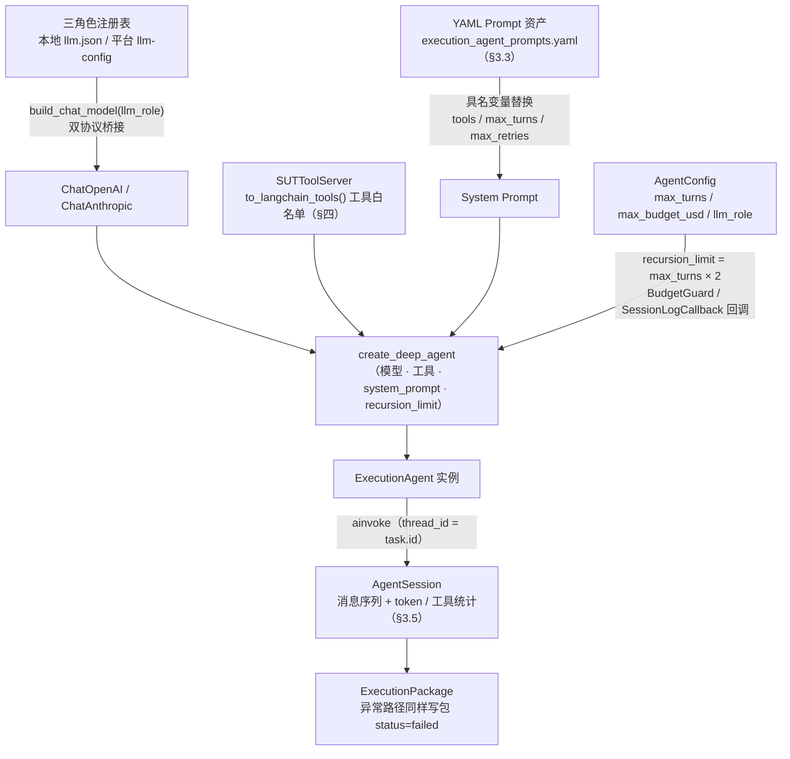
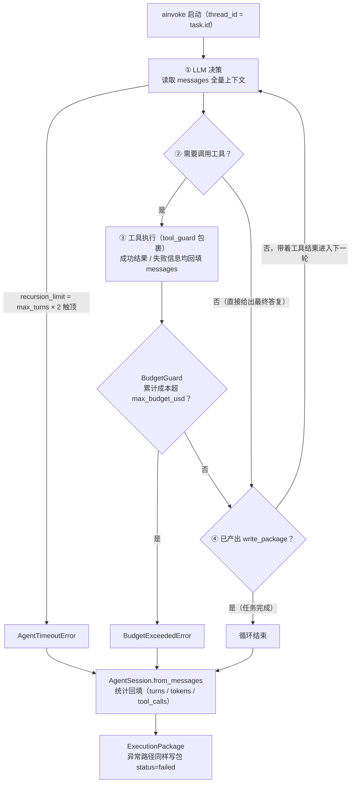

# 执行引擎设计

> 本文档阐述执行引擎的设计：执行引擎全面采用 **Agent-Driven** 架构，ExecutionAgent（基于 **DeepAgents（Python）** 开源 Agent 框架，模型经角色注册表桥接双协议）端到端驱动评测执行流程，SUT 交互工具以 **LangChain Tool 显式绑定**（MCP 为可选封装）。属于 [01 整体架构设计](./01整体架构设计.md) §二中"执行引擎"的详细展开。本文以运行机制阐述为主，实现细节见对应源码（`agent_eval/agent/`、`agent_eval/execution/`）。

---

## 一、职责边界

执行引擎负责**驱动被测 Agent 运行并采集结果**，不涉及任何评估逻辑：

| 组件 | 职责 |
|------|------|
| **ExecutionAgent** | 基于 DeepAgents（Python，开源、双协议模型无关），端到端驱动执行流程：理解任务、调用 SUT Tools、处理错误、收集结果、生成 ExecutionPackage |
| **SUTToolServer** | 提供 SUT Tools（LangChain Tool 显式绑定，MCP 为可选封装：Agent Protocol 语义调用、目录扫描、文件读取、结果收集等），供 ExecutionAgent 调用 |
| **DirectoryCollector** | 遍历目录结构、收集 HTML 文件、生成目录清单。位于 `storage/collector.py`，数据模型定义于 `storage/package.py`，通过 `scan_directory` Tool 暴露给 Agent |
| **TaskSetBuilder** | 任务集构建工具（从零创建 / LLM 半自动生成） |

> **架构变更说明**：传统设计中的 ExecutionEngine + SUTDriver（HTTPDriver/CLIDriver/AgentSUTDriver）分层架构已被 ExecutionAgent + SUT Tools 的 Agent-Driven 架构取代——HTTPDriver/CLIDriver 的逻辑下沉为工具与通道层能力，ExecutionAgent 根据任务描述智能选择调用。
>
> **通道决策（v4.4 定向 / v4.5 收敛）**：全部对接系统均实现 [Agent Protocol](https://langchain-ai.github.io/agent-protocol/api.html)（v0.1.6），本期唯一排期通道为 **AgentProtocolChannel**；通道与鉴权架构（多系统登录、会话复用与凭证安全）见 §4.0。

---

## 二、执行侧数据模型

### 2.1 RunMode — 运行模式

| 模式 | 枚举值 | 行为 |
|------|--------|------|
| 仅执行 | `run-only` | 仅驱动被测 Agent（ExecutionAgent），不进行评估 |
| 仅评估 | `eval-only` | 仅对已有执行包评估，不驱动 SUT |
| 全流程 | `pipeline` | 执行（ExecutionAgent）+ 评估（PipelineEngine）依次完成 |

### 2.2 Task — 单个任务

| 字段 | 类型 | 说明 |
|------|------|------|
| `id` | `str` | 任务唯一标识 |
| `input` | `dict` | 输入参数（学科、年级、知识点等） |
| `expected` | `dict \| None` | 预期结果（知识点清单、约束等） |
| `constraints` | `dict` | 约束条件（文档数量、格式等） |
| `input_mode` | `str = "inline"` | `"inline"`（默认）\| `"directory"`（目录模式） |
| `directory_path` | `str \| None` | 目录路径（`input_mode="directory"` 时必填） |
| `file_patterns` | `list[str]` | 文件匹配模式（如 `["*.html", "*.htm"]`） |

### 2.3 TaskSet — 任务集

`{id, name, description, tasks: list[Task]}`——一次执行的任务集合。

### 2.4 SUTResponse — 被测 Agent 响应

| 字段 | 说明 |
|------|------|
| `success` | 是否成功 |
| `output_files` | 输出文件路径列表 |
| `output_directory` | 输出目录路径（目录模式） |
| `metadata` | Agent 返回的元数据 |
| `error` / `raw_response` | 错误信息 / 原始响应 |

### 2.5 ExecutionTrace — 执行轨迹

| 字段 | 说明 |
|------|------|
| `request` | 发送给 SUT 的请求 |
| `response` | SUT 的响应（含 `sut` 摘要，见下） |
| `started_at` / `finished_at` | ISO 8601 起止时间 |
| `error` | 错误信息 |

**`response.sut` 回填（v4.6.4）**：AgentProtocolToolServer 记录最近一次 run 摘要 `last_run = {status, thread_id, run_id, text}`（text 为截断前原文），ExecutionAgent 写 trace.json 时回填至 `response.sut`——否则 trace 只存 messages/tool_calls 计数，下游 `agent-eval eval` 拿不到 SUT 回答文本、无法评估回答质量。

### 2.6 ProcessMetrics — 过程指标

`{total_duration_ms, steps, retries, tool_calls, dead_end}`——单任务执行过程的耗时、步数、重试与工具调用统计。

---

## 三、ExecutionAgent — Agent 驱动执行

### 3.1 设计理念

> **目标架构已立项**：执行回路的系统性重设计（机械壳 + 决策体——声明式交互预算 / 动作闸门 / 证据台账 / 统一收尾 / 决策简报 / 完成仲裁）见 [16 执行器健壮性架构设计](./16执行器健壮性架构设计.md)；本节及 §四描述的是**现行实现**，Phase 1–3 迁移完成后由其收敛。

传统执行引擎采用 ExecutionEngine + SUTDriver 分层架构：引擎调度 Driver，Driver 机械地渲染模板、发送请求、解析响应。这种方式在简单场景下工作良好，但面对以下挑战时力不从心：

- **任务多样性**：不同 SUT 的接口格式、认证方式、错误模式各不相同，硬编码逻辑难以覆盖
- **错误恢复**：网络超时、服务降级、参数不匹配等问题需要智能判断和处理策略
- **上下文理解**：某些任务需要理解任务描述的语义，动态调整请求构造方式

**Agent-Driven 方案的核心思想**：将执行控制权交给一个理解任务语义的智能 Agent（基于 DeepAgents（Python）开源框架，模型经角色注册表桥接双协议——模型无关），由 Agent 根据任务描述自主决定调用哪些 SUT Tools、如何构造请求参数、遇到错误时如何重试或降级，最终生成结构化的 ExecutionPackage。

**与传统方案的对比**：

| 维度 | 传统 ExecutionEngine + SUTDriver | Agent-Driven ExecutionAgent |
|------|----------------------------------|------------------------------|
| 执行控制 | 代码硬编码的固定流程 | Agent 理解任务后自主决策 |
| 请求构造 | Jinja2 模板变量替换 | Agent 理解任务语义后智能构造 |
| 错误处理 | 预定义的重试/超时策略 | Agent 根据错误类型动态决策 |
| 结果收集 | 固定的文件复制/解析逻辑 | Agent 调用 scan_directory / collect_results 灵活收集 |
| 适应性 | 新 SUT 需编写新 Driver | 新 SUT 只需配置 Tool 参数 |
| 可观测性 | 日志记录 | 完整的 Agent 会话记录（所有决策过程可见） |

### 3.2 核心机制与底座集成

实现位于 `agent_eval/agent/executor/agent.py`。Agent 实例不是手写类，而是由四路输入经 DeepAgents 官方入口 `create_deep_agent`（`[agent]` optional extra，惰性导入）**装配**而成：



单任务 `run_task` 跑完上图即产出一个执行包；批量 `run_task_set` 共享 run_id 逐任务执行，返回 `(run_id, 执行包列表)`（run_id 由 CLI 注入，用于运行清单登记）。**逐任务开始/结束上终端进度日志**（task_id / progress / status / elapsed_s）——执行域只有一根转轮，单任务数十分钟时静默会被误判为卡死（SUT 反问循环实测 2026-09）。任务级五步执行流程见 [02 编排调度层设计](./02编排调度层设计.md) §3.4。

**底座集成要点（v4.6）**：

| 集成点 | 方案 |
|--------|------|
| 模型接入 | `build_chat_model(llm_role)`：读三角色注册表（`resolve_llm_config` 双形态解析：本地 `~/.agent_eval/llm.json` 优先、平台 `llm-config` 兜底，[05](./05LLM模块设计.md)），按协议构造 `ChatOpenAI`（OpenAI 兼容）或 `ChatAnthropic`（Anthropic 兼容），带 `base_url`/`api_key`/`model` 与**显式请求上限**（timeout=120s / max_retries=2——SDK 默认超时可达 600s，执行循环一次卡顿即数分钟无输出）——**执行 Agent 与评估 LLM 共用同一配置源** |
| 工具绑定 | SUTToolServer 工具导出为 LangChain Tool（`@tool` 装饰或 StructuredTool.from_function）显式传入；**工具面复位中间件（v4.15，plan/07 G1）**：`create_deep_agent` 对内置工具 additive 合并，需经 `agent/core/tool_filter.py` 共享的 `ExecutionToolsetFilter`（与工作台域 `WorkbenchToolsetFilter` 同实现、按域异名）把模型可见工具面**复位**为自研装配清单——否则 `FilesystemMiddleware` 的 6 个 StateBackend 虚拟 FS 工具（ls/read_file/…）混进可见面（真实路径恒返回 "No files found"，run 20260911_010507 最后两轮烧在其上），且内置 `read_file` 与自研白名单同名歧义 |
| 预算控制 | BudgetGuard 实现 LangGraph 回调（`on_llm_end` 累计 token → 成本估算，超 `max_budget_usd` 抛 `BudgetExceededError` 终止图执行） |
| 会话状态 | WorkspaceCheckpointer（LangGraph BaseCheckpointSaver 实现）落 `workspace/agent_sessions/`，崩溃可恢复、可重放、可审计；SCF 部署时换 PG/COS 实现。**v4.6.3 未接图装配**：langgraph 高频触达 saver，文件全量读写实现拖垮执行（staging 实测 CPU 空转），单发 ainvoke 亦无恢复需求；待 B4 实现增量真 saver（pending_writes 按 checkpoint_id 索引）后接回 |
| 上下文压缩 | DeepAgents 内置压缩能力直接受益（SUT 大产物回填场景），无需自研 |
| 依赖管理 | `deepagents` + `langgraph` 放 evaluator `[agent]` optional extra（仿 playwright 惰性导入惯例），未安装时 CLI 给出友好提示 |

### 3.3 System Prompt 构建

System Prompt 引导 ExecutionAgent 理解自身角色和执行规则。**模板自 v4.6.5 起抽离为 YAML 资产**（`agent_eval/assets/configs/execution_agent_prompts.yaml`，对齐 summary_prompt.yaml 惯例——prompt 不 hardcode 在代码里，资产损坏 fail-fast）；代码侧仅做具名变量替换。**v4.15 起五段结构**（plan/07 G3）：通用规则按主题分组，通道专属纪律独立成段按工具面注入——agent_protocol 专属规则不再污染 generic_http 任务：

| 段落 | 内容 | 注入变量 |
|------|------|----------|
| 职责 | 理解任务 → 构造请求调用 SUT Tool → 检查响应/智能重试 → 收集结果 → 写执行包 | — |
| 可用工具 | 工具清单与用途说明 | `{tools}`（全部注册表 describe_tools() 汇总） |
| 执行规则（通用，按主题分组） | **会话纪律**：SUT 反问以用户代理人身份当场作答（执行面没有人工通道，等待只会耗尽轮次）；`status=interrupted` 的正式反问经 `answer_sut_questions` 逐题应答并自动续跑（§4.0.6-i）；多轮交互续用原线程（`run_on_thread`——`agent_run` 新建会话丢失上下文，SUT 只会再次提出同样的问题）；被反问超 3 次仍无法推进即写失败包收尾。**产物纪律**：必须调用 `write_package` 收尾；产物获取四步（v4.14 立纪律，v4.16 只读取证前移）——回复含产物路径/下载链接立即 `download_sut_file` 落包；无产物或 run 超时先 `read_thread_state` **只读取证**（GET state 不注入消息），`thread_busy=false` 即 SUT 已完成、产物线索看 values 与 messages 尾部；只读取证仍无产物才经 `run_on_thread` 索取路径（v4.19 催促次数改由闸门控制，被拒即停；每次催促都是向 SUT 会话注入新消息，禁止空转催促），仍无即带证据写失败包；SUT 环境路径本机不存在，`collect_results` 只收本机 workspace 已有文件。**失败处理**（v4.19）：交互预算由机械闸门执行——工具返回 `BudgetExhausted` 拒绝（含预算明细与收尾指引）即按 guidance 行动（先取证、有产物下载、无产物写失败包），不换工具重试同一动作；服务错误至多重试 `{max_retries}` 次；连续 2 次同类失败判定 SUT 配置层问题直接收尾。**安全边界** | `{max_retries}`（`{max_turns}` 占位保留、正文不再引用——数字条款清零，v4.19） |
| 通道纪律（v4.15） | 按 ToolServer 的 `discipline_key` 类属性从 YAML `channel_discipline` 段取对应文本拼接（不声明或无对应段则不注入）——**工具面与规则面同源**：agent_protocol 注册表注入反问应答/线程续用/产物获取三步纪律，generic_http 注册表注入模板预置纪律 | `{channel_rules}` |
| 输出规范 | 产出写入指定 workspace 目录；目录模式需先 `scan_directory` 生成清单 | — |

> 规则全文以 YAML 资产为准，此处不重复；构建逻辑收在 `executor/prompts.py`（`describe_channel_rules` 拼装 + `build_system_prompt` 变量注入），`agent.py` 仅一行委托（v4.15 随 G4 拆分）。

### 3.4 Task Prompt 构建

Task Prompt 提供具体任务信息，按段拼接（JSON 序列化，`ensure_ascii=False`）：

| 段落 | 内容 |
|------|------|
| 任务 ID / 任务输入 | `task.id` + `task.input`（必选） |
| 预期结果 / 约束条件 | `task.expected` / `task.constraints`（存在才拼入） |
| 目录模式段 | `input_mode="directory"` 时拼入目录路径与文件匹配模式，并指示先 `scan_directory` 再收集 |
| 确定性转发指令段（v4.6.3） | 尾部附加固定格式指令——要求 Agent 将任务输入**原样转发**给被测系统（修复 `agent_run` input 格式不一致问题），并声明产出落包要求 |
| 收尾指令 | 完成后调用 `write_package` 写入执行包 |

模板同样在上述 YAML 资产中（v4.6.5）。两段 Prompt 最终拼成 Agent 收到的完整消息（即 §3.5 循环起点 `ainvoke` 的输入）：

```
messages = [
  system  ← System Prompt（§3.3 四段模板 + 变量注入）
  user    ← Task Prompt（上表各段按序拼接）
]
```

### 3.5 Agent 会话管理

ExecutionAgent 通过 DeepAgents 的 `ainvoke` 迭代运行整个会话生命周期。**Agent 驱动执行的本质就是这个循环**——每轮由 LLM 看全量上下文现场决策，没有预排的调用脚本：



三条退出路径对应 §七 的异常策略：触顶抛 `AgentTimeoutError`、超预算抛 `BudgetExceededError`、正常以 `write_package` 收尾——无论哪条，都落到包上（链路可审计）。checkpointer 外部化为 B4 遗留项（v4.6.3 摘除图装配，见 §3.2 底座集成要点表）。

**AgentSession 字段**：`messages`（完整交互历史）、`total_input_tokens` / `total_output_tokens`、`tool_call_count`、`started_at` / `finished_at`。会话收尾时 `messages` 物化为包根 **`transcript.md`**（v4.9）：任务指令 + 逐条对话（ai 文本，**思考块剥离**）+ 工具调用（名称与入参）及其结果（含 SUT 反问）——`answer.md` 只承载 SUT 最终回答（评估输入），人类可读的过程证据由 transcript 补全；单条超长截断（完整原文在 agent_logs 会话日志）。

会话管理的关键机制：

| 机制 | 说明 |
|------|------|
| **消息追踪** | 记录 Agent 的每一步决策和工具调用，支持事后审计 |
| **Token 计量** | 统计输入/输出 token，用于成本控制和预算管理 |
| **轮次限制** | `max_turns` 防止 Agent 无限循环 |
| **预算控制** | `max_budget_usd` 硬性限制单任务花费上限 |

### 3.6 预算控制

预算双层控制：**参数层**由 `max_turns`（轮次）与 `max_budget_usd`（金额）约束（缺省值见 §六）；**执行层**由 `BudgetController` 三态状态机（`ok` / `warning`（≥80% 预算）/ `exceeded`）计量，超限经 `BudgetGuard` LangGraph 回调抛 `BudgetExceededError` 终止图执行——组件实现见 §7a.2。

**轮次预算任务级生效**（v4.17）：任务集在 `task.constraints.max_turns` 声明的轮次**接线生效**——优先于 `AgentConfig.max_turns`（此前声明不接线，任务集声明 5 实际按 20 跑，宽预算放大失败重试/空转催促的燃烧空间）；`recursion_limit = 生效值 × 2`，轮次耗尽报错文案携带生效值。声明值非法（非正整数）时静默回退配置值。

**交互预算声明化与机械闸门**（v4.19，[arch/16 §四](./16执行器健壮性架构设计.md) Phase 1 落地）：语义预算从 prose 纪律与裸轮次数上收为任务集/任务级 `interaction_policy` 声明（`sut_calls_total` / `dispatch` / `nudges` / `state_polls` / `downloads` / `nudge_backoff_s` / `wall_clock_deadline_s`，继承链 task 覆盖 > task_set > 全局缺省，非法子键静默回退上层）；`ResourceLedger` 按动作在**工具入口**授权（`authorize()` 计 attempt，拒绝不消耗），拒载返回 `BudgetExhausted` 拒绝载荷（预算明细 + `guidance` 收尾指引 + `ledger_digest`）——被拒动作不触网，取证/下载/写包工具不设闸；每次 SUT 交互记入 `EvidenceLedger` 并随执行包落 `ledger.jsonl`（§4.12 清账语义不变，账本逐任务新建）。`recursion_limit` 对声明 policy 的任务改为保险丝公式 `derive_recursion_limit`（宽于语义预算、只兜图失控），未声明任务沿用 `max_turns` 旧链（双轨迁移，Phase 2 降格）。

---

## 四、SUT Tools — SUT 交互工具

**这一层回答一个问题：Agent 怎么「动手」。** ExecutionAgent 自己不能联网、不能读写文件——它的一切外部动作都通过工具完成。SUT Tools 就是 Agent 的手脚，分两类：**对话类**负责跟被测系统打交道（发任务、等结果、续跑多轮），**落地类**负责整理产出（扫描文件、收集结果、写执行包）。用哪些工具、传什么参数，由 Agent 根据任务描述自主决定。

整个交互栈分三层，各管一件事：

```
ExecutionAgent —— 只认工具，不感知底层连的是哪个系统
      │ 调用
      ▼
工具层（Agent 看得见的手，§4.1–4.7）
  · 对话类：agent_run / agent_run_stream / create_thread / cancel_run …（§4.0.6-b）
  · 落地类：scan_directory / collect_results / write_package（§4.4–4.6）
      │ 按目标系统类型选择通道
      ▼
通道层（连什么系统，§4.0）
  · AgentProtocolChannel —— 本期唯一排期（§4.0.6）
  · GenericHttpChannel / BrowserChannel —— 预留不排期
      │ 每次连接需要有效登录态
      ▼
鉴权层（怎么登录，§4.0.1–4.0.5）
  CredentialStore 供凭证 → AuthProvider 执行登录 → SUTSession 会话复用
```

两个关键设计，解释了这层为什么长这样：

- **工具是白名单**：工具以 LangChain Tool 显式绑定给 DeepAgents（v4.6，`SUTToolServer` 即工具注册表，见 §4.1）——没绑定的不可用；MCP 封装降为可选形态。
- **协议标准化消灭了定制请求**：全部被测系统都实现 Agent Protocol（端点、状态机、输入输出模型都是同一套），所以「每个系统写一套请求模板」不再需要——只剩两处系统差异要配置：**怎么登录**（§4.0.2）与**结果在哪**（`output_paths`，§4.0.6-c）。

> 读者路线：关心 Agent 能调哪些工具 → §4.1–4.7；关心多系统怎么连接与登录 → §4.0；关心协议交互细节 → §4.0.6。

### 4.0 通道与鉴权架构（v4.4 新增）

**为什么需要这一层**：最早的 `invoke_http_sut` 只会「向单个无鉴权系统发一次性 HTTP」，而实际要对接的是**多个系统、各有各的登录方式**。缺五项能力，本节逐项补齐：

1. **登录流程编排**——先调登录接口、拿到凭证，再发业务请求；
2. **会话复用**——token/cookie 跨任务复用，不能每个任务都登录一遍（触发风控）；
3. **过期自动重登**——会话有有效期，失效后无感恢复；
4. **多系统配置管理**——多份 sut_config 各描述一个系统，按名字索引；
5. **凭证安全**——账密/token 绝不进包配置与日志。

**通道决策**：本期排期通道为 **AgentProtocolChannel**（§4.0.6）与 **GenericHttpChannel**（§4.2 模板模式，v4.7.3 落地，服务非协议系统）；`BrowserChannel`（Playwright，UI-only 兜底 + 截图挂接 VisionEvaluator）**预留不排期**——排期面单源于 `registry.SCHEDULED_CHANNELS`（执行工厂/落盘门禁/执行域预检三处共用），`SUTChannel` 抽象保证后续按需增补实现类，不影响鉴权层与本层其余组件。

#### 4.0.1 组件抽象

五个组件串成一条登录链：**SUTRegistry**（花名册）里按名字查到系统 → **CredentialStore**（凭证库）取出账密 → **AuthProvider** 执行登录拿到 **SUTSession**（会话）→ **SUTChannel**（通道）带着会话去连接系统。

| 组件 | 职责 | 位置（规划） |
|------|------|------|
| **SUTChannel** | 通道抽象：统一"向被测系统发起一次交互"的语义（发送请求 / 挂载会话 / 判定会话失效）。本期实现 `AgentProtocolChannel` 与 `GenericHttpChannel`；`BrowserChannel` 预留 | `agent_eval/execution/channels/` |
| **AuthProvider** | 登录引导：按 sut_config 的 `auth` 策略完成登录 → 产出 `SUTSession`；负责会话过期检测与自动重登（含频次限制） | `agent_eval/execution/auth/` |
| **SUTSession** | 会话产物：token / cookie jar + 过期时间；进程内缓存 + 落盘持久化（跨运行复用，避免重复登录触发风控） | 同上 |
| **SUTRegistry** | 多系统注册表：加载 `sut_configs/` 下多份 sut_config，按 `sut.name` 索引；提供系统清单与健康检查（登录探活） | `agent_eval/execution/registry.py` |
| **CredentialStore** | 凭证读取：sut_config 只存 `credential_ref` 引用，凭证本体经环境变量或本机密钥区注入（细节见下） | 同上 |

> **CredentialStore 补充**：
> ① **读取链**——进程环境变量（`AGENT_EVAL_SUT__<REF>__<FIELD>`，字段名自由；云端 executor 启动时经平台 Secrets 注入，见 [06 数据管理与配置规范 §4.7](./06数据管理与配置规范.md)）→ 本机密钥区文件（`~/.agent_eval/sut_credentials.json`，0600，由 `agent-eval secrets set` 录入）；
> ② **所需字段由配置声明**（`required_credential_fields`）——`body_template` 的 Jinja2 变量即字段，代码不枚举字段集；
> ③ **执行前预检**（`preflight_sut_credentials`）——按声明字段逐项检查，缺失 fail fast 并给 `secrets set` 引导（否则 SUTAuthError 只是工具返回值，ExecutionAgent 会换通道试探烧完 `max_turns`）。
> **凭证本体与会话产物严禁入库、严禁 sut_config 明文。**

#### 4.0.2 鉴权策略（`auth.type`）

四种策略按接入成本从低到高排列；选型原则：**系统能直接给长期测试 token 就用 `static_token`**（没有登录环节，最稳）：

| type | 流程 | 适用 |
|------|------|------|
| `none` | 不鉴权，直接请求 | 内网无鉴权服务 |
| `static_token` | 静态 token/API Key（env 注入），长期有效 | **首选**——系统方可直接提供长期测试 token（最稳，无登录环节） |
| `api_login` | 登录 API 模板：POST 账密（Jinja2 渲染）→ 按提取规则从响应取 token → 后续请求自动挂载 → 过期自动重登 | 系统有登录接口、无验证码/风控 |
| `session_cookie` | 登录后以 cookie 会话：cookie jar 持久化复用，过期重登 | 登录态在 cookie 的传统 web 系统 |

> **凭证字段由模板声明（通用 KV）**：`api_login`/`session_cookie` 所需凭证字段 = `body_template` 里引用的 Jinja2 变量（写 `{{ account }}`/`{{ api_key }}` 就要求 `ref.account`/`ref.api_key`，键名不限 username/password）；`static_token` 为协议约定字段 `token`。预检与登录渲染均按此数据驱动（`required_credential_fields`），代码不枚举字段集。

> 浏览器登录（`storage_state` 持久化 + 验证码人工介入钩子）属 BrowserChannel 范畴，随其立项再入表。

#### 4.0.3 sut_config.yaml v2（多系统 + 鉴权）

一份 config 描述**一个**被测系统，多系统即多份文件；位置：场景包 `sut_configs/<system>.yaml`（`assets/packages/<scenario>/<package>/<version>/sut_configs/`，见 [06 §1.3](./06数据管理与配置规范.md)）或 CLI 显式传入，`SUTRegistry` 聚合加载。

> 本节示例为 **GenericHttpChannel（预留通道）** 的 config 形态；本期主通道 `agent_protocol` 的 config 见 §4.0.6-c。

```yaml
sut:
  name: "courseware-agent"            # 系统标识（SUTRegistry 索引键，全局唯一）
  channel: generic_http               # generic_http（预留）| agent_protocol（本期主通道，§4.0.6）| browser（预留）
  base_url: "https://agent.example.com"
  timeout: 120

  auth:
    type: api_login                   # none | static_token | api_login | session_cookie
    credential_ref: "COURSEWARE_AGENT"  # 凭证引用——实际账密/token 经 env 注入（见下），严禁写在本文
    login:                            # type=api_login 时必填
      method: POST
      path: "/api/login"
      body_template: '{"username": "{{ username }}", "password": "{{ password }}"}'
    extract:                          # 从登录响应提取会话凭证
      token_path: "data.access_token"     # JSON path
      token_type: "Bearer"                # Bearer | cookie | header:<HeaderName>
      expires_in_path: "data.expires_in"  # 秒数；缺省用固定 TTL（默认 3600）
    mount:                            # 业务请求自动挂载方式
      header: "Authorization"             # 与 token_type=Bearer/header:X 配合；cookie 型则挂 cookie jar

  request_template:                   # 业务请求模板（同 v1，Jinja2 渲染任务参数）
    method: POST
    path: "/generate"
    body:
      subject: "{{task.input.subject}}"

  response_mapping:                   # 响应字段映射（同 v1）
    success_field: "success"
    output_files_field: "output_files"
```

**凭证 env 注入约定**（复用 `.secret/.env` 惯例，见 [06 §4.5](./06数据管理与配置规范.md)）：

```
AGENT_EVAL_SUT__<NAME>__<FIELD>=...    # 字段名 = body_template 引用的变量（如 USERNAME/PASSWORD；
                                       # 模板写 {{ account }} 则为 ACCOUNT）；static_token 固定 TOKEN
```

sut_config 中出现明文密码/token 属**安全红线违规**（等同密钥入库，CI/评审拦截）。

#### 4.0.4 会话生命周期

1. **首请求前**：`AuthProvider` 检查会话缓存（内存 → 落盘 `workspace/sut_sessions/`，gitignore、权限 600；W5 起迁入 workspace 分区，旧 `~/.agent_eval/sut_sessions` 自动搬迁）；
2. **无会话/已过期** → 执行登录（渲染账密 env → 请求登录接口 → 提取凭证）→ `SUTSession` 落盘；
3. **业务请求**：经该系统 `SUTSession` 绑定的共享 `AsyncClient`（连接池 + cookie jar 复用）自动挂载凭证——同一运行内多任务**不重复登录**；
4. **命中 401/403** → 判定会话失效 → 自动重登**一次**并重放请求；重登设频次上限（默认每系统每 30 分钟 ≤ 1 次，超限报 `SUTAuthError`），防自动化登录触发风控锁号；
5. **运行结束**：会话默认保留复用（长会话系统收益最大）；config 可声明 `auth.logout_on_finish: true` 显式登出。

#### 4.0.5 安全要求

- 凭证仅经环境变量（含云端平台 Secrets 注入）或本机密钥区文件注入，sut_config 只存 `credential_ref`；
- `SUTSession` 落盘文件（token/cookie）**等同凭证**：存于 `workspace/sut_sessions/`（0600）、gitignore、过期自动清理；
- Agent 会话日志与错误信息对 `Authorization`/`Cookie`/token 值脱敏（复用平台 API Key 脱敏惯例：`Bearer eyJh***`）；
- 建议每个被测系统使用**专用测试账号**，与生产账号隔离。

### 4.0.6 Agent Protocol 通道（本期唯一排期通道）

**适用性**：全部对接系统均实现 [Agent Protocol](https://langchain-ai.github.io/agent-protocol/api.html)（v0.1.6）。协议把端点、状态机、输入输出模型标准化了，本通道只依赖其契约子集，各要点速览如下（细节在下文 §a–§i 展开）：

| 契约面 | 速览 | 详见 |
|--------|------|------|
| 执行端点 | `POST /runs/wait`（阻塞）/ `POST /runs/stream`（SSE）；后台 `POST /runs` → `GET /runs/{id}/wait` + `cancel(action=interrupt\|rollback)` | §a |
| 线程 | Threads 多轮；**每 thread 同时仅一个活跃 run**（违反即 409） | §e |
| 状态机 | `RunStatus: pending \| success \| error \| timeout \| interrupted`（**无 running**，pending 直达终态）；输出 `RunWaitResponse = {run, values, messages}` | §d |
| 能力发现 | `POST /agents/search` + `GET /agents/{id}/schemas`（input/output/state/config JSON Schema + `capabilities`） | §f |
| 错误与流 | `ErrorResponse {code, message, metadata}`；StreamMode `values \| messages \| updates \| custom` | §g |

> **部署形态（v4.6.3）**：上述 runs 族端点之外，官方 Streaming 端点族（`POST /threads/{id}/commands` + `GET /threads/{id}/state` + SSE `/threads/{id}/stream`）是另一类实际部署（AG-UI 网关族，如 SasanAgent staging）。通道以 `protocol_flavor: runs | commands` 区分两者（§i）。

#### a. 执行模式（`exec_mode`）

| exec_mode | 协议调用序列 | 适用 |
|---|---|---|
| `wait`（默认） | `POST /runs/wait` | 单轮任务，阻塞至终态——**评估默认形态**（隐式临时 thread + `on_completion=delete`） |
| `background` | `POST /runs` → `GET /runs/{id}/wait`；超时则 `POST /runs/{id}/cancel(action=interrupt)` | 长任务 / 需取消能力 |
| `stream` | `POST /runs/stream`（带 `stream_mode`） | 需过程数据（messages/updates 流，过程指标数据源） |

#### b. 语义工具面（取代手搓 HTTP 请求）

Agent Protocol 系统不使用 `invoke_http_sut`（该工具属 GenericHttpChannel 预留），改用协议语义级 MCP Tools——**Agent 说「做什么」，不用管 HTTP 细节**：

| MCP Tool | Agent 视角（干什么） | 封装的协议调用 |
|---|---|---|
| `agent_run(input, exec_mode?)` | 把任务交给系统，等它做完拿结果 | `runs/wait`（短）或 `POST /runs`+`wait`（长），返回终态 + values/messages |
| `agent_run_stream(input, stream_mode)` | 同上，但额外要边做边汇报的过程数据 | `runs/stream`，SSE 容错聚合为完整输出 + 过程事件列表 |
| `create_thread / run_on_thread(thread_id, input)` | 开一个多轮对话线程，在同一上下文里连续对话 | Threads 多轮任务（对话式课件生成等） |
| `read_thread_state(thread_id)`（v4.16） | 只读查看线程当前状态（不注入新消息、不打断 SUT）：超时/无产物时先取证——SUT 是否已完成（`thread_busy`）、values 里有无产物线索 | commands 形态 `GET /threads/{id}/state`（runs 形态显式拒绝）；pending 反问与 values 摘要（保尾）一并透出 |
| `answer_sut_questions(answers)`（v4.11） | 应答系统的正式反问（run 返回 `interrupted` + `questions`），逐题作答后自动续跑到终态 | commands 形态 `input.respond`（§4.0.6-i） |
| `cancel_run(run_id, action)` | 我方超时/预算超限时主动叫停系统 | interrupt / rollback |
| `get_agent_info(agent_id?)` | 接入自检：系统支持哪些能力、出入参长什么样 | `/agents/search` + `/agents/{id}/schemas` |
| `download_sut_file(url, task_id, filename?)`（v4.10） | 把系统生成的产物文件（PDF/文档等）下载进执行包 `output/`，随既有链路自动上报 web | 通道会话凭证 GET 下载，落 `{workspace}/{task_id}/output/` |

**download_sut_file 机械边界**（工具内判定，不依赖 LLM 自觉——v4.8 哲学）：①相对路径按 `base_url` 解析（host 恒为 SUT 域）；②绝对 URL 做 **host 白名单**（`base_url` 域 ∪ `sut.artifact_hosts`，越界拒绝——防 SUT 返回恶意地址 SSRF）；③流式累计超 `DOWNLOAD_MAX_BYTES`（50MB）即中止并清除半截文件；④文件名 basename 拍平 + `task_id` 字符集校验（防路径逃逸）；⑤失败转 failed 结果不中断图执行；⑥**SPA 前端壳指纹**（v4.16）：下载内容命中 root 挂载点 + `/assets/index-*.js` 双指纹（AG-UI 网关族对未知文件路径回前端壳而非 404）判定失败且不落包——防 JS 应用骨架顶替真实产物（run 20260911_030343：29.2k 课件被 396 字节壳顶替入包）。落包文件经 `_flush_observability` 既有链路以 `kind="output"` 上报（§6.3），web「原始文档」栏直接可见。

**answer_sut_questions 机械边界**（v4.11，v4.13 载荷勘误）：①仅当最近一次 run 返回 `interrupted`（带结构化 `questions`）时可用，工具注册表 `_record_last_run` 记录待应答上下文（`interrupt_id` / ask_question 工具调用 id（留档诊断）/ 题目），success 即清除——无 pending 直接 failed，杜绝凭空应答；②题数强校验（答案数 ≠ 题数即 failed 并透出全部题目供重答）；③答案规范化（字符串 → `{"selected": [值]}`）；④应答载荷为前端同款 `{"answers": [...]}`（§4.0.6-i），+ 续轮询到终态一次调用闭环，评估 Agent 无需手动 `run_on_thread` 续跑。

**超时重试机械守卫**（v4.17，不依赖 LLM 自觉）：`agent_run` / `agent_run_stream` / `run_on_thread` 抛出的通道超时统一为 **`AgentProtocolTimeoutError`**（`_poll_state` 轮询超时、background pending 超时、SSE deadline 三处），工具面按 `isinstance` 拦截（不做错误文案字符串匹配）逐任务计数——首次超时按 failed 透出原错误（允许重试 1 次，`TIMEOUT_RETRY_LIMIT`）；超过上限后三个执行工具在**入口直接返回 `TimeoutBudgetExhausted` 拒绝载荷**（附超时证据），不再触网。背景：v4.16 事故中执行 Agent 机械遵守「重试」纪律，900s 超时 × 多次重试把单任务拖到小时级（超时后重试只会重烧同量级时长）——重试上限收口为机械约束而非提示词期望。`read_thread_state` / `download_sut_file` / `answer_sut_questions` 不受预算限制（取证与收尾不烧执行预算）；计数随 `reset_task_state` 任务起点统一清账（§4.12 清账语义），不误伤下一任务。

#### c. sut_config（agent_protocol 形态）

```yaml
sut:
  name: "courseware-agent"
  channel: agent_protocol
  base_url: "https://agent.example.com"
  protocol_version: "0.1.6"        # 各系统实现版本可能不一，显式记录（超集实现如 LangGraph Platform 忽略未知字段）
  agent_id: null                   # 缺省用服务默认 agent
  exec_mode: wait                  # wait | background | stream
  stream_mode: messages            # exec_mode=stream 时：values|messages|updates|custom
  auth: { ... }                    # §4.0.2 不变（协议不含鉴权；static_token 首选）
  output_paths:                    # 从 RunWaitResponse 提取产出物（取代 response_mapping）
    files_field: "values.output_files"
    text_field: "values.content"
  artifact_hosts: []               # v4.10 产物下载额外放行域（download_sut_file 白名单 = base_url 域 ∪ 此列表）
  on_completion: delete            # 评估场景默认 delete（临时线程用完即删）
```

#### d. 状态机映射（固定表）

| 协议 RunStatus | → 执行引擎状态 | 处理 |
|---|---|---|
| `success` | success | 按 `output_paths` 从 values/messages 提取进 ExecutionPackage |
| `error` | failed | `ErrorResponse.code/message` 进 ExecutionTrace |
| `timeout` | failed(timeout) | 与我方超时区分：SUT 自报超时 vs 我方主动 cancel |
| `interrupted` | interrupted | 人机协作中断，标记待处理（本期不自动恢复） |
| `pending` 持续 | running → cancel | 超过 exec 超时 → `cancel(action=interrupt)` |

#### e. 并发与线程策略

每 thread 单活跃 run（409 约束）→ 评测任务默认走无状态 run（规避并发冲突）；仅多轮对话任务显式 `create_thread`。`run.metadata` 携带 `{eval_run_id, task_id, sut_name}`，便于被测系统侧审计与限流豁免协商。

#### f. 能力自检（SUTRegistry 接入检查）

接入时执行：`POST /agents/search` → `GET /agents/{id}/schemas` → 校验①`capabilities`（threads/messages/streaming 支持度 vs config 所需）；②`input_schema` vs 任务集参数结构；③`output_schema` vs `output_paths` 有效性。结果（含 `protocol_version`）缓存进注册表，自检失败拒绝接入并给出明确缺口报告。

#### g. 流事件容错

协议将各 stream mode 的**事件细节留给实现者**（官方 roadmap 明示）→ 聚合器规则：未知事件**原样写入 ExecutionTrace**（不解析失败、不丢弃）；语义聚合仅依赖"run 终态事件"+ 可选 messages 顺序拼接；SSE 解析容错（缺 `id`/`event` 字段按 data-only 兜底）。SSE 订阅同样有**行级 deadline**（`sut.timeout + 5s`，防 keepalive 心跳喂住连接无限等待）；runs 形态无 state 轮询兜底，超限即失败（`runs/stream 超时`）。

#### h. 风险与对策

| # | 风险 | 对策 |
|---|---|---|
| R1 | 协议**子集实现**（Threads/Agents 阶段可选未实现，`thread_id` 会被忽略） | 能力自检（§f）强制拦截，config 声明所需最低能力 |
| R2 | 流事件各系统不统一 | 容错聚合（§g），未知事件入 trace |
| R3 | 协议早期版本漂移（v0.1.6）；LangGraph Platform 为超集（有私有扩展） | config 记 `protocol_version`；client 按版本适配；未知字段忽略不报错 |
| R4 | `values` 结构每系统不同（由各 agent 的 output_schema 定义） | `output_paths` 必配 + 接入自检时按 output_schema 校验 |
| R5 | `pending` 无运行中状态可观察，长任务挂死 | `exec_mode=background` + 我方超时 → `cancel(interrupt)`；`rollback` 仅在系统声明支持时使用 |

#### i. commands 形态（v4.6.3：官方 Streaming 端点 / AG-UI 网关族）

`protocol_flavor: commands`（默认 `runs`，388 既有用例零影响）。对应官方 Agent Protocol **Streaming 端点**族部署（实测 SasanAgent staging = deepagents/LangGraph + AG-UI 网关）。**方言声明（v4.15，plan/07 G5）**：本形态的命令方法名（`run.start` / `input.respond`）、反问中断结构、lifecycle 终态事件均以 sasan 实测为基准——是 AG-UI 网关族的**一种实现方言**而非 Agent Protocol v0.1.6 标准端点，接入其他网关前先逐项核对差异（registry `PROTOCOL_FLAVORS` 常量处同此声明）：

- **命令信封**：`POST /threads/{id}/commands`，body `{"id": <int>, "method": "run.start", "params": {input: {messages: [{type: "human", content, id}]}, config, metadata}}`（**v4.6.4 契约修正**：消息必须置于 `params.input.messages` 且为 LangGraph `type` 格式——置于 `params.messages` 或用 Agent Protocol 的 `role: user` 会被网关静默丢弃，SUT 按空会话即兴回答）；响应 `{"type":"success","result":{"run_id"}}` 或 `{"type":"error","error","code"}`。`modelId` 等平台路由键挂 `params.config.configurable`（sut_config `configurable:` 段缺省注入）。
- **线程**：客户端生成 UUID（首个 run.start 隐式建线程，非 UUID 线程号 400）；`create_thread` 为本地操作。业务请求携带网关路由头 `makers-conversation-id: {threadId}`。
- **终态判定（v4.16 修订）**：GET `/threads/{id}/state` 轮询（1.5s 间隔）至 `next == []` 且 baseline 之后**新增过 ai 消息**（内容形态不限；`run_on_thread` 记 baseline 防误读上一轮终态）。v4.15 前曾要求「尾随 ai **文本**消息」——以工具调用收尾的 SUT（写完产物即结束、无结束语，思考存于 reasoning 块）会被判「未终态」，空转轮询烧满 `sut.timeout` 误报超时，执行 Agent 再按恢复纪律向已完成的会话连发追问（run 20260911_030343 事故：6m47s 完成的课件被误等 15 分钟 + 5 次 `run_on_thread` 追问污染会话）；尾随文本的有无降级为结果内容信号（`text` 可为空，values 照常透出）。轮询超时错误 `details.thread_idle` 透出超时瞬间线程是否已空闲——true = SUT 已完成但终态未收口（判定/契约问题），false = SUT 真未跑完。
- **反问中断（v4.11，askQuestion 恢复闭环）**：SUT（deepagents/LangGraph 族）以 **LangGraph interrupt** 挂起等待用户输入——`state.next` 非空 + `state.tasks[].interrupts[]` 携带 `{"id", "value": {type: "ask_question", questions: [{question, options: [{value, description}], multiple?}]}}`。终态轮询**识别挂起即提前返回**，run 结果为 `status: "interrupted"` + 结构化 `questions`（此前缺陷：反问被当普通未终态，空转轮询满 `sut.timeout` 报「run 超时」，反问永远到不了评估 Agent——2026-09《春》课件任务实测）。识别集**可配置（v4.15，plan/07 G2）**：`sut.interrupt_types`（缺省 `["ask_question"]`）声明本 SUT 的反问挂起 `value.type` 集合——换 SUT 扩配置而非改码；轮询超时时线程上出现过但不在识别集内的 interrupt 类型写入错误 `details.unrecognized_interrupts`，失败原因从「超时」变为「超时（线程挂有未识别中断 X）」，排障第一眼即见「缺的只是配置」。恢复契约（对 sasan staging 实测闭环；v4.13 勘误 response 形状）：`POST /threads/{id}/commands` `method: "input.respond"`，`params: {namespace: [], interrupt_id, response: {"answers": [{selected: [选项值]}, ...]}}`（**顶层 `answers` 键，不按工具调用 id 键控**——SUT 前端 AskQuestionCard 同款；v4.11 误载的工具调用 id 键控形状会恢复图但被 ask_question 端校验拒绝）→ 200 后图恢复推进；直接下发新消息被 `PENDING_QUESTION` 拒绝、其他 method 名均 `unknown_command`。`input.respond` 受理与图推进间存在竞态窗口（旧中断短暂仍在 state 上），续轮询**跳过刚应答的 interrupt** 等真终态。评估 Agent 侧经 `answer_sut_questions` 工具应答（§4.0.6-b），执行纪律见 §3.3。runs 形态的 RunStatus `interrupted`（§4.0.6-d）仍不自动恢复（人机协作中断语义不同，预留）。
- **消息摘要（v4.11，v4.14 保尾弃头）**：工具结果中的 `values`/`messages` 先做**摘要化**再截断——丢弃 `reasoning`/`thinking` 块、超长文本逐条封顶（800 字符）、保留文本与工具调用骨架（含 ask_question 调用 id）。此前整表 JSON 化再截 4000 字符：单条数万字符 reasoning 排布在 text 之前，真正的回答/反问被头部体量挤出局（实测单任务连烧 3 轮要求 SUT「不要截断」——截断发生在评测器侧而非 SUT）。v4.14 起消息列表序列化改**保尾弃头**：截断预算从最新消息向前分配，历史头部以 `{note: 前 N 条已省略}` 占位——多轮线程上头部截断会把最新一条 SUT 回复（往往携带产物路径/完成声明）挤出窗口，执行 Agent 看不见交付物便空转催促（run 20260911_010507 实测：12 次催促烧尽 20 轮）。v4.15 起 `values` 复合载荷（外壳字段 + `messages` 列表，state 终态形态）**同走保尾弃头**——与顶层 `messages` 行为对称，外壳字段保留、消息部分按同一预算从尾部分配。
- **stream 模式**：run.start 后订阅 SSE `/threads/{id}/stream/events`（失败自动回退 `/stream`），事件入 trace；**终态与文本一律以 state 收口**（SSE 中断不致命）。SSE 有**行级 deadline**（`sut.timeout + 5s`）：SUT 反问暂停时服务端可持续发 keepalive 注释帧喂住连接，read timeout 永不触发，且注释帧不产生事件——deadline 须在行级判定，超时跳出后由 state 轮询收口。
- **能力自检**：`/agents/search` 为 runs 族端点（网关对未知路径回 SPA HTML）→ commands 形态 `get_agent_info` 返回**本地配置自描述**，不发网络请求。
- **工具面护栏**：`AgentProtocolToolServer` 全部工具 `tool_guard` 包裹——通道异常（AgentEvalError）转 `{status:"failed", error:{type,message}}` 结果返回执行 Agent 决策重试/降级/写错误包，**不中断图执行**。
- **登录跨域**：`auth.login.path` 支持完整 `http(s)://` URL（登录域与 API 域分离的部署，如登录在统一认证服务、agent API 在网关后）。
- **落地文件（v4.15 拆分，plan/07 G4）**：`execution/channels/thread_commands.py`（信封 + run/poll 编排）、`commands_stream.py`（SSE 流式 run + deadline 常量）、`sse.py`（SSE 行级解析，runs/commands 共用）、`interrupts.py`（中断提取/诊断）、`message_digest.py`（消息摘要）、`agent_protocol.py`（flavor 分发）、`agent_eval/assets/configs/sut_config.example.yaml`（示例）。

### 4.1 SUTToolServer

工具注册表（`agent_eval/agent/sut_tools.py`），职责三件事：

1. **装配**：构造时持有 `SUTToolsConfig` 与 `DirectoryCollector`，按配置实例化各工具函数；
2. **导出**：`to_langchain_tools()` 将注册的工具导出为 LangChain Tool 列表，供 `create_deep_agent` 显式绑定（白名单——未绑定的内置工具不可用）；MCP 封装（`create_sdk_mcp_server`）为可选路径；
3. **描述**：`describe_tools()` 输出工具清单文本，注入 System Prompt 的 `{tools}` 变量（§3.3）。

### 4.2 GenericHttpChannel — generic_http 通道（v4.8 链式模板落地）

面向未实现 Agent Protocol 的 HTTP 服务：请求形态由 sut_config 的 `request_template` 声明（**单步 `method`/`path` 或 steps 链二选一**；body 与 headers 值支持 Jinja2 模板，变量空间 `input`/`metadata` 与前序步骤名），响应提取由 `response_mapping` 声明（`text`/`files`/`success` 三键，值为响应 JSON 点分路径，支持负索引下标与 `key[-1]` 方括号写法）。机制四步：

1. 渲染：`request_template` 字符串叶子经 Jinja2 `StrictUndefined` 渲染（拼错变量名报错而非静默空串）；body 为 dict 直发 JSON，为 str 则渲染后 `json.loads`；
2. 发送：复用基座 `SUTChannel.request()`——鉴权挂载、401/403 自动重登重放、共享 client 全部继承；**steps 链逐步执行**，每步响应 JSON 解析成功存 dict、失败（SSE 等纯文本）存 `{"text": ...}`，供后续步以 `{{ 步骤名.路径 }}` 引用（值全程服务端流动）；链中任一步 ≥400 即整体 failed（错误带步骤名）；
3. 提取：`response_mapping` 作用于**末步**响应。**`text` 已配置但路径未命中/取 null → failed（`text_path_miss`，错误带响应体摘录供修正映射）**——不静默兜底整包（v4.8 假成功红线：jxb 事故中未命中被兜底成「创建成功」JSON，status=success 假成功）；`text` 未配置时整个响应体兜底（纯文本 API 的合法形态）；`files`/`success` 为显式声明路径，未命中属配置变形报错；`success` 取值 falsy 判 failed；
4. 返回：与 AgentProtocolChannel.run 同构的归一化 dict（`status`/`text`/`output`/`error`），经 `GenericHttpToolServer.sut_request` 语义工具暴露给执行 Agent（`agent/executor/http_tools.py`）。

**SSE 流式末步**：content-type 含 `text/event-stream` 且配置了 mapping 时，机械解析 `data:` 帧为事件列表、包装成 `{"events": [...]}` 供点分路径提取（如 `events.-1.content` 取末帧）；`data: [DONE]` 哨兵终止；未配置 mapping 时整段原文即回答。

**模板变量审计**（落盘门禁，`validate_sut_config_document`，staging 与 CLI 双端同源）：以 jinja2 `meta.find_undeclared_variables` 对全部模板叶子做静态审计——变量并集必须含 `input`（否则测试指令从未发送给被测系统，v4.8 事故根因的机械判定），且 ⊆ {`input`, `metadata`, 前序步骤名}（拼错变量名/前向引用在落盘前打回，而非运行时 StrictUndefined）。

与协议通道的差异：无线程/多轮语义（多轮任务由执行 Agent 逐轮调用工具，每轮独立请求），`exec_mode`/`stream` 不适用；`health_check` 为模板语法静态自检（零网络请求，单步与 steps 全叶子覆盖）。

> **v4.4 行为增强**（配合 §4.0 通道与鉴权架构，签名新增可选参数 `system: str = None`、`stream: bool = False`）：
>
> 1. **会话复用**——请求不再每次新建 `AsyncClient`：按 `system` 参数（缺省按 `url` 前缀匹配 SUTRegistry）解析目标系统，使用该系统 `SUTSession` 绑定的共享客户端（连接池 + cookie jar），同一运行内多任务不重复登录；
> 2. **凭证自动挂载**——`auth.mount` 声明的鉴权头/cookie 由 `HttpChannel` 注入；Agent 传入的 `headers` **不含凭证**（防凭证泄漏进 Agent 会话日志），检测到凭证字段则剔除并告警；
> 3. **流式响应聚合**——`stream=true` 时对 SSE/chunked 响应按"终帧到达或超时"聚合为完整文本再返回（web Agent 普遍流式输出，评估器需要完整产物）；
> 4. **会话失效自愈**——命中 401/403 时由 AuthProvider 自动重登并重放一次（对 Agent 透明，仅记录于结构化日志）。

### 4.3 invoke_cli_sut — CLI 执行工具（已退出 LLM 工具面）

继承原 CLIDriver 能力：子进程执行 CLI 命令（支持 `working_dir`/`env_vars`/`timeout`），返回 `{exit_code, stdout, stderr}`；超时 kill 进程并以 `exit_code=-1` 返回超时错误。

> **v4.8 安全裁剪**：任意 shell 无沙箱、可读任意文件——实测 LLM 在语义工具受挫后借它 `cat` 凭证与 `.env`（prompts 禁令拦不住，工具可用性赢得一切）。`invoke_cli_sut` 与 `invoke_http_sut` 已从默认工具面移除（`DEFAULT_EXECUTION_TOOLS` 白名单，`enabled_tools` 参数显式恢复），方法本体保留供服务端直调与测试；SUT 交互唯一出口是通道语义工具。配套纵深防御：`read_file`/`scan_directory`/`list_files` 只能访问 workspace 子树与任务目录模式指定的 `directory_path`（逐任务机械注入 `extra_allowed_roots`，不由 LLM 运行时决定）。

### 4.4 scan_directory — 目录扫描工具

封装 `DirectoryCollector`（`storage/collector.py`；数据模型在 `storage/package.py`），为 Agent 提供目录结构扫描能力。入参 `directory_path` + `file_patterns`（缺省 `["*.html", "*.htm"]`），返回 DirectoryManifest 的 JSON 序列化结果：

| 字段 | 说明 |
|------|------|
| `total_files` / `file_types` | 文件总数 / 按类型统计 |
| `modules` | 顶层模块列表（`DirectoryManifestModule`：name / path / file_count / children） |
| `files` | 采集文件扁平列表（`DirectoryManifestFile`：relative_path / absolute_path / file_size / depth / file_type） |
| `hierarchy` / `hierarchy_depth` | 嵌套字典目录树 / 最大深度 |

`DirectoryCollector` 遍历目录树、按 pattern 收集文件并保留层级信息，提供 `collect()`（完整清单）、`collect_flat()`（扁平列表）与 `write_manifest()`（落 `_manifest.json`）三个入口。

### 4.5 collect_results — 结果收集工具

将源文件/目录复制到 ExecutionPackage 的 output 目录（`{workspace_dir}/{task_id}/output/`，清单落 `_manifest.json`）。v4.6.3 设计约束：

- **目的地 `workspace_dir` 由 SUTToolServer 构造时持有（ExecutionAgent 注入），不作为 LLM 参数**——LLM 会幻觉绝对路径（如 `/workspace/...`）触发 OS 错误击穿图执行；
- `task_id` 做白名单校验防路径逃逸；`mkdir` OSError 转 `ToolExecutionError`（tool_guard 兜住转为 failed 结果，见 §4.0.6-i）。

### 4.6 write_package — 执行包写入工具

将 ExecutionPackage 写入 workspace（目的地 `workspace_dir` 服务端持有，同 §4.5）：按入参分别落 `metadata.json` / `trace.json` / `metrics.json` 三个文件，并聚合产出内容 sha256 写入 `manifest.content_hash`（纳入评估缓存键，见 §7a.8）。

执行包收尾两道机械守卫（run_task 汇总时执行，不依赖 LLM 自觉）：

- **回显守卫**：`sut_request`/`agent_run` 记录请求输入 alongside 回答文本；SUT 回答与输入完全相同（strip 后相等且非空）而 manifest 仍标 success → 翻转为 failed 并在 metadata 落 `guard_echo: true`（提取路径取到回显即假成功——run 20260910_034232 16/16 回显事故的机械防线；answer.md 保留作证据）；
- **指纹时序**：`content_hash` 在全部产出物落盘（含兜底 task/trace/metrics 补齐）后按包目录重算 sha256——此前在聚合前置指纹，16 个包指纹同为空串哈希（e3b0c4…），评估缓存键失真。

### 4.7 工具总览

| 工具名称 | 描述 | 继承自 |
|----------|------|--------|
| `agent_run` 等语义工具面 ×6 | Agent Protocol 协议执行（本期主通道，§4.0.6-b） | 新增 |
| `sut_request` | generic_http 模板请求（v4.7.3，§4.2） | 新增 |
| `invoke_http_sut` | 发送 HTTP 请求到 SUT（**v4.8 退出 LLM 工具面**，§4.3） | 原 HTTPDriver |
| `invoke_cli_sut` | 执行 CLI 命令调用本地 SUT（**v4.8 退出 LLM 工具面**，§4.3） | 原 CLIDriver |
| `scan_directory` | 扫描目录结构，生成清单（封装 DirectoryCollector） | 原 DirectoryCollector |
| `read_file` / `list_files` | 读取文件内容 / 列出目录文件（v4.8 加 workspace 边界） | 新增 |
| `collect_results` | 收集执行结果文件到 workspace | 原 ResultCollector |
| `write_package` | 写入 ExecutionPackage 到 workspace | 原 ExecutionEngine 内部逻辑 |

---

## 五、执行路径：Agent-Driven 与 Inferencer

### 5.1 Benchmark 数据集的 Inferencer 执行路径（场景包对接）

> 对接 [13 配置管理设计](./13配置管理设计.md) §十六。对于传统 LLM benchmark 数据集（GSM8K/MMLU/HumanEval 等，`Dataset` 的 `role: test`），被测对象是模型本身而非多步 Agent，此时**不适用** Agent-Driven 的 ExecutionAgent 路径，而走更轻量的 **Inferencer 执行路径**。

两条执行路径并存，由场景包的资产类型决定：

| 路径 | 适用场景 | 驱动组件 | 输入 | 输出 |
|------|----------|----------|------|------|
| **Agent-Driven**（§三） | 课件生成、行程规划等需要多步推理/工具调用的场景 | `ExecutionAgent` + SUT Tools | `TaskSet`（inline / `role: reference` 辅助） | `ExecutionPackage`（多文件产出） |
| **Inferencer**（本节） | benchmark 数据集（`role: test`），被测对象 = 单次模型推理 | `Inferencer` + `SUTConfig` | `Dataset(role=test)` → `TaskSet`（input/reference） | `ExecutionPackage`（prediction + reference） |

**Inferencer 执行流程**：

```
ScenarioPackage
    │
    ├── Dataset(role=test) ──► DatasetBackend.load() ──► TaskSet(input, reference)
    │
    ├── SUTConfig ────────────► Inferencer ──────────► predictions
    │                              (gen / ppl / api)
    ├── PromptTemplate ───────► formatted prompt
    │
    └── ExecutionPackage(input, prediction, reference) ──► 评估器 MetricEvaluator
```

**Inferencer 抽象**：`Inferencer(ABC)` 仅声明 `generate(inputs, sut_config) -> list[str]`。内置实现：

- `GenInferencer`：文本生成（HuggingFace / API）。
- `PPLInferencer`：perplexity 推理（用于选择题，如 MMLU）。
- `APIInferencer`：调用远程 API（OpenAI / Claude / 自定义 gateway）。

**SUTConfig**：描述被测模型 backend、`path`、`max_out_len`、`batch_size`、`run_cfg`（如 `num_gpus`），见 [13 §十六](./13配置管理设计.md)。

**与评估引擎的衔接**：Inferencer 产出的 `ExecutionPackage` 与 Agent 路径产出的包结构一致，统一进入评估引擎；benchmark 场景使用 `MetricEvaluator`（如 `ExactMatchEvaluator`）计算指标，输出 `metrics: Record<metric_id, number>`（见 [04 §七之二](./04评估引擎设计.md)、[07 §五之二](./07评估指标与方法.md)）。

---

## 六、AgentConfig — 配置模型

ExecutionAgent 配置（`agent_eval/execution/models.py`，缺省值集中 `config/execution.py::AGENT_DEFAULTS`）：

| 配置 | 说明 | 默认值 |
|------|------|--------|
| `max_turns` | 单任务最大交互轮次，防止无限循环（对应 `recursion_limit = 生效值 × 2`）；任务集 `task.constraints.max_turns` 声明优先生效（v4.17），非法声明回退本值；声明了 `interaction_policy` 的任务忽略本值、轮次面由 policy 接管（v4.19 双轨，Phase 2 降格） | `20` |
| `max_budget_usd` | 单任务最大预算（美元），超出时终止执行 | `1.0` |
| `max_retries` | 工具调用失败时的最大重试次数 | `3` |
| `llm_role` | 执行侧 LLM 角色（`agent`/`vision`/`text`；`agent` 未配置时解析器回退 `text`） | `"agent"` |
| `model` | 覆盖角色默认模型（可选；经 `build_chat_model` 桥接双协议） | `None`（用角色注册表默认） |
| `workspace_dir` | 执行包输出目录 | `./workspace` |
| `sut_tools_config` | SUT Tools 配置（见下） | — |

**SUTToolsConfig**：HTTP 侧 `http_base_url` / `http_default_headers` / `http_timeout=120`；CLI 侧 `cli_default_timeout=120` / `cli_working_dir`；目录收集 `file_patterns=["*.html", "*.htm"]`；**`allowed_hosts`（v4.6.7）**——host 白名单（空 = 不限制），CLI run/pipeline 执行段按被测系统 `base_url` 域收敛请求目标（§4.2 v4.4 增强之配套红线）。

---

## 七、异常处理

执行引擎异常体系（`ExecutionError` 为基类）：

```
ExecutionError（执行引擎基础异常）
├── AgentError                    # ExecutionAgent 执行失败
│   ├── AgentTimeoutError         # 超过 max_turns 或 wall-clock timeout
│   └── BudgetExceededError       # 超过 max_budget_usd
├── ToolExecutionError            # 工具执行失败（HTTP 请求失败、CLI 错误、文件操作失败等）
├── CollectionError               # 结果采集失败（文件复制错误、目录遍历失败等）
└── TaskBuildError                # 任务集构建失败（模板渲染错误、LLM 生成异常等）
```

`AgentError` 适用场景：LLM Provider 调用失败（连接/认证/协议格式，经 LangChain ChatModel 抛出）、DeepAgents/LangGraph 运行时异常、超过 `max_turns`、产出物解析失败、工具调用权限不足。

**Agent 错误处理策略**：

| 错误类型 | 处理策略 |
|----------|----------|
| Tool 调用失败（HTTP 超时/CLI 错误） | Agent 自主重试（最多 `max_retries` 次），或降级到其他工具 |
| 超过 max_turns | 抛出 `AgentTimeoutError`，写入包含部分结果的 ExecutionPackage |
| 超过 max_budget_usd | 抛出 `BudgetExceededError`，立即终止执行 |
| Agent 会话异常中断 | 捕获异常，记录已完成的工具调用轨迹，写入错误 ExecutionPackage |
| 工具返回意外结果 | Agent 分析错误信息，尝试修正参数后重试 |

---

## 七a、结构化日志

### 7a.1 设计要求

**即使使用 ExecutionAgent，系统必须输出结构化日志**。Agent 的自然语言推理过程是补充信息，不能替代机器可解析的结构化记录。

结构化日志的核心要求：

| 要求 | 说明 |
|------|------|
| **机器可解析** | 所有日志均为 JSON Lines 格式（`structlog` + JSON renderer），可被 ELK/Grafana 等工具直接消费 |
| **完整追踪链** | 每条日志包含 `run_id`、`task_id`、`trace_id`，支持全链路追踪 |
| **工具调用记录** | 每次 SUT Tool 调用生成独立日志条目，包含工具名、输入摘要、输出摘要、耗时、状态 |
| **成本可审计** | 每条日志包含 `cost_usd`、`tokens_used` 字段，支持成本归因 |
| **与评估引擎对齐** | ExecutionAgent 输出的 ExecutionPackage 结构与 PipelineEngine 评估输入要求一致 |

### 7a.2 当前实现（2026-08-21 Phase A 落地）

结构化日志与底座支撑组件已全量实现（Sprint 8 Phase A）：

| 组件 | 位置 | 说明 |
|------|------|------|
| `AgentExecutionLog` | `agent/core/session_log.py` | §7a.3 日志条目模型（dataclass） |
| `SessionLogger` | `agent/core/session_log.py` | 完整实现：log_start / log_tool_call / log_tool_result / log_decision / log_error / log_end + close 汇总；JSONL 落盘 §7a.5 布局；输入摘要脱敏（api_key/token/secret/password 等命中即 `***`） |
| `BudgetController` | `agent/core/budget.py` | check() 状态机（§3.6）+ record(cost_usd, tokens) 计量 |
| `SessionLogCallback` | `agent/core/callbacks.py` | LangGraph 回调（鸭子类型）：on_tool_start / on_tool_end / on_tool_error → SessionLogger |
| `BudgetGuard` | `agent/core/callbacks.py` | LangGraph 回调：on_llm_end 累计 token（新式 usage_metadata / 旧式 token_usage 兼容）→ 可选 pricing 估算成本 → 超限抛 BudgetExceededError |
| `WorkspaceCheckpointer` | `agent/core/session.py` | LangGraph checkpointer（put / get_tuple / list / put_writes 含 async 变体），pickle 落盘 `workspace/agent_sessions/{thread_id}.session.pkl`；v4.6.3 起未接图装配（B4 接回） |
| `build_chat_model` | `agent/model_bridge.py` | 三角色注册表（resolve_llm_config 双形态解析）→ ChatOpenAI（deepseek/openai 协议）/ ChatAnthropic（anthropic 协议）双协议桥接 |

### 7a.3 日志条目模型（AgentExecutionLog）

| 字段组 | 字段 | 说明 |
|--------|------|------|
| 追踪信息 | `timestamp` / `run_id` / `task_id` / `trace_id` | ISO 8601 + 三级追踪链 |
| 事件类型 | `event` | `agent_start` \| `tool_call` \| `tool_result` \| `agent_decision` \| `agent_end` \| `error` |
| 工具调用 | `tool_name` / `tool_input_summary` / `tool_output_summary` / `tool_duration_ms` / `tool_status` | 输入摘要脱敏、输出摘要截断；status = success \| error \| timeout |
| Agent 决策 | `decision` / `decision_reason` | retry \| fallback \| skip \| continue + 结构化原因 |
| 成本追踪 | `cost_usd` / `tokens_used` / `turns_used` | 成本归因 |
| 错误信息 | `error_type` / `error_message` | event=error 时 |

### 7a.4 日志输出示例

```jsonl
{"timestamp":"2026-06-09T10:00:00Z","run_id":"run_001","task_id":"task_01","trace_id":"tr_abc123","event":"agent_start","decision_reason":{"task_input":{"subject":"物理","grade":"八年级","topic":"浮力"},"task_constraints":{"min_documents":20}}}
{"timestamp":"2026-06-09T10:00:02Z","run_id":"run_001","task_id":"task_01","trace_id":"tr_abc123","event":"tool_call","tool_name":"agent_run","tool_input_summary":{"url":"https://sut.example.com","method":"run.wait","input_keys":["subject","grade","topic"]},"turns_used":1}
{"timestamp":"2026-06-09T10:00:15Z","run_id":"run_001","task_id":"task_01","trace_id":"tr_abc123","event":"tool_result","tool_name":"agent_run","tool_output_summary":{"status":"success","body_length":45000},"tool_duration_ms":13000,"tool_status":"success","turns_used":1}
{"timestamp":"2026-06-09T10:00:16Z","run_id":"run_001","task_id":"task_01","trace_id":"tr_abc123","event":"tool_call","tool_name":"scan_directory","tool_input_summary":{"directory_path":"/tmp/output","file_patterns":["*.html"]},"turns_used":2}
{"timestamp":"2026-06-09T10:00:17Z","run_id":"run_001","task_id":"task_01","trace_id":"tr_abc123","event":"tool_result","tool_name":"scan_directory","tool_output_summary":{"total_files":24,"modules":2},"tool_duration_ms":800,"tool_status":"success","turns_used":2}
{"timestamp":"2026-06-09T10:00:25Z","run_id":"run_001","task_id":"task_01","trace_id":"tr_abc123","event":"agent_end","cost_usd":0.035,"tokens_used":12400,"turns_used":4}
```

### 7a.5 日志存储位置

```
workspace/runs/{run_id}/agent_logs/
├── agent_{task_id_1}.jsonl       # 单任务 Agent 执行日志
├── agent_{task_id_2}.jsonl
└── agent_summary.jsonl           # 汇总日志（所有任务的统计）
```

### 7a.6 与 Orchestrator 的集成

SessionLogger / BudgetGuard 等经 LangGraph 回调注入 ExecutionAgent（DeepAgents）的执行流程——回调装配清单见 [02 编排调度层设计](./02编排调度层设计.md) §6.2。

### 7a.7 与评估引擎的输入对齐

执行引擎（ExecutionAgent）的输出作为评估引擎（PipelineEngine）的标准输入，结构保持一致：

| 数据 | 来源组件 | 说明 |
|------|----------|------|
| ExecutionPackage | ExecutionAgent（调用 `write_package`） | PipelineEngine 评估阶段的标准输入 |
| trace.json | SessionLogger（从 tool_call 序列构建） | 执行轨迹，评估阶段可读取 |
| metrics.json | SessionLogger（从 Agent 会话统计） | 过程指标 |
| agent_logs/ | SessionLogger | ExecutionAgent 执行会话记录，额外产出 |

### 7a.8 workspace 布局与运行产物归位

`workspace/` 是评测状态的单一聚集地——**清除 workspace 即获得全新重测环境**：

```
workspace/
├── runs/{run_id}/           # 一次运行的产物分层
│   ├── packages/{task_id}/  #   ExecutionPackage（归位 run_id，消除 workspace 根同名覆盖）
│   ├── agent_logs/          #   执行 Agent 决策日志（JSONL）
│   ├── results/{task}/      #   评估结果（report/rule_results/scores + evidence/）
│   ├── reports/             #   汇总报告 + run_manifest.json
│   └── run_manifest.json    #   运行绑定：{package_ref, task_set, sut, llm_role, packages}
├── cache/                   # 评估缓存（键 = 内容指纹 + 规则集 + LLM 指纹）
├── packages/                # pack 命令的执行包输出
├── datasets/                # 本地数据集
└── sut_sessions/{sut}.json  # SUT 登录会话 token（0600，过期清理；跨 run 复用）
```

- `run_task_set` 接受外部 `run_id` 注入（CLI 用于运行清单登记与外部关联）
- `sut_version`（包 metadata 回填）→ run 事件 → 平台 `Run.sutVersion`
- 执行包 `manifest.content_hash`（write_package 聚合 sha256）纳入评估缓存键——内容变 → 缓存自动失效

---

## 八、版本记录

> 逐版一行速览，只记「改了什么」；演进理由见 git 提交历史与正文对应章节。

| 版本 | 日期 | 变更内容 |
|------|------|----------|
| v1.0 | 2026-06-08 | 自总览独立，合并执行侧数据模型 |
| v1.1 | 2026-06-08 | 评估目标改 Markdown/HTML；HTTPDriver 标注预留 |
| v2.0 | 2026-06-08 | 新增 DirectoryCollector 与目录模式模型 |
| v3.0 | 2026-06-09 | 新增 AgentSUTDriver 说明（后被替代） |
| v4.0 | 2026-06-09 | Agent-Driven 重构：SDK 底座 + 工具化 |
| v4.1 | 2026-06-12 | 位置与返回值勘误；§七a 分现状/目标 |
| v4.2 | 2026-07-07 | 移除 EvaluationAgent；评估归 PipelineEngine |
| v4.3 | 2026-07-13 | 新增 Inferencer 执行路径（§5.1） |
| v4.4 | 2026-08-18 | 新增 §4.0 通道与鉴权架构、sut_config v2 |
| v4.5 | 2026-08-18 | 通道收敛 Agent Protocol（唯一排期） |
| v4.6 | 2026-08-18 | 底座切 DeepAgents；工具改 LangChain Tool |
| v4.6.1 | 2026-08-21 | Phase A 落地同步（结构化日志组件） |
| v4.6.2 | 2026-08-21 | Phase B 落地：CLI run 接通、鉴权实现 |
| v4.6.3 | 2026-08-24 | commands 形态；tool_guard；checkpointer 摘除 |
| v4.6.4 | 2026-08-24 | run.start 输入契约修正；trace 回填 SUT 文本 |
| v4.6.5 | 2026-08-25 | 提示词抽离 YAML 资产 |
| v4.6.6 | 2026-08-27 | 会话目录迁移 workspace；run_id 归位 |
| v4.6.7 | 2026-09-02 | 韧性三修：异常兜底/模拟标注/host 白名单 |
| v4.7 | 2026-09-07 | 大段代码改机制描述；全文去重；版本记录精简 |
| v4.7.1 | 2026-09-07 | §三 图示化：新增装配图与会话循环图 |
| v4.7.2 | 2026-09-07 | §四 重构：三层交互栈导览、鉴权组件串联解读、协议要点速览表 |
| v4.7.3 | 2026-09-08 | GenericHttpChannel 落地（§4.2 改实现描述）；排期面单源 SCHEDULED_CHANNELS；sut_request 语义工具面 |
| v4.8 | 2026-09-10 | content-safety 事故修复：§4.2 steps 链式模板/SSE 末步/text 未命中判 failed/负索引；invoke_* 退出 LLM 工具面 + 文件工具 workspace 边界（§4.3/§4.7）；模板变量审计落盘门禁 |
| v4.9 | 2026-09-10 | SUT 反问卡死修复：执行纪律（反问当场作答 + run_on_thread 续用原线程，§3.3）；SSE 行级 deadline 防 keepalive 喂住（§g/§4.0.6）；LLM 请求显式上限（§3.2）；run_task_set 逐任务进度日志；transcript.md 执行对话记录落包（§3.5） |
| v4.8.1 | 2026-09-10 | 事故修复第二批：回显机械守卫 + content_hash 落盘后重算（§4.6）；提取路径字段过滤段 `[k=v]`（负下标之外的列表过滤，未命中 fail-loud） |
| v4.10 | 2026-09-10 | download_sut_file 语义工具（§4.0.6-b）：SUT 远端产物下载落包 + host 白名单（`artifact_hosts`，§4.0.6-c）/50MB 上限/路径逃逸防护；执行 Agent workspace 注入扩至全部工具注册表；sink Content-Type 扩展（pdf/office/图片/csv，未知后缀 octet-stream 兜底） |
| v4.11 | 2026-09-10 | askQuestion 反问恢复闭环（§4.0.6-i）：终态轮询识别 LangGraph interrupt 挂起提前返回（`interrupted` + 结构化 questions），`input.respond` 恢复契约（含受理/推进竞态窗口跳过旧中断）；`answer_sut_questions` 语义工具应答续跑一次闭环（§4.0.6-b）；工具结果消息摘要化——reasoning 块不再挤占截断窗口 |
| v4.12 | 2026-09-10 | 跨任务串台清账（run 20260910_112237 事故）：语义工具注册表 `last_run` 单槽缓存整个任务集共享——任务起点统一置空，本任务 SUT 调用全失败时兜底回填/answer 物化不再拿到上一任务残留（physics 抓到 chinese 的《春》完成通知，答非所问全 0 分） |
| v4.13 | 2026-09-11 | input.respond 恢复载荷勘误（run 20260910_234613 事故）：v4.11 记载的「按 ask_question 工具调用 id 键控」形状错误——respond 200 且图恢复但 ask_question 端校验报「答案数据无效(answers 非数组)未采纳」，SUT agent 视角=提问卡片失败 ×3 后放弃反问按默认生成；正确形状为前端 AskQuestionCard 同款 `{"answers": [{selected: [...]}]}`（前端源码比对 + staging 实测命中双证）。`answer_sut_questions` 改发顶层 answers 键并解除 tool_call_id 强依赖；`cancel_run` 空体/非 JSON 2xx 兜底（staging 取消端点实测空体） |
| v4.14 | 2026-09-11 | 催促循环防线（run 20260911_010507 事故：反问应答修复生效后，执行 Agent 应答成功即陷入「继续/完成了吗」催促，12 次 `run_on_thread` 烧尽 20 轮，SUT 实际已写出课件但路径不可见）：①消息摘要**保尾弃头**（§4.0.6-e）——最新一条 SUT 回复（产物路径所在）必须留在截断窗口内，历史头部占位省略；②执行纪律**应答后产物获取**（§3.3）——回复含路径立即 `download_sut_file` 落包收尾，无产物索取路径最多 2 次，仍无即带证据写失败包，禁止空转催促；③`collect_results` 语义澄清——只收本机 workspace 文件，SUT 环境路径唯一合法入口是 `download_sut_file` |
| v4.15 | 2026-09-11 | 执行链路通用性与结构优化（plan/07，专项 Review 五缺口 G1–G5 落地）：①**执行图工具面复位**（G1，§3.2）——`ExecutionToolsetFilter` 隐去 deepagents 内置 StateBackend 虚拟 FS 工具，消除 `read_file` 同名歧义（过滤中间件上移 `agent/core/tool_filter.py` 与工作台域共享）；②**反问中断识别配置化**（G2，§4.0.6-i）——`sut.interrupt_types` 识别集 + 超时 `details.unrecognized_interrupts` 诊断；③**提示词五段结构**（G3，§3.3）——通用规则四主题分组 + `channel_discipline` 段按 `discipline_key` 与工具面同源注入；④**300 行红线拆分**（G4）——executor 拆 transcript/package_writer/prompts（agent.py 625→299）、channels 拆 thread_commands/commands_stream/sse/interrupts/message_digest（thread_commands.py 541→267，消费方直连新家不留 re-export）；⑤**commands 方言显式声明**（G5，§4.0.6-i）+ values 复合载荷保尾对称 + `_stages.py` 通道装配显式化 + 兜底写包去重 `ensure_failure_package`。单测 991→998 全绿 |
| v4.16 | 2026-09-11 | 误报超时→追问污染→产物顶替事故三修（run 20260911_030343：SUT 6m47s 完成课件并写出 29.2k 文件，终态判定因无尾随文本空转轮询 900s 误报超时，执行 Agent 连发 5 次 `run_on_thread` 追问污染会话，download 又命中网关 SPA 壳——396 字节前端骨架顶替真实产物入包）：①**终态判定**改「`next` 空 + baseline 后新增 ai 消息」（内容形态不限），尾随文本降级为内容信号，超时 `details.thread_idle` 诊断（§4.0.6-e）；②**`read_thread_state` 只读取证工具**（§4.0.6-b）——超时/无产物先 GET state 取证再决定是否催促，产物纪律改四步、催促降为第三步（§3.3）；③**`download_sut_file` SPA 前端壳指纹防线**（§4.0.6-b 机械边界⑥） |
| v4.17 | 2026-09-11 | 超时放大器治理（v4.16 事故复盘后两条失效防线收口为机械约束）：①**`constraints.max_turns` 接线生效**（§3.6）——任务集声明 5 此前不接线、实际按配置 20 跑（烧 24 事件/6 次追问的宽预算来源），现任务级声明优先生效、`recursion_limit` 同步缩放、报错文案携带生效值；②**超时重试机械守卫**（§4.0.6-b）——通道超时统一类型化 `AgentProtocolTimeoutError`（isinstance 拦截），执行工具逐任务计数，超上限入口直接返回 `TimeoutBudgetExhausted`（附超时证据、不再触网），`read_thread_state`/`download_sut_file` 不受限，计数随任务起点清账；提示词失败处理同步改写（超时至多重试 1 次）。单测 1007→1014 全绿 |
| v4.18 | 2026-09-11 | 执行器目标架构立项（复盘 run 20260911_050015 预算击穿 + 失败包空白后系统性 Review）：v4.9–v4.17 十二例事故四类归因（prose 纪律失效/谓词脆弱/资源模型/证据），目标架构「机械壳 + 决策体」五支柱（interaction_policy 声明式预算/动作闸门/证据台账/统一收尾/决策简报+完成仲裁），Phase 1–3 迁移路径——详见 [16 执行器健壮性架构设计](./16执行器健壮性架构设计.md)；本文 §三/§四为其收敛对象，现行行为不变 |
| v4.19 | 2026-09-11 | Phase 1 机械壳落地（arch/16 v1.1）：①**`interaction_policy` 声明式预算**（§3.6）——`InteractionPolicy` 模型 + 继承解析（task 覆盖 > task_set > 缺省）+ `derive_recursion_limit` 保险丝公式，courseware 任务集 `constraints.max_turns` 迁移为顶层声明（双轨：未声明任务沿用旧链）；②**资源账本与动作闸门**——`ResourceLedger` 按动作工具入口授权（dispatch/nudge/sut_call/state_poll/download/nudge_backoff/墙钟），拒绝返回 `BudgetExhausted` 载荷（明细+guidance）不触网，取证/下载/写包不设闸；③**证据台账**——`EvidenceLedger` 记 SUT 交互/闸门拒绝/收尾事件随包落 `ledger.jsonl`（指纹覆盖）；④**统一收尾 CLOSE**——`_abort` 并入 `finalize_execution_package` 补齐链，异常失败包补齐 trace（回填 SUT 证据）/answer/transcript/metrics（修 run 20260911_050015 失败包空白），trace.error 落真实错误；⑤**提示词数字条款清零**（§3.3）——催促 ≤2 次/轮次上限等改由闸门拒绝载荷实时告知。单测 1014→1062 全绿 |
