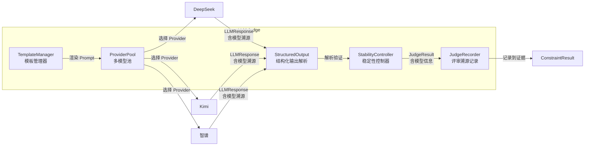

# LLM 模块设计

> 本文档涵盖 LLM Provider 抽象层、LLM Judge 模块及 Langfuse 调用追踪的设计，属于 [01 整体架构设计](./01整体架构设计.md) §二中"基础设施层"的详细展开。评估器调用 LLM 的方式参见 [04 评估引擎设计](./04评估引擎设计.md)，Provider 配置格式参见 [06 数据管理与配置规范](./06数据管理与配置规范.md)。

---

## 一、LLM Provider 抽象层

### 1.1 设计目标

统一封装不同协议的大模型客户端，使上层调用者无需关心底层协议差异。

**核心能力**：

| 能力 | 说明 |
|------|------|
| **多模型配置** | 支持在配置中声明一个或多个 LLM Provider，每个 Provider 有独立的名称、协议、模型、密钥 |
| **按名切换** | 通过 Provider 名称随时切换当前使用的模型，无需重启或改代码 |
| **协议兼容** | 支持 DeepSeek（OpenAI 兼容）、Kimi / 智谱 / MiniMax（Anthropic 协议）、OpenAI 原生 |
| **调用溯源** | 每次 LLM 调用都记录使用了哪个 Provider / 模型，便于审计和复现 |

当前需支持的协议：

| 协议 | 适用厂商 |
|------|----------|
| OpenAI 兼容 | DeepSeek、以及所有 OpenAI 协议兼容服务 |
| Anthropic 协议 | Kimi（月之暗面）、智谱（GLM）、MiniMax coding plan |
| OpenAI 原生 | OpenAI GPT 系列 |

### 1.2 核心接口

```python
# agent_eval/llm/client.py

class LLMClient(ABC):
    @abstractmethod
    def chat(self, messages: list[Message], **kwargs) -> LLMResponse:
        """发送对话请求，返回包含溯源信息的响应。"""
        ...

    @abstractmethod
    def chat_with_vision(self, messages: list[Message],
                         images: list[str], **kwargs) -> LLMResponse:
        """发送多模态请求（文本+图片），返回包含溯源信息的响应。"""
        ...

@dataclass
class LLMResponse:
    """LLM 响应 — 包含内容与溯源信息。"""
    content: str                          # 响应文本
    provider_name: str                    # 使用的 Provider 名称，如 "deepseek_judge"
    model: str                            # 实际模型 ID，如 "deepseek-chat"
    usage: TokenUsage | None = None       # Token 消耗
    raw_response: dict | None = None      # 原始响应（调试用）
    duration_ms: float = 0.0              # 调用耗时（毫秒）

@dataclass
class TokenUsage:
    prompt_tokens: int = 0
    completion_tokens: int = 0
    total_tokens: int = 0
```

### 1.3 实现类

```python
# agent_eval/llm/providers/deepseek.py
class DeepSeekClient(LLMClient):
    """DeepSeek / OpenAI 协议客户端 — 基于 openai 库兼容模式。

    同时支持 provider="deepseek" 和 provider="openai" 两种类型。
    DeepSeek: base_url=https://api.deepseek.com/v1
    OpenAI:   base_url 由用户配置指定
    """
```

> **Provider 实现现状（Sprint 6）**：
> - `OpenAICompatClient`（`agent_eval/llm/providers/openai_compat.py`）覆盖所有 OpenAI Chat Completions 协议兼容服务。`provider="openai"` 为通用协议值，`provider="deepseek"` 为便捷别名（未指定 base_url 时预置 DeepSeek 端点）。两者复用同一客户端类，`provider_type` 返回协议 `"openai"`（不再硬编码厂商名）。
> - `AnthropicCompatClient`（`agent_eval/llm/providers/anthropic.py`）覆盖所有 Anthropic Messages API 协议兼容服务（Kimi/智谱/MiniMax 等通过自定义 `base_url` 接入）。协议要点：`system` 为顶层参数、`max_tokens` 必填、不支持 `seed`、usage 为 `input_tokens`/`output_tokens`（无 total_tokens，需自算）、多模态图片块 `{"type":"image","source":{...}}`。

### 1.4 Provider Pool — 多模型管理

```python
# agent_eval/llm/pool.py

class ProviderPool:
    """
    LLM Provider 池 — 管理多个已配置的 LLM 客户端，支持按名获取与切换。

    配置示例：
      llm:
        providers:
          deepseek_judge: { provider: deepseek, model: deepseek-chat, ... }
          kimi_vision:    { provider: anthropic, model: kimi-2.6, ... }
          zhipu_judge:    { provider: anthropic, model: glm-4, ... }
    """

    def __init__(self, config: LLMConfig):
        self._providers: dict[str, LLMClient] = {}
        self._default_name: str = config.default
        # 初始化所有配置的 Provider
        for name, provider_config in config.providers.items():
            self._providers[name] = LLMClientFactory.create(provider_config)

    def get(self, name: str | None = None) -> LLMClient:
        """
        获取指定名称的 Provider。
        name=None → 返回默认 Provider。
        name 不存在 → 抛出 ValueError 并列出可用 Provider。
        """
        key = name or self._default_name
        if key not in self._providers:
            raise ValueError(
                f"未配置的 Provider: '{key}'，可用: {list(self._providers.keys())}"
            )
        return self._providers[key]

    def list_providers(self) -> list[ProviderInfo]:
        """列出所有已配置 Provider 的元信息。"""
        return [
            ProviderInfo(name=name, model=client.model, provider=client.provider_type)
            for name, client in self._providers.items()
        ]

    @property
    def default(self) -> LLMClient:
        return self._providers[self._default_name]

@dataclass
class ProviderInfo:
    name: str           # 配置名称，如 "deepseek_judge"
    model: str          # 模型 ID，如 "deepseek-chat"
    provider: str       # 协议类型，如 "deepseek" / "anthropic"
```

### 1.5 工厂模式

```python
# agent_eval/llm/factory.py

class LLMClientFactory:
    @staticmethod
    def create(name: str, config: ProviderConfig) -> LLMClient:
        if config.provider in ("deepseek", "openai"):
            _check_openai_available()
            from agent_eval.llm.providers.openai_compat import OpenAICompatClient
            return OpenAICompatClient(name, config)
        elif config.provider == "anthropic":
            _check_anthropic_available()
            from agent_eval.llm.providers.anthropic import AnthropicCompatClient
            return AnthropicCompatClient(name, config)
        else:
            raise LLMError(f"不支持的 provider 类型: {config.provider}")
```

### 1.6 使用示例

```python
# 初始化
pool = ProviderPool(config)

# 使用默认 Provider（deepseek_judge）
client = pool.get()
response = client.chat(messages)

# 按名切换到 kimi_vision
client = pool.get("kimi_vision")
response = client.chat_with_vision(messages, images)

# 列出所有可用 Provider
for info in pool.list_providers():
    print(f"{info.name}: {info.provider} / {info.model}")
```

---

## 二、LLM Judge 模块

### 2.1 架构



### 2.2 JudgeRecord — 评审溯源记录

每次 LLM-as-judge 调用都生成一条溯源记录，写入评估结果的 evidence 目录。

```python
@dataclass
class JudgeRecord:
    """单次 LLM Judge 调用的完整记录。"""
    # 溯源信息
    judge_id: str                         # 唯一标识，如 "judge_fmt001_20260608_143000"
    constraint_id: str                    # 对应的约束 ID
    sample_id: str                        # 对应的样本 ID
    # 模型信息 — 核心溯源字段
    provider_name: str                    # 使用的 Provider，如 "deepseek_judge"
    model: str                            # 实际模型 ID，如 "deepseek-chat"
    # 调用参数
    template_id: str                      # 使用的 Prompt 模板
    temperature: float                    # 温度
    seed: int                             # 随机种子
    # 结果
    raw_response: str                     # LLM 原始响应
    parsed_scores: dict                   # 解析后的评分
    final_scores: dict                    # 最终得分（多次采样取中位数后）
    confidence: dict                      # 各维度置信度
    summary: str = ""                     # LLM 生成的评价总结（可解释性）
    # 统计
    num_samples: int                      # 采样次数
    total_duration_ms: float              # 总耗时
    token_usage: TokenUsage | None        # Token 消耗
    timestamp: str                        # 调用时间 ISO 8601
```

**溯源记录存储位置**：

```
workspace/runs/{run_id}/results/{task_id}/evidence/
└── judge_{constraint_id}_{timestamp}.json   # JudgeRecord JSON 文件
```

**溯源记录在 ConstraintResult 中的引用**：

```python
@dataclass
class ConstraintResult:
    constraint_id: str
    name: str
    tier: ConstraintTier
    status: EvalStatus
    score: float = 0.0
    reason: str = ""
    # 新增：LLM Judge 溯源字段（仅 LLM 类评估器填充）
    judge_provider: str | None = None     # "deepseek_judge"
    judge_model: str | None = None        # "deepseek-chat"
    judge_record_path: str | None = None  # evidence/judge_SFT001_xxx.json
    ...
```

### 2.3 Prompt 模板管理

```python
# agent_eval/llm/judge/template_manager.py

@dataclass
class JudgeDimension:
    """评分维度"""
    dim_id: str
    name: str
    description: str
    weight: float
    score_range: tuple[float, float] = (0, 10)

@dataclass
class JudgeTemplate:
    """LLM 评审 Prompt 模板"""
    template_id: str
    name: str
    dimensions: list[JudgeDimension]
    system_prompt: str
    user_prompt_template: str
    output_schema: dict
    temperature: float = 0.0
    seed: int = 42
    num_samples: int = 3

class TemplateManager:
    """从文件系统加载和管理 Prompt 评估模板。"""

    def __init__(self, template_dir: str): ...

    def render(self, template_id: str, variables: dict) -> tuple[str, str]:
        """渲染模板，返回 (system_prompt, user_prompt)。"""
        ...
```

### 2.4 结构化输出

```python
# agent_eval/llm/judge/structured_output.py

class StructuredOutputParser:
    """
    强制 LLM 返回结构化 JSON 评分结果。

    策略：
    1. Prompt 中声明 JSON Schema
    2. 解析 LLM 响应中的 JSON 块
    3. Schema 验证，不符合则重试（最多 3 次）
    """

    def parse(self, raw_response: str, schema: dict) -> dict:
        json_str = self._extract_json(raw_response)
        data = json.loads(json_str)
        self._validate_schema(data, schema)
        return data
```

### 2.5 稳定性控制

```python
# agent_eval/llm/judge/stability.py

class StabilityController:
    """
    控制 LLM 评估结果的稳定性。

    方法：
    1. 温度 ≈ 0 + 固定 seed：减少单次随机性
    2. 多次采样取中位数：N 次独立评估，取中位数作为最终得分
    3. 一致性校验：标准差 > 阈值 → 标记"低置信度"
    """

    def __init__(self, num_samples: int = 3, stddev_threshold: float = 1.5): ...

    def evaluate_stable(self, judge_fn, sample, template) -> dict:
        scores_list = [judge_fn(sample, template, seed=self._derive_seed(i))
                       for i in range(self.num_samples)]

        final_scores = {}
        confidence = {}
        for dim in template.dimensions:
            dim_scores = [s[dim.dim_id] for s in scores_list]
            final_scores[dim.dim_id] = statistics.median(dim_scores)
            confidence[dim.dim_id] = (
                "high" if statistics.stdev(dim_scores) <= self.stddev_threshold
                else "low"
            )
        return {"scores": final_scores, "confidence": confidence}
```

### 2.6 JudgeOrchestrator — Judge 调用编排

将模板渲染、Provider 选择、稳定性控制、溯源记录串联起来：

```python
# agent_eval/llm/judge/orchestrator.py

class JudgeOrchestrator:
    """
    LLM Judge 调用编排器。

    职责：
    1. 接收评估请求（constraint_id + sample_id + template_id + variables）
    2. 从 ProviderPool 获取指定 Provider（或使用默认）
    3. 渲染 Prompt 模板
    4. 调用 StabilityController 进行多次采样
    5. 生成 JudgeRecord 并持久化到 evidence 目录
    6. 返回 (scores_dict, JudgeRecord) 元组
    """

    def __init__(self, pool: ProviderPool,
                 template_manager: TemplateManager,
                 stability: StabilityController,
                 output_parser: StructuredOutputParser):
        self.pool = pool
        self.templates = template_manager
        self.stability = stability
        self.parser = output_parser

    def judge(
        self,
        *,
        constraint_id: str,
        sample_id: str,
        template_id: str,
        variables: dict,
        evidence_dir: Path,
        provider_name: str | None = None,
    ) -> tuple[dict[str, Any], JudgeRecord]:
        """
        执行 LLM Judge 评估。

        Args:
            constraint_id: 约束 ID。
            sample_id: 样本 ID。
            template_id: Prompt 模板 ID。
            variables: 模板渲染变量。
            evidence_dir: 证据保存目录。
            provider_name: 指定 Provider，None 使用默认。

        Returns:
            (scores_dict, JudgeRecord) 元组。
        """
        # 1. 获取 Provider
        client = self.pool.get(provider_name)
        provider_info = client.provider_info

        # 2. 渲染模板
        system_prompt, user_prompt = self.templates.render(template_id, variables)

        # 3. Langfuse Trace（详见 §五）
        trace_info = create_trace(name=f"judge:{constraint_id}", metadata={...})
        root_span = trace_info[0] if trace_info else None

        # 4. 多次采样
        def single_judge(sample_index: int) -> dict:
            messages = [Message(role="system", content=system_prompt),
                        Message(role="user", content=user_prompt)]
            response = client.chat(messages, seed=template.seed + sample_index,
                                   temperature=template.temperature)
            # Langfuse Generation Span（详见 §五）
            ...
            parsed = self.parser.parse(response.content, template.output_schema)
            return parsed

        stable_result = self.stability.evaluate_stable(single_judge, template.dimensions)

        # 5. 生成 JudgeRecord（含 summary）
        record = JudgeRecord(...)
        JudgeRecorder.save(record, evidence_dir)

        # 6. 结束 Langfuse Trace
        if root_span:
            root_span.update(output={"scores": stable_result.scores, ...})
            root_span.end()

        return stable_result.scores, record
```

### 2.7 降级机制

当 LLM 服务不可用时（未配置 `llm_config.yaml`、Provider 连接失败等），LLM Judge 评估器自动降级为默认通过模式：

```python
class BaseLLMJudgeEvaluator(BaseEvaluator):
    """LLM Judge 评估器基类。"""

    def evaluate(self, sample, context: dict) -> ConstraintResult:
        judge_orchestrator = context.get("judge_orchestrator")
        evidence_dir = context.get("evidence_dir")

        if judge_orchestrator is None or evidence_dir is None:
            # 降级模式：LLM 不可用，默认通过
            return self._make_result(
                status=EvalStatus.PASS,
                score=0.7,
                reason="LLM 不可用，降级模式默认 0.7",
            )

        # 正常模式：调用 JudgeOrchestrator
        scores, record = judge_orchestrator.judge(
            constraint_id=self.evaluator_id,
            sample_id=sample.get("sample_id", ""),
            template_id=self.template_id,
            variables={...},
            evidence_dir=evidence_dir,
        )
        # 计算加权分数，归一化到 [0,1]
        ...
```

**降级策略**：

| 场景 | 行为 |
|------|------|
| 未配置 LLM（`llm_config_path=None`） | 所有 LLM Judge 评估器返回 `score=0.7, PASS` |
| Provider 连接失败 | 单个评估器降级，不阻塞管线 |
| 模板解析失败 | 降级为 `score=0.7`，记录错误信息 |

> **设计意图**：降级机制确保系统在无 LLM 配置时仍可正常运行 Rule-based 评估（格式门控 + 常识检查），LLM Judge 评估器的结果仅作参考。

---

## 三、多模态视觉评估

VisionEvaluator 通过 ProviderPool 获取多模态 Provider（如 Kimi-2.6），输入 HTML 文档渲染截图输出结构化评分。

> **评估对象**：当前阶段为 Markdown/HTML 文档集。Markdown 可先转为 HTML 再截图评估，HTML 文档直接通过浏览器渲染后截图。PPTX 评估暂不支持，后续可通过插件扩展。

```python
# agent_eval/evaluation/evaluators/vision.py

@registry.register("vision.quality")
class VisionEvaluator(BaseEvaluator):
    evaluator_id = "vision.quality"
    tier = ConstraintTier.SOFT
    method = EvalMethod.VISION

    def evaluate(self, sample, context: dict) -> ConstraintResult:
        # 通过 ProviderPool 获取配置的多模态 Provider
        client = self.provider_pool.get(self.params.get("llm_provider"))

        # 将 HTML 文档渲染为截图（Markdown 先转 HTML）
        screenshots = self._render_and_capture(sample)
        prompt = self.template_manager.render("visual_quality", context)
        response = client.chat_with_vision(messages=prompt, images=screenshots)
        scores = self.output_parser.parse(response.content, self.output_schema)
        ...
```

---

## 四、模型选择与切换流程

### 4.1 配置级选择

在 `pipeline.yaml` 的评估器配置中指定 `llm_provider`：

```yaml
# 详见 06数据管理与配置规范
evaluators:
  - name: soft.teaching_logic
    params:
      llm_provider: deepseek_judge       # 使用 DeepSeek 进行教学逻辑评估
      template_id: pedagogical_logic
  - name: vision.quality
    params:
      llm_provider: kimi_vision          # 使用 Kimi-2.6 进行视觉评估
```

### 4.2 运行时切换

通过 CLI 参数或 SDK 覆盖默认 Provider：

```bash
# CLI：覆盖所有 LLM 评估使用指定 Provider
agent-eval pipeline --llm-provider zhipu_judge ...

# CLI：仅覆盖某个评估器的 Provider
agent-eval pipeline --override-provider soft.teaching_logic=kimi_vision ...
```

```python
# SDK：运行时切换
pool = ProviderPool(config)
result = judge.judge(
    constraint_id="SFT_001",
    provider_name="kimi_vision",  # 切换到 Kimi
    ...
)
```

### 4.3 溯源链路

```
pipeline.yaml (llm_provider: deepseek_judge)
        ↓
ProviderPool.get("deepseek_judge")
        ↓
DeepSeekClient.chat() → LLMResponse(provider_name="deepseek_judge", model="deepseek-chat")
        ↓
JudgeOrchestrator → JudgeRecord(provider_name="deepseek_judge", model="deepseek-chat")
        ↓
ConstraintResult(judge_provider="deepseek_judge", judge_model="deepseek-chat",
                 judge_record_path="evidence/judge_SFT001_xxx.json")
        ↓
rule_results.json 中可见每个约束使用的模型
```

**rule_results.json 示例**（含模型溯源）：

```json
[
  {
    "rule_id": "SFT_001",
    "constraint_id": "soft.teaching_logic",
    "passed": true,
    "score": 0.85,
    "reason": "教学逻辑清晰，导入→新授→练习→总结结构完整",
    "judge_provider": "deepseek_judge",
    "judge_model": "deepseek-chat",
    "judge_record_path": "evidence/judge_soft.teaching_logic_20260608_143000.json"
  },
  {
    "rule_id": "VIS_001",
    "constraint_id": "vision.quality",
    "passed": true,
    "score": 0.78,
    "reason": "排版规范，配色协调，信息层级清晰",
    "judge_provider": "kimi_vision",
    "judge_model": "kimi-2.6",
    "judge_record_path": "evidence/judge_vision.quality_20260608_143005.json"
  }
]
```

---

## 五、Langfuse 调用追踪

### 5.1 设计目标

| 目标 | 说明 |
|------|------|
| **全链路追踪** | 一次 `judge()` 调用生成一条 Trace，内含 N 个 Generation Span，完整记录每次 LLM 调用 |
| **零侵入禁用** | 未配置 Langfuse 环境变量时完全无感，不影响评估流程和性能 |
| **Cloud SaaS** | 优先使用 Langfuse Cloud（零部署），配置 3 个环境变量即可启用 |
| **多模态预留** | 架构支持未来追踪图片/音频等多模态输入输出 |

### 5.2 技术选型

| 方案 | 类型 | 开源 | 选型结论 |
|------|------|------|---------|
| **Langfuse** | LLM 可观测平台 | ✅ MIT | ✅ **首选** — 功能全（Tracing + Eval + Prompt），16k+ Stars |
| Arize Phoenix | AI 可观测工具 | ✅ MIT | 备选 — OpenTelemetry 原生 |

**依赖声明**：

```toml
# pyproject.toml
[project.optional-dependencies]
llm = [
    "openai>=1.30",
    "anthropic>=0.30",
    "langfuse>=2.0",
]
```

> 当前安装版本为 Langfuse v4.x，其 API 与 v2/v3 有较大差异（详见 §5.4）。

### 5.3 核心模块：`agent_eval/llm/tracing.py`

```python
"""Langfuse 追踪模块 — LLM 调用可观测性。

Cloud SaaS 模式：通过环境变量配置。
未配置时自动禁用，对评估流程无任何影响。
"""

_langfuse_client: Optional[Langfuse] = None

def get_langfuse() -> Optional[Langfuse]:
    """获取 Langfuse 客户端单例。未配置时返回 None。"""

def create_trace(name: str, metadata: dict | None = None)
        -> Optional[tuple[Any, dict[str, str]]]:
    """创建 Langfuse Trace（根 Span）。

    Returns: (span, trace_context_dict) 元组，或 None（未启用时）。
    """

def is_tracing_enabled() -> bool:
    """检查 Langfuse 追踪是否已启用。"""

def flush_traces() -> None:
    """刷新所有待发送的 trace 数据。在评估结束时调用。"""

def reset_langfuse() -> None:
    """重置 Langfuse 客户端（仅用于测试）。"""
```

**设计要点**：

| 设计决策 | 理由 |
|----------|------|
| 懒初始化单例 | 首次调用时才创建客户端，避免未安装 langfuse 时导入报错 |
| 环境变量控制 | 无需修改配置文件，3 个环境变量即可启用/禁用 |
| `create_trace()` 封装 | 屏蔽 v4 API 的 `create_trace_id` + `start_observation` 复杂度 |
| `flush_traces()` | Langfuse SDK 异步发送，需在评估结束时确保数据落盘 |

### 5.4 Langfuse v4 API 说明

Langfuse v4.x 相较于 v2/v3 有重大 API 变更：

| 概念 | v2/v3 API | v4 API（本项目使用） |
|------|-----------|---------------------|
| 创建客户端 | `Langfuse()` | `Langfuse(public_key, secret_key, host)` |
| 创建 Trace | `langfuse.trace(name=...)` | `create_trace_id(seed=...)` + `start_observation(trace_context=..., as_type="span")` |
| 嵌套观察 | `trace.generation(name=...)` | `span.start_observation(name=..., as_type="generation")` |
| 记录输出 | `generation.end(output=..., usage=...)` | `generation.update(output=..., usage_details=...)` + `generation.end()` |
| 刷新 | `langfuse.flush()` | `langfuse.flush()`（不变） |

**v4 API 调用流程**：

```
Langfuse(public_key, secret_key, host)
  │
  ├─ create_trace_id(seed=name)       → trace_id: str
  │
  ├─ start_observation(               → root_span (as_type="span")
  │     name, trace_context={trace_id}, as_type="span", metadata={...})
  │
  │   ├─ root_span.start_observation( → generation (as_type="generation")
  │   │     name="sample_0", input={...}, model="...", model_parameters={...})
  │   │   ├─ generation.update(output=..., usage_details={...})
  │   │   └─ generation.end()
  │   │
  │   ├─ (sample_1, sample_2 ... 同上)
  │   │
  │   ├─ root_span.update(output={scores, confidence})
  │   └─ root_span.end()
  │
  └─ flush()                           → 发送到 Langfuse 服务端
```

### 5.5 埋点设计

#### 调用链与埋点位置

```
eval_packages()
  → Orchestrator.eval_only()
    → PipelineEngine.evaluate_sample()
      → PipelineStage.execute()
        → Evaluator.evaluate()
          → JudgeOrchestrator.judge()            ← ① 创建 Trace (root_span)
            → single_judge(0)                    ← ② 创建 Generation (sample_0)
              → client.chat()                    ← ③ LLM API 调用
              → generation.update(output, usage)
              → generation.end()
            → single_judge(1)                    ← ② 创建 Generation (sample_1)
            → single_judge(2)                    ← ② 创建 Generation (sample_2)
            → root_span.update(output=scores)
            → root_span.end()
  → flush_traces()                               ← ④ 确保数据落盘
```

#### flush 位置

| 入口 | 文件 | 位置 |
|------|------|------|
| SDK `eval_packages()` | `agent_eval/orchestrator/orchestrator.py` | 函数末尾 |
| CLI `agent-eval eval` | `cli.py` | eval 命令末尾 |

### 5.6 配置

通过 `.env` 文件或环境变量配置：

| 变量 | 必需 | 默认值 | 说明 |
|------|------|--------|------|
| `LANGFUSE_PUBLIC_KEY` | ✅ | — | 公钥，`pk-lf-` 前缀 |
| `LANGFUSE_SECRET_KEY` | ✅ | — | 密钥，`sk-lf-` 前缀 |
| `LANGFUSE_HOST` | ❌ | `https://cloud.langfuse.com` | 服务端地址 |

### 5.7 Dashboard 数据结构

一次 `judge()` 调用在 Langfuse Dashboard 上展示为：

```
Trace: judge:commonsense.logical_consistency
├── metadata: {sample_id, template_id, provider, model}
├── Generation: sample_0
│   ├── input: {system, user}
│   ├── output: {"internal_consistency": 8, ...}
│   ├── model: deepseek_judge/deepseek-chat
│   └── usage_details: {prompt_tokens, completion_tokens, total_tokens}
├── Generation: sample_1 (seed=43)
├── Generation: sample_2 (seed=44)
└── output: {scores, confidence}
```

### 5.8 测试策略

**Mock 策略**：在 `tests/conftest.py` 中全局 mock langfuse 模块：

```python
import sys
from unittest.mock import MagicMock
sys.modules.setdefault("langfuse", MagicMock())
```

**追踪模块测试**（`tests/llm/test_tracing.py`）：

| 测试类 | 覆盖场景 |
|--------|---------|
| `TestGetLangfuse` | 无环境变量→None、空 key→None、双 key→客户端实例、单例复用、导入失败→None |
| `TestIsTracingEnabled` | 禁用/启用判断 |
| `TestFlushTraces` | 禁用时无异常、启用时调用 flush |
| `TestCreateTrace` | 禁用时→None、启用时返回 (span, trace_ctx) |
| `TestResetLangfuse` | 重置后单例清空 |

### 5.9 未来扩展

| Phase | 内容 | 说明 |
|-------|------|------|
| Phase 2 | 评估结果 Score 关联 | 将 scores 写入 Langfuse Score，与 Trace 关联 |
| Phase 3 | Prompt 版本管理 | 将 `assets/prompts/*.yaml` 迁移到 Langfuse Prompt 管理 |
| Phase 4 | 多模态追踪 | 扩展追踪图片/音频输入，支持多模态评估场景 |

---

## 六、版本记录

| 版本 | 日期 | 变更内容 |
|------|------|----------|
| v1.0 | 2026-06-08 | 按架构层次重组，更新交叉引用 |
| v1.1 | 2026-06-08 | 新增 ProviderPool 多模型管理、运行时切换、JudgeRecord 评审溯源、ConstraintResult 模型溯源字段 |
| v1.2 | 2026-06-08 | 视觉评估从 PPTX 截图调整为 HTML 渲染截图；PPTX 评估标注为后续插件扩展 |
| **v2.0** | **2026-06-12** | **§1.3 更新 Provider 实现现状（DeepSeekClient 覆盖 deepseek+openai；Anthropic 未实现）；§1.5 Factory 更新为实际代码；LLMResponse 新增 duration_ms 字段；JudgeRecord 新增 summary 字段；JudgeOrchestrator.judge() 签名更新为 keyword-only + 返回 tuple；新增 §2.7 降级机制；合并原 09 Langfuse 调用追踪设计文档到 §五** |
