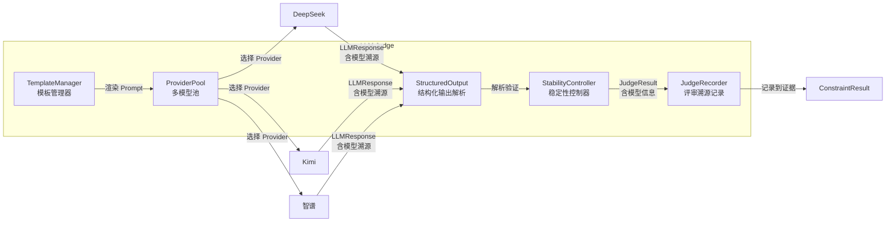

# LLM 模块设计

> 本文档涵盖 LLM Provider 抽象层与 LLM Judge 模块的设计，属于 [01 整体架构设计](./01整体架构设计.md) §二中"基础设施层"的详细展开。评估器调用 LLM 的方式参见 [04 评估引擎设计](./04评估引擎设计.md)，Provider 配置格式参见 [07 配置规范](./07配置规范.md)。

---

## 一、LLM Provider 抽象层

### 1.1 设计目标

统一封装不同协议的大模型客户端，使上层调用者无需关心底层协议差异。

**核心能力**：

| 能力 | 说明 |
|------|------|
| **多模型配置** | 支持在配置中声明一个或多个 LLM Provider，每个 Provider 有独立的名称、协议、模型、密钥 |
| **按名切换** | 通过 Provider 名称随时切换当前使用的模型，无需重启或改代码 |
| **协议兼容** | 支持 DeepSeek（OpenAI 兼容）、Kimi / 智谱 / MiniMax（Anthropic 协议）、OpenAI 原生 |
| **调用溯源** | 每次 LLM 调用都记录使用了哪个 Provider / 模型，便于审计和复现 |

当前需支持的协议：

| 协议 | 适用厂商 |
|------|----------|
| OpenAI 兼容 | DeepSeek、以及所有 OpenAI 协议兼容服务 |
| Anthropic 协议 | Kimi（月之暗面）、智谱（GLM）、MiniMax coding plan |
| OpenAI 原生 | OpenAI GPT 系列 |

### 1.2 核心接口

```python
# agent_eval/llm/client.py

class LLMClient(ABC):
    @abstractmethod
    def chat(self, messages: list[Message], **kwargs) -> LLMResponse:
        """发送对话请求，返回包含溯源信息的响应。"""
        ...

    @abstractmethod
    def chat_with_vision(self, messages: list[Message],
                         images: list[str], **kwargs) -> LLMResponse:
        """发送多模态请求（文本+图片），返回包含溯源信息的响应。"""
        ...

@dataclass
class LLMResponse:
    """LLM 响应 — 包含内容与溯源信息。"""
    content: str                          # 响应文本
    provider_name: str                    # 使用的 Provider 名称，如 "deepseek_judge"
    model: str                            # 实际模型 ID，如 "deepseek-chat"
    usage: TokenUsage | None = None       # Token 消耗
    raw_response: dict | None = None      # 原始响应（调试用）

@dataclass
class TokenUsage:
    prompt_tokens: int = 0
    completion_tokens: int = 0
    total_tokens: int = 0
```

### 1.3 实现类

```python
# agent_eval/llm/providers/deepseek.py
class DeepSeekClient(LLMClient):
    """DeepSeek — 使用 openai 库兼容模式。"""
    # base_url: https://api.deepseek.com/v1

# agent_eval/llm/providers/anthropic_compat.py
class AnthropicCompatClient(LLMClient):
    """Anthropic 协议兼容 — Kimi / 智谱 / MiniMax。"""

# agent_eval/llm/providers/openai_compat.py
class OpenAICompatClient(LLMClient):
    """OpenAI 协议通用客户端。"""
```

### 1.4 Provider Pool — 多模型管理

```python
# agent_eval/llm/pool.py

class ProviderPool:
    """
    LLM Provider 池 — 管理多个已配置的 LLM 客户端，支持按名获取与切换。

    配置示例：
      llm:
        providers:
          deepseek_judge: { provider: deepseek, model: deepseek-chat, ... }
          kimi_vision:    { provider: anthropic, model: kimi-2.6, ... }
          zhipu_judge:    { provider: anthropic, model: glm-4, ... }
    """

    def __init__(self, config: LLMConfig):
        self._providers: dict[str, LLMClient] = {}
        self._default_name: str = config.default
        # 初始化所有配置的 Provider
        for name, provider_config in config.providers.items():
            self._providers[name] = LLMClientFactory.create(provider_config)

    def get(self, name: str | None = None) -> LLMClient:
        """
        获取指定名称的 Provider。
        name=None → 返回默认 Provider。
        name 不存在 → 抛出 ValueError 并列出可用 Provider。
        """
        key = name or self._default_name
        if key not in self._providers:
            raise ValueError(
                f"未配置的 Provider: '{key}'，可用: {list(self._providers.keys())}"
            )
        return self._providers[key]

    def list_providers(self) -> list[ProviderInfo]:
        """列出所有已配置 Provider 的元信息。"""
        return [
            ProviderInfo(name=name, model=client.model, provider=client.provider_type)
            for name, client in self._providers.items()
        ]

    @property
    def default(self) -> LLMClient:
        return self._providers[self._default_name]

@dataclass
class ProviderInfo:
    name: str           # 配置名称，如 "deepseek_judge"
    model: str          # 模型 ID，如 "deepseek-chat"
    provider: str       # 协议类型，如 "deepseek" / "anthropic"
```

### 1.5 工厂模式

```python
# agent_eval/llm/factory.py

class LLMClientFactory:
    @staticmethod
    def create(config: ProviderConfig) -> LLMClient:
        if config.provider == "deepseek":
            return DeepSeekClient(config)
        elif config.provider == "anthropic":
            return AnthropicCompatClient(config)
        elif config.provider == "openai":
            return OpenAICompatClient(config)
        else:
            raise ValueError(f"不支持的 provider: {config.provider}")
```

### 1.6 使用示例

```python
# 初始化
pool = ProviderPool(config)

# 使用默认 Provider（deepseek_judge）
client = pool.get()
response = client.chat(messages)

# 按名切换到 kimi_vision
client = pool.get("kimi_vision")
response = client.chat_with_vision(messages, images)

# 列出所有可用 Provider
for info in pool.list_providers():
    print(f"{info.name}: {info.provider} / {info.model}")
```

---

## 二、LLM Judge 模块

### 2.1 架构



### 2.2 JudgeRecord — 评审溯源记录

每次 LLM-as-judge 调用都生成一条溯源记录，写入评估结果的 evidence 目录。

```python
@dataclass
class JudgeRecord:
    """单次 LLM Judge 调用的完整记录。"""
    # 溯源信息
    judge_id: str                         # 唯一标识，如 "judge_fmt001_20260608_143000"
    constraint_id: str                    # 对应的约束 ID
    sample_id: str                        # 对应的样本 ID
    # 模型信息 — 核心溯源字段
    provider_name: str                    # 使用的 Provider，如 "deepseek_judge"
    model: str                            # 实际模型 ID，如 "deepseek-chat"
    # 调用参数
    template_id: str                      # 使用的 Prompt 模板
    temperature: float                    # 温度
    seed: int                             # 随机种子
    # 结果
    raw_response: str                     # LLM 原始响应
    parsed_scores: dict                   # 解析后的评分
    final_scores: dict                    # 最终得分（多次采样取中位数后）
    confidence: dict                      # 各维度置信度
    # 统计
    num_samples: int                      # 采样次数
    total_duration_ms: float              # 总耗时
    token_usage: TokenUsage | None        # Token 消耗
    timestamp: str                        # 调用时间 ISO 8601
```

**溯源记录存储位置**：

```
workspace/runs/{run_id}/results/{task_id}/evidence/
└── judge_{constraint_id}_{timestamp}.json   # JudgeRecord JSON 文件
```

**溯源记录在 ConstraintResult 中的引用**：

```python
@dataclass
class ConstraintResult:
    constraint_id: str
    name: str
    tier: ConstraintTier
    status: EvalStatus
    score: float = 0.0
    reason: str = ""
    # 新增：LLM Judge 溯源字段（仅 LLM 类评估器填充）
    judge_provider: str | None = None     # "deepseek_judge"
    judge_model: str | None = None        # "deepseek-chat"
    judge_record_path: str | None = None  # evidence/judge_SFT001_xxx.json
    ...
```

### 2.3 Prompt 模板管理

```python
# agent_eval/llm/judge/template_manager.py

@dataclass
class JudgeDimension:
    """评分维度"""
    dim_id: str
    name: str
    description: str
    weight: float
    score_range: tuple[float, float] = (0, 10)

@dataclass
class JudgeTemplate:
    """LLM 评审 Prompt 模板"""
    template_id: str
    name: str
    dimensions: list[JudgeDimension]
    system_prompt: str
    user_prompt_template: str
    output_schema: dict
    temperature: float = 0.0
    seed: int = 42
    num_samples: int = 3

class TemplateManager:
    """从文件系统加载和管理 Prompt 评估模板。"""

    def __init__(self, template_dir: str): ...

    def render(self, template_id: str, variables: dict) -> tuple[str, str]:
        """渲染模板，返回 (system_prompt, user_prompt)。"""
        ...
```

### 2.4 结构化输出

```python
# agent_eval/llm/judge/structured_output.py

class StructuredOutputParser:
    """
    强制 LLM 返回结构化 JSON 评分结果。

    策略：
    1. Prompt 中声明 JSON Schema
    2. 解析 LLM 响应中的 JSON 块
    3. Schema 验证，不符合则重试（最多 3 次）
    """

    def parse(self, raw_response: str, schema: dict) -> dict:
        json_str = self._extract_json(raw_response)
        data = json.loads(json_str)
        self._validate_schema(data, schema)
        return data
```

### 2.5 稳定性控制

```python
# agent_eval/llm/judge/stability.py

class StabilityController:
    """
    控制 LLM 评估结果的稳定性。

    方法：
    1. 温度 ≈ 0 + 固定 seed：减少单次随机性
    2. 多次采样取中位数：N 次独立评估，取中位数作为最终得分
    3. 一致性校验：标准差 > 阈值 → 标记"低置信度"
    """

    def __init__(self, num_samples: int = 3, stddev_threshold: float = 1.5): ...

    def evaluate_stable(self, judge_fn, sample, template) -> dict:
        scores_list = [judge_fn(sample, template, seed=self._derive_seed(i))
                       for i in range(self.num_samples)]

        final_scores = {}
        confidence = {}
        for dim in template.dimensions:
            dim_scores = [s[dim.dim_id] for s in scores_list]
            final_scores[dim.dim_id] = statistics.median(dim_scores)
            confidence[dim.dim_id] = (
                "high" if statistics.stdev(dim_scores) <= self.stddev_threshold
                else "low"
            )
        return {"scores": final_scores, "confidence": confidence}
```

### 2.6 JudgeOrchestrator — Judge 调用编排

将模板渲染、Provider 选择、稳定性控制、溯源记录串联起来：

```python
# agent_eval/llm/judge/orchestrator.py

class JudgeOrchestrator:
    """
    LLM Judge 调用编排器。

    职责：
    1. 接收评估请求（constraint_id + sample + context）
    2. 从 ProviderPool 获取指定 Provider（或使用默认）
    3. 渲染 Prompt 模板
    4. 调用 StabilityController 进行多次采样
    5. 生成 JudgeRecord 并持久化到 evidence 目录
    6. 返回 ConstraintResult（含模型溯源字段）
    """

    def __init__(self, pool: ProviderPool,
                 template_manager: TemplateManager,
                 stability: StabilityController,
                 output_parser: StructuredOutputParser,
                 evidence_dir: Path):
        self.pool = pool
        self.templates = template_manager
        self.stability = stability
        self.parser = output_parser
        self.evidence_dir = evidence_dir

    def judge(self, constraint_id: str, sample_id: str,
              template_id: str, variables: dict,
              provider_name: str | None = None) -> ConstraintResult:
        """
        执行 LLM Judge 评估。

        Args:
            provider_name: 指定使用哪个 Provider。
                           None → 使用 pipeline.yaml 中该评估器配置的 llm_provider。
                           也未配置 → 使用默认 Provider。
        """
        # 1. 获取 Provider
        client = self.pool.get(provider_name)
        provider_info = client.provider_info  # (name, model)

        # 2. 渲染模板
        template = self.templates.get(template_id)
        system_prompt, user_prompt = self.templates.render(template_id, variables)

        # 3. 稳定性控制 — 多次采样
        def single_judge(seed: int) -> dict:
            messages = [Message(role="system", content=system_prompt),
                        Message(role="user", content=user_prompt)]
            response = client.chat(messages, seed=seed, temperature=template.temperature)
            return self.parser.parse(response.content, template.output_schema)

        stable_result = self.stability.evaluate_stable(single_judge, sample, template)

        # 4. 生成 JudgeRecord
        record = JudgeRecord(
            judge_id=f"judge_{constraint_id}_{datetime.now().strftime('%Y%m%d_%H%M%S')}",
            constraint_id=constraint_id,
            sample_id=sample_id,
            provider_name=provider_info.name,
            model=provider_info.model,
            template_id=template_id,
            temperature=template.temperature,
            seed=template.seed,
            raw_response=...,  # 保存原始响应
            parsed_scores=...,
            final_scores=stable_result["scores"],
            confidence=stable_result["confidence"],
            num_samples=template.num_samples,
            total_duration_ms=...,
            token_usage=...,
            timestamp=datetime.now().isoformat(),
        )

        # 5. 持久化 JudgeRecord
        record_path = self.evidence_dir / f"{record.judge_id}.json"
        record_path.write_text(json.dumps(asdict(record), ensure_ascii=False, indent=2))

        # 6. 返回 ConstraintResult（含溯源字段）
        # 聚合各维度得分为单个分数
        total_score = sum(
            stable_result["scores"].get(dim.dim_id, 0) * dim.weight
            for dim in template.dimensions
        ) / sum(dim.weight for dim in template.dimensions)

        return ConstraintResult(
            constraint_id=constraint_id,
            name=template.name,
            tier=ConstraintTier.SOFT,
            status=EvalStatus.PASS if total_score >= 0.6 else EvalStatus.FAIL,
            score=total_score / 10.0,  # 归一化到 [0,1]
            reason=self._build_reason(stable_result, template),
            judge_provider=provider_info.name,
            judge_model=provider_info.model,
            judge_record_path=str(record_path),
        )
```

---

## 三、多模态视觉评估

VisionEvaluator 通过 ProviderPool 获取多模态 Provider（如 Kimi-2.6），输入 HTML 文档渲染截图输出结构化评分。

> **评估对象**：当前阶段为 Markdown/HTML 文档集。Markdown 可先转为 HTML 再截图评估，HTML 文档直接通过浏览器渲染后截图。PPTX 评估暂不支持，后续可通过插件扩展。

```python
# agent_eval/evaluation/evaluators/vision.py

@registry.register("vision.quality")
class VisionEvaluator(BaseEvaluator):
    evaluator_id = "vision.quality"
    tier = ConstraintTier.SOFT
    method = EvalMethod.VISION

    def evaluate(self, sample, context: dict) -> ConstraintResult:
        # 通过 ProviderPool 获取配置的多模态 Provider
        client = self.provider_pool.get(self.params.get("llm_provider"))

        # 将 HTML 文档渲染为截图（Markdown 先转 HTML）
        screenshots = self._render_and_capture(sample)
        prompt = self.template_manager.render("visual_quality", context)
        response = client.chat_with_vision(messages=prompt, images=screenshots)
        scores = self.output_parser.parse(response.content, self.output_schema)
        ...
```

---

## 四、模型选择与切换流程

### 4.1 配置级选择

在 `pipeline.yaml` 的评估器配置中指定 `llm_provider`：

```yaml
# 详见 07配置规范
evaluators:
  - name: soft.teaching_logic
    params:
      llm_provider: deepseek_judge       # 使用 DeepSeek 进行教学逻辑评估
      template_id: pedagogical_logic
  - name: vision.quality
    params:
      llm_provider: kimi_vision          # 使用 Kimi-2.6 进行视觉评估
```

### 4.2 运行时切换

通过 CLI 参数或 SDK 覆盖默认 Provider：

```bash
# CLI：覆盖所有 LLM 评估使用指定 Provider
agent-eval pipeline --llm-provider zhipu_judge ...

# CLI：仅覆盖某个评估器的 Provider
agent-eval pipeline --override-provider soft.teaching_logic=kimi_vision ...
```

```python
# SDK：运行时切换
pool = ProviderPool(config)
result = judge.judge(
    constraint_id="SFT_001",
    provider_name="kimi_vision",  # 切换到 Kimi
    ...
)
```

### 4.3 溯源链路

```
pipeline.yaml (llm_provider: deepseek_judge)
        ↓
ProviderPool.get("deepseek_judge")
        ↓
DeepSeekClient.chat() → LLMResponse(provider_name="deepseek_judge", model="deepseek-chat")
        ↓
JudgeOrchestrator → JudgeRecord(provider_name="deepseek_judge", model="deepseek-chat")
        ↓
ConstraintResult(judge_provider="deepseek_judge", judge_model="deepseek-chat",
                 judge_record_path="evidence/judge_SFT001_xxx.json")
        ↓
rule_results.json 中可见每个约束使用的模型
```

**rule_results.json 示例**（含模型溯源）：

```json
[
  {
    "rule_id": "SFT_001",
    "constraint_id": "soft.teaching_logic",
    "passed": true,
    "score": 0.85,
    "reason": "教学逻辑清晰，导入→新授→练习→总结结构完整",
    "judge_provider": "deepseek_judge",
    "judge_model": "deepseek-chat",
    "judge_record_path": "evidence/judge_soft.teaching_logic_20260608_143000.json"
  },
  {
    "rule_id": "VIS_001",
    "constraint_id": "vision.quality",
    "passed": true,
    "score": 0.78,
    "reason": "排版规范，配色协调，信息层级清晰",
    "judge_provider": "kimi_vision",
    "judge_model": "kimi-2.6",
    "judge_record_path": "evidence/judge_vision.quality_20260608_143005.json"
  }
]
```

---

## 五、版本记录

| 版本 | 日期 | 变更内容 |
|------|------|----------|
| v1.0 | 2026-06-08 | 按架构层次重组，更新交叉引用 |
| v1.1 | 2026-06-08 | 新增 ProviderPool 多模型管理、运行时切换、JudgeRecord 评审溯源、ConstraintResult 模型溯源字段 |
| v1.2 | 2026-06-08 | 视觉评估从 PPTX 截图调整为 HTML 渲染截图；PPTX 评估标注为后续插件扩展 |
