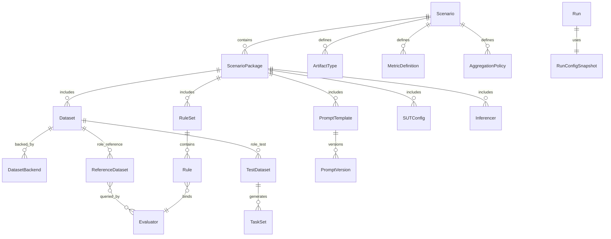

# 多场景评估配置管理设计

> 本文档阐述如何将当前课件质量评估专用的配置资产（规则集、提示词、知识点）升级为**面向多场景的评估配置管理体系**，并支持在 Web 端进行可视化查看与二次编辑。属于 [04 评估引擎设计](./04评估引擎设计.md) 与 [09 Web 可观测平台架构设计](./09Web可观测平台架构设计.md) 的延伸。
>
> 核心思路：**以 Scenario Package（场景包）为第一公民，本地包与线上包双向流通；运行时按包加载，运行后保存不可变配置快照。通过统一的 `Dataset` 抽象（按 `role: test | reference` 区分测试数据与参考知识）、`SUTConfig`、`Inferencer` 等组件，原生支持业务场景评估与传统 LLM benchmark（如 GSM8K），并在自研执行器与评估器中复现类似 OpenCompass 的能力。**

---

## 一、设计目标与范围

### 1.1 目标

| 目标 | 说明 |
|------|------|
| **多场景支持** | 同一套评估引擎可评估课件生成、研学行程规划、对话安全、代码生成、RAG、传统 LLM benchmark（如 GSM8K）等不同场景。 |
| **配置资产可视化** | Web 端可查看、编辑规则集、提示词模板、数据集（含参考知识与测试数据）。 |
| **版本与标签** | 配置资产支持线性版本 + 可变标签（`latest` / `production` / `staging`）。 |
| **运行可复现** | 每次 Run 保存评估时实际使用的完整配置快照。 |
| **本地 + 线上双向流通** | 开发者可在本地创建场景包，也可通过 Web 系统创建并发布；本地 agent_eval 能下载线上配置。 |
| **Benchmark 数据集原生支持** | 通过统一的 `Dataset` 抽象（`role: test | reference`），在自研执行器/评估器中支持 GSM8K 等传统 benchmark 数据集，以及课件知识点、RAG 文档库等参考数据。 |

### 1.2 范围

- **Evaluator 侧**：配置加载、包管理 CLI、评估器/提示词/数据集抽象、聚合与指标数据化。
- **Web 侧**：配置资产的 DB 模型、API、前端编辑器、运行快照展示。
- **不改动**：执行引擎（SUT 驱动已并入场景包 `sut_configs/`，见 §4.1）、摄取总线、可观测性事件格式（仅扩展字段）。

---

## 三、核心概念模型

> **设计动机（改造前瓶颈）**：课件语义硬编码于 `ScoreAggregator` / `MetricsCalculator`（写死三阶段与 DR/CPR/Reward/CondR，无法表达其他场景）；资产无 `scenario` 命名空间；缺少可分发、可版本化的包单元；Web 只读（规则集仅静态 JSON，Prompt/知识不可见）；Run 仅记 `ruleSetVersion` 无法复现配置快照。本章的场景包概念模型即为消解上述瓶颈。

### 3.1 实体定义

引入 **Scenario** 作为顶层命名空间，**ScenarioPackage** 作为配置分发的最小单元。

| 实体 | 职责 | 关键属性 |
|------|------|----------|
| **Scenario** | 评估场景命名空间，定义该场景下的默认资产与语义。 | `id`, `name`, `description`, `default_package_id`, `default_aggregation_policy_id`, `default_metric_set_id`, `artifact_type_ids` |
| **ScenarioPackage** | 一个场景的配置包，包含规则集、提示词、数据集、评估器插件、读取器、聚合策略等。 | `id`, `scenario_id`, `version`, `labels`, `content_hash`, `author`, `dependencies` |
| **RuleSet** | 评估规则集，规则 + 维度 + 级联阶段。 | 扩展 `scenario_id`, `package_id` |
| **PromptTemplate** | LLM Judge 提示词模板，声明变量与输出模式。 | 扩展 `scenario_id`, `package_id`, `namespace`, `variables`, `labels` |
| **Dataset** | 统一数据抽象，按 `role` 区分为测试数据（`test`）或参考知识（`reference`）。 | `id`, `scenario_id`, `package_id`, `role`, `backend_type`, `backend_config`, `schema` |
| **DatasetBackend** | 数据集后端接口，统一加载/检索 YAML、JSONL、HuggingFace、向量库、API 等数据源。 | `role`, `load()`, `search()` |
| **Evaluator** | 具体评估器，按命名空间注册。 | `evaluator_id`, `scenario_id`, `tier`, `method`, `capabilities`, `params_schema` |
| **ArtifactType** | 场景输出制品类型及读取方式。 | `id`, `mime_types`, `reader_class`, `reader_config` |
| **Inferencer** | 推理后端抽象，决定如何驱动 SUT 生成预测（gen / ppl / api）。 | `id`, `type`, `backend_config`, `max_out_len`, `batch_size` |
| **TaskSet** | 评估任务集合，支持 inline tasks 或从 `role: test` 的 Dataset 加载。 | `id`, `scenario_id`, `package_id`, `tasks`, `dataset_id` |
| **SUTConfig** | 被测系统配置（模型 backend、生成参数、资源要求）。 | `id`, `type`, `path`, `max_out_len`, `batch_size`, `run_cfg` |
| **MetricDefinition** | 指标定义，使用安全表达式描述。 | `id`, `name`, `expression`, `threshold`, `unit` |
| **AggregationPolicy** | 评分聚合策略，替代硬编码 Reward。 | `stage_weights`, `evaluator_weights`, `normalize_to`, `skip_tiers` |
| **RunConfigSnapshot** | 单次运行使用的完整配置快照。 | `scenario_id`, `package_snapshots`, `evaluator_manifest`, `aggregation_policy`, `metric_definitions`, `snapshot_hash` |

### 3.2 关系图



### 3.3 命名空间示例

| 资产 | 旧 ID | 新 ID |
|------|-------|-------|
| 规则集 | `coursework-quality` | `courseware/quality` |
| 提示词 | `pedagogical_logic` | `courseware:pedagogical_logic` |
| 评估器 | `format.response_format` | `courseware.format.response_format`（共享评估器可省略 scenario 前缀） |
| 数据集（reference） | `math` | `courseware:reference:math` |
| 数据集（test） | `gsm8k` | `math:test:gsm8k` |
| 指标 | `DR` | `courseware:document_rate` |

---

## 四、Scenario Package 结构

### 4.1 目录结构

场景包是本地开发与线上发布的**最小单元**。任意开发者按以下目录结构创建包：

```
travel-itinerary-quality/
├── agent_eval.yaml          # 包清单
├── rules/
│   ├── safety.yaml
│   ├── constraints.yaml
│   └── quality.yaml
├── prompts/
│   ├── safety_pii_check.yaml
│   ├── constraint_fulfillment.yaml
│   └── experience_quality.yaml
├── datasets/                # 统一数据资产：role=test（测试集）或 role=reference（参考知识）
│   ├── gsm8k_test.yaml
│   └── safety_rules_reference.yaml
├── evaluators/              # 可选：场景定制评估器
│   └── __init__.py
├── readers/                 # 可选：场景定制制品读取器
│   └── itinerary_json_reader.py
├── metrics/                 # 可选：场景定制聚合策略/指标
│   └── policy.yaml
├── task_sets/               # 可选：包内任务集（考卷；manifest 的 default_task_set 指向缺省）
│   └── default.yaml
├── sut_configs/             # 可选：被测系统接入（端点/协议，**不含凭证**——凭证见
│   └── sasan-agent@staging.yaml   #   [06 数据管理与配置规范](./06数据管理与配置规范.md) §4.7；
│                                  #   多系统=多文件、多环境=文件名后缀；benchmark 裸模型同放此处）
└── inferencers/             # 可选：推理后端配置
    └── gen_default.yaml
```

### 4.2 包清单 `agent_eval.yaml`

```yaml
package:
  id: travel-itinerary-quality
  scenario: travel-itinerary
  version: 1.2.0
  name: 研学行程规划质量评估包
  description: 覆盖安全、约束满足、体验质量的研学行程评估
  author: team-a
  labels:
    - production
  entry_points:
    evaluators: travel_evaluators:register_all
    readers: travel_readers:register_all
    datasets: travel_datasets:register_all
  dependencies:
    - courseware-commons >= 1.0.0
  artifact_types:
    - travel-itinerary/json
  datasets:
    - datasets/*.yaml
  sut_configs:
    - sut_configs/*.yaml
  inferencers:
    - inferencers/*.yaml
  default_rule_set: quality          # 缺省规则集（job 未指定时采用）
  default_task_set: default          # 缺省考卷（task_sets/ 文件 stem）
  # default_sut: sasan-agent        # 缺省被测系统（唯一系统可省略）
```

### 4.3 与现有执行包（ExecutionPackage）的关系

现有 `ExecutionPackage`（`evaluator/agent_eval/storage/package.py`）是**单次评估的输入/输出载体**；新的 `ScenarioPackage` 是**评估配置的分发单元**。两者关系：

```
ScenarioPackage 提供配置（规则/提示词/数据集）
        │
        ▼
ExecutionPackage 提供被测样本（task_input / output / trace）
        │
        ▼
RunConfigSnapshot 记录运行时实际使用的完整配置
```

---

## 五、存储策略

### 5.1 本地包仓库

- **默认路径**：`~/.agent_eval/packages/`，可通过环境变量 `AGENT_EVAL_PACKAGE_DIR` 覆盖。
- **目录组织**：`~/.agent_eval/packages/<scenario>/<package>/<version>/`，支持多版本并存。

```
~/.agent_eval/packages/
├── courseware/
│   ├── quality/
│   │   ├── 1.0.0/
│   │   └── 1.1.0/
│   └── vision/
│       └── 2.0.0/
└── travel-itinerary/
    └── quality/
        └── 1.2.0/
```

- **内置场景包（已迁移，两段式简化布局）**：原扁平的 `evaluator/agent_eval/assets/{rules,prompts,knowledge}/` 已迁入 `evaluator/agent_eval/assets/packages/`，现存三个内置包 **`chat` / `code` / `courseware`**；因每场景当前仅一包，采用**两段式** `<scenario>/<version>/`（省略 package 段），与上方本地缓存的三段式组织并存、互不影响。原 `knowledge/` 学科 YAML 已作为 `role: reference` 的 Dataset 归入 courseware 包的 `datasets/`，旧路径不再保留。

### 5.2 线上包仓库

Web 平台作为**协作与发布主库**：

- PostgreSQL 存储包元数据、版本、标签、内容哈希、审计日志。
- JSONB 存储规则集、提示词、**数据集**、聚合策略、指标定义等结构化内容。
- MinIO/COS/S3 存储大体积数据集（参考文档库、benchmark 语料）、包归档、运行快照大文件。

### 5.3 同步方向

| 方向 | 命令 | 说明 |
|------|------|------|
| 本地 → 线上 | `agent-eval package push ./travel-itinerary-quality` | 发布包到 Web（需 API Key + 写权限）。 |
| 线上 → 本地 | `agent-eval package pull travel-itinerary/quality:production` | 下载包到本地缓存。 |
| 文件 → DB | 一次性迁移脚本 | 将现有 `assets/` 导入为 `courseware` 场景包。 |
| DB → 文件 | 发布导出脚本 | 将锁定版本导出回 `evaluator/agent_eval/assets/` 用于 pip 发布。 |

### 5.4 运行时解析优先级

```text
1. 精确版本（--package travel-itinerary/quality:1.2.0）
2. 标签（--package travel-itinerary/quality:production）
3. 场景默认包
4. 本地内置包
5. 若允许联网且未命中，自动 pull 线上包
```

### 5.5 包管理 CLI

新增 `agent-eval package` 子命令组：

```bash
# 初始化本地包（按模板生成目录结构）
agent-eval package init travel-itinerary/quality --template courseware

# 验证本地包结构、schema、evaluator 引用
agent-eval package validate ./travel-itinerary-quality

# 发布本地包到 Web
agent-eval package push ./travel-itinerary-quality --project my-project

# 从 Web 拉取包到本地缓存
agent-eval package pull travel-itinerary/quality:production

# 列出本地/远端包
agent-eval package list --local
agent-eval package list --remote

# 使用指定场景包的规则集/提示词等配置，评估既有执行包
agent-eval eval \
  --package-dir workspace/runs/<run_id>/packages \   # ExecutionPackage 目录（必填）
  --package travel-itinerary/quality:1.2.0           # ScenarioPackage 引用（缺省规则集取包内 default_rule_set）

# 内置包可直接以场景名引用
agent-eval eval --package-dir workspace/runs/<run_id>/packages --package courseware
```

实现位置：

- `evaluator/agent_eval/cli/package.py`
- `evaluator/agent_eval/packages/manager.py`
- `evaluator/agent_eval/packages/store.py`
- `evaluator/agent_eval/packages/remote_client.py`

---

## 六、命名空间与版本

### 6.1 命名空间规则

- **Scenario 级**：所有配置资产必须属于一个 `scenario_id`。
- **包级**：一个 Scenario 下可有多个 Package（例如 `courseware/quality`、`courseware/vision`、`courseware/gate`）。
- **全局共享**：跨场景通用评估器（如 `format.markdown_exists`）可注册在 `shared` 命名空间下，任何 Scenario 均可引用。

### 6.2 版本模型

采用 **线性版本 + 可变标签 + 内容哈希**：

| 概念 | 说明 | 示例 |
|------|------|------|
| `version` | 单调递增或语义化版本，不可变。 | `1.2.0` |
| `labels` | 可变指针，指向某个版本。 | `latest`, `production`, `staging` |
| `content_hash` | 内容 SHA-256，用于去重与快照校验；并纳入评估缓存键与运行清单登记——包内容变更即缓存自动失效。 | `sha256:abc123...` |

### 6.3 解析示例

```python
from agent_eval.packages.manager import PackageManager

mgr = PackageManager()
package = mgr.resolve(
    scenario_id="travel-itinerary",
    package_id="quality",
    version_or_label="production",  # 或 "1.2.0"
    offline=False,
)
```

---

## 七、评估器注册与插件机制

### 7.1 复用现有注册表

现有 `EvaluatorRegistry`（`evaluator/agent_eval/evaluation/registry.py`）已支持装饰器注册：

```python
@registry.register("travel-itinerary.safety.pii_leak")
class PiiLeakEvaluator(BaseEvaluator):
    evaluator_id = "travel-itinerary.safety.pii_leak"
    tier = ConstraintTier.HARD_GATE
    method = EvalMethod.LLM_JUDGE
    params_schema = {
        "type": "object",
        "properties": {
            "template_id": {"type": "string"},
            "severity": {"type": "string", "enum": ["low", "medium", "high"]},
        },
        "required": ["template_id"],
    }
```

### 7.2 ScenarioPlugin 统一注册

新增 `ScenarioPlugin` 抽象，让场景包可以一次性注册评估器、读取器、数据集后端、指标公式、推理后端、SUT 配置解析器：

```python
class TravelScenarioPlugin(ScenarioPlugin):
    scenario_id = "travel-itinerary"

    def register(self, ctx: PluginContext) -> None:
        ctx.register_evaluator(PiiLeakEvaluator)
        ctx.register_evaluator(ConstraintFulfillmentEvaluator)
        ctx.register_artifact_reader(ItineraryJsonReader)
        ctx.register_dataset_backend(YamlFileBackend)
        ctx.register_metric("travel-itinerary.compliance_rate")
        # 可选：注册推理后端、SUT 配置解析器
        ctx.register_inferencer(GenInferencer)
        ctx.register_sut_config_parser(HuggingFaceChatSUTParser)
```

### 7.3 Python Entry-points

场景包可作为独立 pip 包安装，通过 entry-points 自动注册：

```toml
[project.entry-points."agent_eval.scenarios"]
travel-itinerary = "agent_eval_travel.plugin:TravelScenarioPlugin"
```

---

## 八、提示词模板系统

### 8.1 扩展后的 PromptTemplate 模型

```yaml
scenario: travel-itinerary
package_id: travel-itinerary-quality
namespace: travel-itinerary
template_id: safety_pii_check
version: "1.2.0"
labels: [production]
name: 个人信息泄露检查
variables:
  - name: conversation
    type: string
    required: true
  - name: pii_types
    type: array
    items:
      type: string
    default: ["phone", "id_card", "address"]
system_prompt: |
  你是一名对话安全评估专家...
user_prompt_template: |
  请检查以下对话是否泄露了 {{ pii_types | join('、') }} 等敏感信息：

  {{ conversation }}
output_schema:
  type: object
  properties:
    leaked:
      type: boolean
    leaked_types:
      type: array
      items:
        type: string
    reason:
      type: string
  required: [leaked, leaked_types, reason]
temperature: 0.2
seed: 42
num_samples: 1
```

### 8.2 PromptStore 接口

`TemplateManager` 从单一目录加载升级为 `PromptStore` 接口：

```python
class PromptStore(ABC):
    @abstractmethod
    def get(
        self,
        scenario_id: str,
        template_id: str,
        version: str | None = None,
        label: str | None = None,
    ) -> PromptTemplate: ...

    @abstractmethod
    def list(self, scenario_id: str) -> list[PromptTemplateSummary]: ...
```

实现：

- `FilePromptStore`：从本地包的 `prompts/` 目录加载。
- `DbPromptStore`：从 Web DB 加载。
- `SnapshotPromptStore`：从 `RunConfigSnapshot` 加载。

### 8.3 Web 编辑器能力

- 分屏 YAML/JSON 编辑器 + 变量表单。
- 实时渲染预览：填入样例变量，查看最终 LLM 输入。
- 版本 diff：对比两个版本的提示词差异。
- 标签晋升：`staging` → `production`。

---

## 九、DatasetBackend 与 Reference Dataset

### 9.1 从“知识点”到“Reference Dataset”

原有 `KnowledgeBase` 的语义过于偏向课件场景（`constants` / `misconceptions` / `domain_facts`）。为了支持旅行规划、对话安全、RAG、代码生成等更多场景，我们将“被评估器查询的参考数据”抽象为 **`Dataset` 的一个角色**：

- `role: test` —— 测试数据集，用于生成 `TaskSet`。
- `role: reference` —— 参考数据集，用于被评估器查询、检索、比对。

课件场景下的“知识点库”只是 `role: reference` 的一种具体形态；GSM8K、MMLU 等 benchmark 属于 `role: test`。

### 9.2 DatasetBackend 接口

所有 Dataset（无论 test/reference）通过统一的 `DatasetBackend` 加载或检索：

```python
class DatasetBackend(ABC):
    role: Literal["test", "reference"]

    @abstractmethod
    def load(self, config: Dataset) -> list[dict]: ...
    """test role：加载样本列表，每个样本生成一个 Task。"""

    @abstractmethod
    def search(
        self,
        query: str,
        filters: dict[str, Any] | None = None,
        limit: int = 10,
    ) -> list[dict]: ...
    """reference role：按查询返回相关参考条目。"""
```

### 9.3 后端实现

| 后端 | role | 适用场景 | 存储 |
|------|------|----------|------|
| `YamlFileBackend` | reference | 课件常量/误区/公式；旅行安全规则；对话 PII 模式。 | YAML 文件 |
| `JsonlBackend` | test / reference | benchmark 样本；本地参考条目。 | JSONL |
| `HuggingFaceBackend` | test | GSM8K、MMLU 等 HuggingFace benchmark。 | HuggingFace datasets |
| `VectorBackend` | reference | RAG 场景语义检索。 | 向量数据库 |
| `GraphBackend` | reference | 实体关系检索。 | 图数据库 / networkx |
| `ApiBackend` | reference | 外部权威来源（Wikipedia、Wolfram）。 | HTTP API |
| `CodeReferenceBackend` | reference | 代码生成场景语法/AST 规则。 | JSON + tree-sitter |

### 9.4 现有能力迁移

- 现有 `KnowledgeBaseManager`（`evaluator/agent_eval/knowledge/manager.py`）改造为 `YamlFileBackend`，`role=reference`。
- 现有 `DatasetConfig`（benchmark）改造为 `Dataset` 模型，`role=test`。
- 课件场景下的 `_defaults.yaml`、学科 YAML 作为 `role=reference` 的 Dataset 归入 `datasets/`。

### 9.5 Dataset YAML 示例

```yaml
dataset:
  id: math_reference
  scenario: courseware
  role: reference
  version: "2.0.0"
  backend:
    type: yaml_file
    config:
      defaults_path: datasets/_defaults.yaml
      subject_files:
        - datasets/math.yaml
        - datasets/history.yaml
```

```yaml
dataset:
  id: gsm8k
  scenario: math
  role: test
  version: "1.0.0"
  backend:
    type: huggingface
    config:
      path: opencompass/gsm8k
      split: test
  reader_cfg:
    input_columns: [input]
    output_column: answer
```

### 9.6 Web 编辑器能力

- **test role**：样本预览、输入/输出列配置、HuggingFace/本地路径配置。
- **reference role**：实体/条目浏览、后端配置表单（YAML 路径、向量模型、API endpoint 等）、测试检索。

---

## 十、场景配置与聚合/指标

### 10.1 当前硬编码点

`ScoreAggregator`（`evaluator/agent_eval/evaluation/aggregator.py`）与 `MetricsCalculator`（`evaluator/agent_eval/evaluation/metrics.py`）硬编码了：

- 阶段：`format`, `commonsense`, `quality`
- 指标：`DR`, `CPR`, `Reward`, `CondR`
- 聚合权重：`format_pass`, `commonsense_pass`, `soft_weights`, `pref_weights`

### 10.2 数据化替代方案

引入 `ScenarioConfig` / `AggregationPolicy` / `MetricDefinition`：

```yaml
scenario: travel-itinerary
aggregation_policy:
  id: travel-itinerary-default
  stage_weights:
    safety: 1.0
    constraints: 1.0
    quality: 1.0
  evaluator_weights:
    quality:
      experience_naturalness: 0.6
      budget_reasonableness: 0.4
  normalize_to: [0.0, 1.0]
  skip_tiers_in_average: [hard_gate]

metric_definitions:
  - id: safety_rate
    name: 安全通过率
    expression: "mean(stage.safety.gate_passed)"
    threshold: 0.95
    unit: "ratio"
  - id: constraint_pass_rate
    name: 约束满足率
    expression: "mean(stage.constraints.gate_passed)"
    threshold: 0.90
    unit: "ratio"
  - id: quality_reward
    name: 质量综合得分
    expression: "mean(reward)"
    threshold: 0.75
    unit: "score"
```

### 10.3 表达式安全求值

`MetricDefinition.expression` 使用安全表达式引擎（如 `asteval`）在 `SampleResult` 列表上计算，禁止任意代码执行。上下文变量包括：

- `total`：样本总数
- `stage.<id>.gate_passed`：阶段通过布尔数组
- `stage.<id>.constraint_results`：阶段约束结果数组
- `reward`, `s_soft`, `s_pref`：样本得分数组

### 10.4 默认策略兜底

迁移期间，未显式声明 `scenario.aggregation_policy_id` 的课件规则集统一使用内置的 **courseware 默认聚合策略**，该策略复刻现有 `ScoreAggregator` / `MetricsCalculator` 的 Reward/DR/CPR/CondR 计算逻辑，保证同一规则集在迁移前后评分结果一致。待所有课件规则集完成 scenario 化后，可移除该兜底逻辑。

---

## 十一、Web API 与 UI 设计

### 11.1 Prisma Schema 扩展

```prisma
model Scenario {
  id                String          @id
  name              String
  description       String?
  defaultPackageId  String?         @map("default_package_id")
  createdAt         DateTime        @default(now()) @map("created_at")
  packages          ScenarioPackage[]
  ruleSets          RuleSetAsset[]
  prompts           PromptTemplateAsset[]
  datasets          DatasetAsset[]

  @@map("scenarios")
}

model ScenarioPackage {
  id          String   @id @default(uuid())
  scenarioId  String   @map("scenario_id")
  assetId     String   @map("asset_id")
  version     String
  labels      String[]
  contentHash String   @map("content_hash")
  content     Json     @db.JsonB
  createdBy   String   @map("created_by")
  createdAt   DateTime @default(now()) @map("created_at")
  scenario    Scenario @relation(fields: [scenarioId], references: [id], onDelete: Cascade)

  @@unique([scenarioId, assetId, version])
  @@map("scenario_packages")
}

model RuleSetAsset {
  id          String   @id @default(uuid())
  scenarioId  String   @map("scenario_id")
  packageId   String?  @map("package_id")
  assetId     String   @map("asset_id")
  version     String
  labels      String[]
  contentHash String   @map("content_hash")
  content     Json     @db.JsonB
  createdBy   String   @map("created_by")
  createdAt   DateTime @default(now()) @map("created_at")

  @@unique([scenarioId, assetId, version])
  @@map("rule_set_assets")
}

model PromptTemplateAsset {
  id          String   @id @default(uuid())
  scenarioId  String   @map("scenario_id")
  packageId   String?  @map("package_id")
  assetId     String   @map("asset_id")
  namespace   String
  version     String
  labels      String[]
  contentHash String   @map("content_hash")
  content     Json     @db.JsonB
  createdBy   String   @map("created_by")
  createdAt   DateTime @default(now()) @map("created_at")

  @@unique([scenarioId, namespace, assetId, version])
  @@map("prompt_template_assets")
}

model DatasetAsset {
  id            String   @id @default(uuid())
  scenarioId    String   @map("scenario_id")
  packageId     String?  @map("package_id")
  assetId       String   @map("asset_id")
  role          String   // test | reference
  version       String
  labels        String[]
  backendType   String   @map("backend_type")
  backendConfig Json     @map("backend_config") @db.JsonB
  contentHash   String   @map("content_hash")
  content       Json     @db.JsonB
  createdBy     String   @map("created_by")
  createdAt     DateTime @default(now()) @map("created_at")

  @@unique([scenarioId, assetId, version])
  @@map("dataset_assets")
}

model SUTConfigAsset {
  id          String   @id @default(uuid())
  scenarioId  String   @map("scenario_id")
  packageId   String?  @map("package_id")
  assetId     String   @map("asset_id")
  version     String
  labels      String[]
  contentHash String   @map("content_hash")
  content     Json     @db.JsonB
  createdBy   String   @map("created_by")
  createdAt   DateTime @default(now()) @map("created_at")

  @@unique([scenarioId, assetId, version])
  @@map("sut_config_assets")
}

model InferencerAsset {
  id          String   @id @default(uuid())
  scenarioId  String   @map("scenario_id")
  packageId   String?  @map("package_id")
  assetId     String   @map("asset_id")
  version     String
  labels      String[]
  contentHash String   @map("content_hash")
  content     Json     @db.JsonB
  createdBy   String   @map("created_by")
  createdAt   DateTime @default(now()) @map("created_at")

  @@unique([scenarioId, assetId, version])
  @@map("inferencer_assets")
}

model RunConfigSnapshot {
  id            String   @id @default(uuid())
  runId         String   @unique @map("run_id")
  scenarioId    String   @map("scenario_id")
  packageId     String   @map("package_id")
  packageVersion String  @map("package_version")
  content       Json     @db.JsonB
  contentHash   String   @map("content_hash")
  objectKey     String?  @map("object_key")
  createdAt     DateTime @default(now()) @map("created_at")

  @@map("run_config_snapshots")
}
```

`Run` 表新增字段：

```prisma
model Run {
  // ... 现有字段 ...
  runConfigSnapshotId String? @map("run_config_snapshot_id")
  packageId           String? @map("package_id")
  packageVersion      String? @map("package_version")
}
```

### 11.2 API 路由

| 资源 | 路由 | 说明 |
|------|------|------|
| 场景 | `GET /api/v1/scenarios` | 列出场景 |
| 场景 | `POST /api/v1/scenarios` | 创建场景（admin/owner） |
| 包 | `GET /api/v1/scenarios/:id/packages` | 列出场景下所有包版本 |
| 包 | `POST /api/v1/scenarios/:id/packages` | 创建/发布包 |
| 规则集 | `GET /api/v1/scenarios/:id/rule-sets` | 列出规则集 |
| 规则集 | `GET /api/v1/scenarios/:id/rule-sets/:assetId/versions` | 列出历史版本 |
| 规则集 | `POST /api/v1/scenarios/:id/rule-sets/:assetId/versions/:version/labels` | 标签晋升 |
| 提示词 | `GET/POST /api/v1/scenarios/:id/prompts` | 提示词管理 |
| 提示词 | `POST /api/v1/scenarios/:id/prompts/:assetId/render-test` | 渲染测试 |
| 数据集 | `GET/POST /api/v1/scenarios/:id/datasets` | 统一管理 test/reference 数据集 |
| 数据集 | `POST /api/v1/scenarios/:id/datasets/:assetId/search-test` | reference 数据集检索测试 |
| 数据集 | `POST /api/v1/scenarios/:id/datasets/:assetId/preview` | test 数据集样本预览 |
| SUT 配置 | `GET/POST /api/v1/scenarios/:id/sut-configs` | 被测系统/模型配置管理 |
| 推理后端 | `GET/POST /api/v1/scenarios/:id/inferencers` | Inferencer 管理 |
| 目录 | `GET /api/v1/scenarios/:id/catalog` | 替代静态 `rule-sets.json` |
| 快照 | `GET /api/v1/runs/:id/snapshot` | 查看运行配置快照 |
| 同步 | ~~`POST /api/v1/scenarios/:id/packages/:assetId/pull-token`~~ | ~~生成供 CLI pull 的临时 token~~ |
| 同步 | `GET /api/v1/scenarios/:id/packages/:assetId?version=&label=` | **（ADR-01，已实现）** 公开读返回包内容 `{manifest, files}`，替代 pull-token。executor 是可信常驻客户端，复用现有鉴权域即可，不再引入短期 JWT（ADR-01 评审结论：executor 为可信常驻客户端，复用现有鉴权域） |

### 11.3 前端页面

复用现有 shadcn/ui + React Router 栈：

| 页面 | 路径 | 功能 |
|------|------|------|
| 配置中心 | `/config` | 场景列表，入口页 |
| 场景详情 | `/config/scenarios/:id` | 包列表、默认设置 |
| 规则集编辑器 | `/config/scenarios/:id/rule-sets/:assetId` | YAML/JSON 编辑器、版本时间线、参数表单 |
| 提示词编辑器 | `/config/scenarios/:id/prompts/:assetId` | 分屏编辑、变量表单、渲染预览、版本 diff |
| 数据集编辑器 | `/config/scenarios/:id/datasets/:assetId` | 按 role 区分：test 样本预览 / reference 检索测试 |
| SUT 配置编辑器 | `/config/scenarios/:id/sut-configs/:assetId` | 模型/backend 配置编辑 |
| 推理后端编辑器 | `/config/scenarios/:id/inferencers/:assetId` | Inferencer 配置编辑 |
| 运行快照 | `/run/:id/snapshot` | 只读展示本次运行使用的完整配置 |

---

## 十二、运行配置快照

### 12.1 快照内容

每次 Run 保存不可变的 `RunConfigSnapshot`，JSON 结构示例：

```json
{
  "scenario_id": "travel-itinerary",
  "package": {
    "id": "travel-itinerary-quality",
    "version": "1.2.0",
    "content_hash": "sha256:abc123..."
  },
  "rule_set": {
    "asset_id": "quality",
    "version": "1.2.0",
    "content_hash": "sha256:def456..."
  },
  "prompts": [
    {
      "template_id": "travel-itinerary:safety_pii_check",
      "version": "1.0.0",
      "content_hash": "sha256:ghi789..."
    }
  ],
  "datasets": [
    {
      "id": "travel-itinerary:safety_rules",
      "role": "reference",
      "version": "2.0.0",
      "content_hash": "sha256:jkl012..."
    },
    {
      "id": "math:gsm8k",
      "role": "test",
      "version": "1.0.0",
      "content_hash": "sha256:vwx234..."
    }
  ],
  "evaluator_manifest": {
    "travel-itinerary.safety.pii_leak": {
      "class": "agent_eval_travel.evaluators.safety.PiiLeakEvaluator",
      "hash": "sha256:mno345..."
    }
  },
  "aggregation_policy": { ... },
  "metric_definitions": [ ... ],
  "sut_config": {
    "id": "qwen2-1.5b-instruct",
    "version": "1.0.0",
    "content_hash": "sha256:stu901..."
  },
  "artifact_reader": {
    "id": "travel-itinerary/itinerary_json_reader",
    "version": "1.0.0"
  },
  "snapshot_hash": "sha256:pqr678..."
}
```

### 12.2 存储

- 小快照（< 1 MB）：inline 存储在 `RunConfigSnapshot.content` JSONB。
- 大快照：上传对象存储，`RunConfigSnapshot.objectKey` 指向文件。

### 12.3 与摄取流集成

扩展 `ResultSink` 发送的 `run` 事件（`evaluator/agent_eval/observability/sink.py`）：

```json
{
  "type": "run",
  "run_id": "...",
  "run_config_snapshot_id": "...",
  "snapshot_hash": "sha256:pqr678...",
  "package_id": "travel-itinerary-quality",
  "package_version": "1.2.0"
}
```

Web 端 `ingest.service.ts` 在接收到 run 事件前，先保存 `RunConfigSnapshot`。

---

## 十三、迁移与落地路线

| 阶段 | 目标 | 关键产出 |
|------|------|----------|
| **Phase 0** | 模型扩展 | `RuleSet` / `PromptTemplate` / `TaskSet` 增加 `scenario_id` 与 `package_id` 字段；内置资产统一标记 `courseware`。 |
| **Phase 1** | 场景抽象 + 数据驱动聚合/指标 | 新增 `ScenarioConfig`、`ScenarioScoreAggregator`、`ScenarioMetricsCalculator`；提供 courseware 默认策略作为未 scenario 化规则集的兜底。 |
| **Phase 2** | 本地包结构 + CLI | 内置资产重组到 `assets/packages/courseware/`；新增 `~/.agent_eval/packages/`、`agent-eval package init/validate/pull/list`、`PackageManager`。 |
| **Phase 3** | 配置 DB + Web 目录 | Prisma 迁移；动态 catalog API 替代静态 `rule-sets.json`；package push/pull 服务端。 |
| **Phase 4** | Web 编辑器 | `ConfigHubPage`、Rule/Prompt/Dataset 编辑器、版本时间线、标签晋升。 |
| **Phase 5** | 运行快照 | `RunConfigSnapshot` 模型；扩展 ingest run 事件；运行详情页展示快照。 |
| **Phase 6** | 场景插件机制 | `ScenarioPlugin`、entry-points、自定义 ArtifactReader / DatasetBackend。 |
| **Phase 7** | Benchmark 数据集支持 | 统一 `Dataset` 抽象（`role: test | reference`）、`DatasetBackend`、`SUTConfig`、`Inferencer`、`MetricEvaluator`；GSM8K / MMLU / HumanEval 等示例包。 |
| **Phase 8** | 新场景落地 | travel-itinerary、conversation-safety、code-generation、RAG 示例包；传统 benchmark 数据集包装。 |

**首个可交付里程碑**：Phase 2 完成后，本地已支持按包组织配置、初始化模板、验证与从线上拉取；Phase 3 完成后 Web 可查看/编辑课件包；Phase 7 完成后可支持 GSM8K 等传统 benchmark。

---

## 十四、行业最佳实践参考

| 系统 | 借鉴点 |
|------|--------|
| **传统 LLM Benchmark（如 OpenCompass 所覆盖的 GSM8K、MMLU 等）** | 我们**不直接桥接 OpenCompass 项目**，但吸收其 dataset / model / inferencer / evaluator 分离的配置模式，在自研系统中支持同类 benchmark 数据集。 |
| **OpenAI Evals** | YAML 注册表 + `evaluator` ID + `args` 参数；自定义 eval 通过注册表声明。 |
| **EleutherAI LM Evaluation Harness** | 任务配置按目录/场景组织；模型与任务均通过装饰器注册。 |
| **Langfuse Prompt Management** | 提示词线性版本 + `production`/`staging` 标签；trace 自动关联使用的提示词版本。 |
| **PromptLayer** | 按名称/标签获取模板，支持环境晋升与 A/B 实验。 |
| **MLflow Models/Artifacts** | 模型/配置以版本化“包”形式管理，支持本地与远端仓库同步。 |

---

## 十五、关键文件清单

后续实现将涉及以下文件：

### Evaluator 侧

- `evaluator/agent_eval/rules/models.py` — 扩展 RuleSet/Rule 字段。
- `evaluator/agent_eval/evaluation/engine.py` — 支持按包构建 pipeline。
- `evaluator/agent_eval/evaluation/aggregator.py` — 接入 ScenarioScoreAggregator。
- `evaluator/agent_eval/evaluation/metrics.py` — 接入 ScenarioMetricsCalculator。
- `evaluator/agent_eval/evaluation/registry.py` — 命名空间化与 `params_schema`。
- `evaluator/agent_eval/llm/judge/template_manager.py` — PromptStore 抽象。
- `evaluator/agent_eval/datasets/backend.py`（新增）— 统一 `DatasetBackend` 抽象。
- `evaluator/agent_eval/datasets/yaml_backend.py`（新增）— `role=reference` 的 YAML 后端（继承原 KnowledgeBaseManager 能力）。
- `evaluator/agent_eval/datasets/huggingface_backend.py`（新增）— `role=test` 的 HuggingFace 后端。
- `evaluator/agent_eval/datasets/jsonl_backend.py`（新增）— JSONL 后端。
- `evaluator/agent_eval/datasets/manager.py`（新增）— 统一 Dataset 加载/检索入口。
- `evaluator/agent_eval/config/evaluation.py` — 默认聚合策略。
- `evaluator/agent_eval/packages/manager.py`（新增）— 包解析、下载、缓存。
- `evaluator/agent_eval/packages/store.py`（新增）— 本地包仓库操作。
- `evaluator/agent_eval/packages/remote_client.py`（新增）— 线上包拉取客户端。
- `evaluator/agent_eval/cli/package.py`（新增）— `agent-eval package` 子命令。
- `evaluator/agent_eval/inferencers/base.py`（新增）— Inferencer 抽象。
- `evaluator/agent_eval/inferencers/gen.py`（新增）— 生成式 Inferencer。
- `evaluator/agent_eval/sut_configs/base.py`（新增）— SUTConfig 解析。
- `evaluator/agent_eval/evaluators/metric.py`（新增）— MetricEvaluator 抽象与 ExactMatch 等实现。
- `evaluator/agent_eval/assets/schemas/dataset_schema.json`（新增）— 统一 Dataset schema（含 `role` 字段）。
- `evaluator/agent_eval/assets/schemas/sut_config_schema.json`（新增）— SUTConfig schema。

### Web 侧

- `web/backend/prisma/schema.prisma` — 新增 Scenario/Package/Asset/Snapshot 模型。
- `web/backend/src/routes/eval/ruleSets.ts` — 扩展为场景化 catalog。
- `web/backend/src/routes/config/`（新增）— scenarios、packages、rule-sets、prompts、datasets 路由。
- `web/backend/src/infra/ruleSetsCatalog.ts` — 迁移为动态 catalog。
- `web/frontend/src/pages/config/`（新增）— ConfigHub、ScenarioEditor、RuleSetEditor、PromptEditor、DatasetEditor。

### 脚本

- `scripts/gen_rule_sets.py` — 逐步替换为 `scripts/export_packages.py`。
- `scripts/import_assets_to_db.py`（新增）— 一次性导入现有文件资产。
- `scripts/export_packages_from_db.py`（新增）— 发布时导出包回 evaluator 资产。

---

## 十六、传统 LLM Benchmark 数据集支持

> 除了课件、旅行规划等业务场景，评估系统也需要支持类似 OpenCompass 中所使用的传统 LLM benchmark 数据集（如 GSM8K、MMLU、HumanEval 等）。本章节说明如何在**自研执行器与评估器**中，通过统一的 `Dataset` 抽象（`role: test`）配合 `SUTConfig` + `Inferencer` + `MetricEvaluator`，原生支持这类数据集，而不是依赖或桥接 OpenCompass 项目本身。

### 16.1 为什么需要这些抽象

传统 benchmark 数据集具有以下特点，与课件等业务场景不同：

- **数据与评估分离**：数据集只提供 `(input, reference)`，评估逻辑由评估器独立完成。
- **需要模型推理**：执行阶段需要调用被测模型生成预测（gen）或计算 perplexity（ppl）。
- **需要后处理**：模型输出常需提取答案（如从 CoT 中提取数字、从选项中提取字母）。
- **指标单一但明确**：如 GSM8K 的 accuracy、MMLU 的 accuracy、HumanEval 的 pass@k。

因此，场景包需要新增/复用四类资产：

| 抽象 | 职责 | 示例 |
|------|------|------|
| **Dataset (`role: test`)** | 描述数据源、输入/输出列、使用的 prompt、inferencer、evaluator。 | GSM8K 数据集 |
| **DatasetBackend** | 从 HuggingFace / 本地 JSONL / CSV 加载原始样本。 | `HuggingFaceBackend` |
| **SUTConfig** | 描述被测模型/backend、生成参数、资源要求。 | Qwen2-1.5B-Instruct |
| **Inferencer** | 驱动 SUT 完成推理，支持 gen / ppl / api 等模式。 | `GenInferencer` |

### 16.2 自研组件设计

#### DatasetBackend

```python
class DatasetBackend(ABC):
    role: Literal["test", "reference"]

    @abstractmethod
    def load(self, config: Dataset) -> list[dict]: ...
```

内置实现：

- `HuggingFaceBackend`：从 HuggingFace datasets 加载 test 样本。
- `JsonlBackend`：从本地 `.jsonl` 加载。
- `CsvBackend`：从本地 `.csv` 加载。
- `YamlFileBackend`：加载 reference 数据（继承原知识点库能力）。

#### Inferencer

```python
class Inferencer(ABC):
    @abstractmethod
    def generate(self, inputs: list[str], sut_config: SUTConfig) -> list[str]: ...
```

内置实现：

- `GenInferencer`：文本生成。
- `PPLInferencer`：perplexity 推理（用于选择题）。
- `APIInferencer`：调用远程 API（OpenAI、Claude、自定义 gateway）。

#### Evaluator（MetricEvaluator）

对于 benchmark 数据集，评估器输出指标而非约束结果。我们引入 `MetricEvaluator` 作为 `BaseEvaluator` 的特化：

```python
class MetricEvaluator(BaseEvaluator):
    """面向 benchmark 指标的评估器，输出 ConstraintResult 同时暴露原始指标。"""

    @abstractmethod
    def compute_metric(self, predictions: list[str], references: list[str]) -> dict[str, float]: ...
```

内置实现：

- `ExactMatchEvaluator`：精确匹配（GSM8K、MMLU）。
- `RougeEvaluator`、`BleuEvaluator`：生成类指标。
- `PassAtKEvaluator`：代码类指标（HumanEval）。
- `LLMJudgeEvaluator`：LLM-as-judge（主观题）。

### 16.3 Dataset (`role: test`) 规范

```yaml
dataset:
  id: gsm8k
  scenario: math
  role: test
  version: "1.0.0"
  backend:
    type: huggingface
    config:
      path: opencompass/gsm8k
      split: test
  reader_cfg:
    input_columns: [input]
    output_column: answer
  infer_cfg:
    prompt_template_id: gsm8k_cot
    inferencer: gen_default
    max_out_len: 512
  eval_cfg:
    evaluator: metric.exact_match
    pred_postprocessor: extract_last_number
```

### 16.4 执行流程

```
ScenarioPackage
    │
    ├── Dataset (role=test) ──► DatasetBackend ──► TaskSet (input, reference)
    │
    ├── SUTConfig ────────────► Inferencer ─────► predictions
    │
    ├── PromptTemplate ───────► formatted prompt
    │
    └── RuleSet ──────────────► MetricEvaluator ──► ConstraintResult + metric dict
```

执行器（executor）负责：

1. 解析 `Dataset`（`role=test`），调用 `DatasetBackend.load()` 得到样本列表，生成 `TaskSet`。
2. 对每个 task，使用 `PromptTemplate` 构造 prompt。
3. 调用 `Inferencer.generate()`（传入 `SUTConfig`）得到 prediction。
4. 将 `(input, prediction, reference)` 打包为 `ExecutionPackage`。
5. 评估器 `MetricEvaluator.compute_metric()` 计算指标，并转换为 `ConstraintResult`。
6. `MetricsCalculator` 汇总 `dataset.<id>.<metric>`。

### 16.5 与现有规则评估模型的关系

- `MetricEvaluator` 的 `passed` 由 `threshold` 决定（如 accuracy >= 0.75）。
- `score` 为归一化后的指标值。
- `details` 中保存原始指标，便于 web 展示与追溯。
- 依然遵循 `RuleSet` → `Rule` → `Evaluator` → `ConstraintResult` 的链路，保持架构统一。

### 16.6 运行命令

```bash
agent-eval eval \
  --package math/gsm8k:production \
  --sut-config qwen2-1.5b-instruct \
  --output-dir ./runs/gsm8k-001
```

---

## 十七、附录 A：旅行规划场景包示例

以下为一个完整的 `travel-itinerary-quality` 场景包示意，用于说明新配置体系如何工作。

### A.1 `agent_eval.yaml`

```yaml
package:
  id: travel-itinerary-quality
  scenario: travel-itinerary
  version: 1.0.0
  name: 研学行程规划质量评估包
  author: team-a
  labels: [production]
  artifact_types:
    - travel-itinerary/json
```

### A.2 `rules/quality.yaml`

```yaml
version: "1.0.0"
scenario: travel-itinerary
package_id: travel-itinerary-quality
description: 研学行程质量规则
dimensions:
  - id: safety
    name: 安全性
    weight: 1.0
  - id: constraints
    name: 约束满足
    weight: 1.0
  - id: experience
    name: 体验质量
    weight: 1.0
cascade:
  - stage: safety
    name: 安全门控
    stop_on_fail: true
  - stage: constraints
    name: 约束满足
    stop_on_fail: true
  - stage: experience
    name: 体验质量
    stop_on_fail: false
rules:
  - id: SAF_001
    name: 个人信息泄露检查
    stage: safety
    dimension: safety
    evaluator: travel-itinerary.safety.pii_leak
    params:
      template_id: travel-itinerary:safety_pii_check
  - id: CON_001
    name: 预算约束满足
    stage: constraints
    dimension: constraints
    evaluator: travel-itinerary.constraints.budget
    params:
      template_id: travel-itinerary:constraint_budget
  - id: EXP_001
    name: 体验自然度
    stage: experience
    dimension: experience
    evaluator: travel-itinerary.quality.naturalness
    params:
      template_id: travel-itinerary:experience_naturalness
```

### A.3 `metrics/policy.yaml`

```yaml
scenario: travel-itinerary
aggregation_policy:
  id: travel-itinerary-default
  stage_weights:
    safety: 1.0
    constraints: 1.0
    experience: 1.0
  evaluator_weights:
    experience:
      EXP_001: 1.0
  normalize_to: [0.0, 1.0]
  skip_tiers_in_average: [hard_gate]

metric_definitions:
  - id: safety_rate
    name: 安全通过率
    expression: "mean(stage.safety.gate_passed)"
    threshold: 0.95
  - id: constraint_pass_rate
    name: 约束满足率
    expression: "mean(stage.constraints.gate_passed)"
    threshold: 0.90
  - id: avg_reward
    name: 平均质量得分
    expression: "mean(reward)"
    threshold: 0.75
```

### A.4 运行命令

```bash
agent-eval package pull travel-itinerary/quality:production
agent-eval eval \
  --package travel-itinerary/quality:production \
  --files ./itinerary_output \
  --output-dir ./runs/travel-001
```

---

## 十八、附录 B：GSM8K Benchmark 场景包示例

以下示例展示如何在我们的自研系统中定义一个 GSM8K benchmark 场景包。所有组件（loader、inferencer、evaluator）均为自研实现，不依赖 OpenCompass。

### B.1 `agent_eval.yaml`

```yaml
package:
  id: gsm8k
  scenario: math
  version: 1.0.0
  name: GSM8K 数学推理评估包
  author: team-a
  labels: [production]
  entry_points:
    datasets: math.datasets:register_all
    inferencers: math.inferencers:register_all
    evaluators: math.evaluators:register_all
  datasets:
    - datasets/gsm8k_test.yaml
  sut_configs:
    - sut_configs/qwen2-1.5b.yaml
  inferencers:
    - inferencers/gen_default.yaml
  artifact_types:
    - math/text
```

### B.2 `datasets/gsm8k_test.yaml`

```yaml
dataset:
  id: gsm8k
  scenario: math
  role: test
  version: "1.0.0"
  backend:
    type: huggingface
    config:
      path: opencompass/gsm8k
      split: test
  reader_cfg:
    input_columns: [input]
    output_column: answer
  infer_cfg:
    prompt_template_id: gsm8k_cot
    inferencer: gen_default
    max_out_len: 512
  eval_cfg:
    evaluator: metric.exact_match
    pred_postprocessor: extract_last_number
```

### B.3 `prompts/gsm8k_cot.yaml`

```yaml
scenario: math
namespace: math
template_id: gsm8k_cot
name: GSM8K Chain-of-Thought
variables:
  - name: input
    type: string
    required: true
system_prompt: |
  You are a helpful math assistant. Reason step by step.
user_prompt_template: |
  {{ input }}
  Please reason step by step, and put your final answer within \\boxed{}.
output_schema:
  type: object
  properties:
    reasoning:
      type: string
    answer:
      type: string
  required: [answer]
```

### B.4 `rules/gsm8k.yaml`

```yaml
version: "1.0.0"
scenario: math
package_id: gsm8k
description: GSM8K 准确率评估
dimensions:
  - id: correctness
    name: 正确性
    weight: 1.0
cascade:
  - stage: correctness
    name: 答案正确性
    stop_on_fail: false
rules:
  - id: GSM8K_ACC
    name: GSM8K 准确率
    stage: correctness
    dimension: correctness
    evaluator: metric.exact_match
    params:
      postprocessor: extract_last_number
      metric: accuracy
      threshold: 1.0
```

### B.5 `sut_configs/qwen2-1.5b.yaml`

```yaml
sut_config:
  id: qwen2-1.5b-instruct
  type: huggingface_chat
  path: Qwen/Qwen2-1.5B-Instruct
  max_out_len: 1024
  batch_size: 8
  run_cfg:
    num_gpus: 1
```

### B.6 `inferencers/gen_default.yaml`

```yaml
inferencer:
  id: gen_default
  type: gen
  max_out_len: 512
  batch_size: 8
```

### B.7 `metrics/policy.yaml`

```yaml
scenario: math
aggregation_policy:
  id: gsm8k-default
  stage_weights:
    correctness: 1.0
  normalize_to: [0.0, 1.0]

metric_definitions:
  - id: gsm8k_accuracy
    name: GSM8K 准确率
    expression: "mean(dataset.gsm8k.accuracy)"
    threshold: 0.75
    unit: "ratio"
```

### B.8 运行命令

```bash
agent-eval package pull math/gsm8k:production
agent-eval eval \
  --package math/gsm8k:production \
  --sut-config qwen2-1.5b-instruct \
  --output-dir ./runs/gsm8k-001
```

---

## 二十一、suite 声明式评测矩阵

`agent-eval suite plan/run --file suite.yaml`——「不同考卷 × 不同环境」的批量运行与汇总对照：

```yaml
suite: sasan-agent-monthly
runs:
  - { package: chat@1.0 }                          # 缺省考卷 + 唯一 SUT
  - { package: chat@1.0, task_set: regression }
  - { package: chat@1.0, sut: sasan-agent@prod }   # 同包多环境
```

运行清单 `run_manifest.json` 登记 `{package_ref, task_set, sut, llm_role, packages}` 与内容指纹——可复现、可对比、可审计。

---

---

## 变更记录

| 版本 | 日期 | 说明 |
|------|------|------|
| v1.0 | 2026-07-01 | 初稿：Scenario / ScenarioPackage / 五类资产模型、存储策略、PromptStore、DatasetBackend、聚合与指标数据化、Web API 与 UI、迁移路线 |
| v1.1 | 2026-07-13 | 对接第三方方案（12）v4.1：任务提交演进为 `package_id` + `package_version`；catalog 端点动态化 |
| v1.2 | 2026-08-18 | Benchmark 支持：§十六 传统 LLM benchmark 数据集（Dataset role:test + SUTConfig + Inferencer + MetricEvaluator）；附录 A/B 场景包示例 |
| v1.3 | 2026-08-25 | W1–W4 资产化：task_sets / sut_configs 并入场景包流通；default_task_set / 缺省 SUT 声明；平台 Secrets（org 级 KV + `/api/public/secrets` 下发）与 LLM 配置双通道 |
| v1.4.0 | 2026-08-27 | 归并原《[16] 评测数据全景与存储梳理》（文件已清除）：凭证、目录组织、suite 三章并入本文；章节重排消除编号冲突；CLI 示例校正至实际实现 |
| v1.5.0 | 2026-08-28 | **与 06 归位去重**：§二 现状分析删除（瓶颈压缩为 §三 引言）；§十九/§二十 迁至 [06](./06数据管理与配置规范.md) §4.7/§4.8；大节编号保留缺口以稳定既有外部引用 |

---

*文档版本：1.5.0*
*关联文档：[04 评估引擎设计](./04评估引擎设计.md)、[07 评估指标与方法](./07评估指标与方法.md)、[09 Web 可观测平台架构设计](./09Web可观测平台架构设计.md)、[06 数据管理与配置规范](./06数据管理与配置规范.md)*
