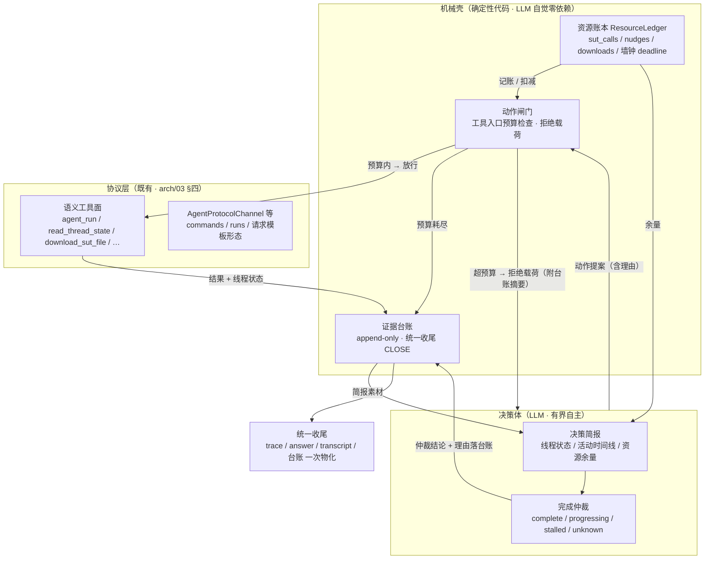

# 执行器健壮性架构设计

> 状态：**Phase 1 已实施**（机械壳：policy / 账本 / 闸门 / 台账 / 统一收尾，见 §七；验收门③待 staging 重放确认）——Phase 2（决策回路）与 Phase 3（SUT 画像）未实施；现行执行回路行为以 [03 执行引擎设计](./03执行引擎设计.md) 为准。
>
> 本文档是 [03 执行引擎设计](./03执行引擎设计.md) §三（ExecutionAgent）/ §四（SUT Tools）所定义执行回路的**目标架构重设计**，源自 2026-09 执行链路事故的系统复盘（§一）。核心论点：连续九起事故不是九个独立缺陷，而是同一控制架构错位的反复显形——**该机械的靠了 LLM 自觉（数字纪律写在提示词里），该自主的被管成了状态机（决策体看不到资源余量与线程活动史）**。目标架构「机械壳 + 决策体」把这个错位正过来：资源与证据归机器，判断归 agent。落地后反向收敛 arch/03 对应章节（§七）。

## 一、问题复盘：事故分类学

### 1.1 事故台账（按失败类别归类，非按表面症状）

复盘窗口为执行回路（v4.9 起；v4.8 及之前的通道类修复不属本文范围）。每起事故按**失败类别**而非表象归档——分类相同的事故无论表象多不同，都是同一架构缺陷的再显形：

| # | arch/03 版本 | 事故 / run 依据 | 表面症状 | 失败类别 | 当时修复形态 |
|---|---|---|---|---|---|
| 1 | v4.9 | SUT 反问卡死 | 执行 Agent 对反问不作为，空转烧尽轮次 | **prose 纪律失效** | 提示词加「反问当场作答」纪律（prose） |
| 2 | v4.11 | askQuestion 中断不识别 | SUT 正式反问（interrupt 挂起）被当成无响应 | **谓词脆弱** | interrupt 提前返回 + `answer_sut_questions`（机械，✅） |
| 3 | v4.12 | 跨任务串台（run 20260910_112237） | physics 抓到 chinese 的《春》完成通知，答非所问全 0 分 | **资源/状态** | `reset_task_state` 任务起点清账（机械，✅） |
| 4 | v4.13 | respond 载荷勘误（run 20260910_234613） | 应答 200 但 SUT 端报「答案数据无效」，反问放弃 | 契约勘误 | 源码比对 + staging 实测锁定载荷形状（机械，✅） |
| 5 | v4.14 | 催促循环（run 20260911_010507） | 12 次 `run_on_thread` 烧尽 20 轮，SUT 早已写出课件 | **prose 纪律失效** | 消息保尾弃头 + 「催促 ≤2 次」纪律（**仍是 prose**） |
| 6 | v4.16① | 误报超时（run 20260911_030343） | SUT 6m47s 写完 29.2k 课件，无尾随文本被空转轮询 900s 误判超时 | **谓词脆弱** | 终态判定改「`next` 空 + baseline 后新增 ai 消息」（机械，✅） |
| 7 | v4.16② | 追问污染（同 run 030343） | 误报后连发 5 次 `run_on_thread` 追问，污染已完成的会话 | **prose 纪律失效** | `read_thread_state` 只读取证 + 产物纪律四步（机制 + prose 混合） |
| 8 | v4.16③ | SPA 壳顶替（同 run 030343） | 396 字节前端骨架顶替 29.2k 真实产物入包 | **证据完整性** | 双指纹防线（机械，✅） |
| 9 | v4.17① | 超时放大 | 900s 超时 × LLM 自觉重试，单任务拖到小时级 | **资源模型**（prose 表达） | `TimeoutBudgetExhausted` 机械守卫（机械，✅） |
| 10 | v4.17② | max_turns 死配置 | 任务集声明 5 实际按 20 跑，宽预算放大一切失败 | **资源模型** | `constraints.max_turns` 接线（机械，✅） |
| 11 | 未入版本表 | 预算击穿（run 20260911_050015） | `max_turns=5` 接线后真实生效，1 次执行 + 3 次催促烧穿 10 step，`write_package` 排不上，GraphRecursionError 收场 | **资源模型**（第 3 次） | 未修复——把 5 调成 8 是同类陷阱（换个数字继续赌） |
| 12 | 未入版本表 | 失败包空白（同 run 050015） | SUT 13:05:23 已交付完整摘要，异常路径只落 manifest+metadata，trace/answer 全丢 | **证据**（第 2 次） | 未修复——`_abort` 不走补齐链是结构性缺口 |

### 1.2 跑步机判据

- **四类失败各自多次复发**：prose 纪律失效 ×4（#1/#5/#7 及 #11 中 3 次催促超「≤2 次」纪律 50%）、谓词脆弱 ×2（#2/#6）、资源模型 ×3（#9/#10/#11）、证据 ×2（#8/#12，且 #3 同根）。每轮修复只覆盖当次实例，类别本身没有架构归宿。
- **所有「✅ 好补丁」集中在机械层**：#2/#3/#6/#8/#9/#10 的机械修复全部一次闭环、无复发；#1/#5 的 prose 修复全部复发。方向早已被实践验证——缺的不是修复手段，是**把机械层从事故后的补丁上升为默认架构**。
- 成本参照：仅 run 20260911_030343 与 20260911_050015 两起，合计烧掉约 45k token 与 20+ 分钟墙钟，产出两个零证据/错误证据的失败包；其间工程侧往返诊断修复 4 批。

## 二、病根：四个控制架构错位

### 2.1 错位一：量化策略用 prose 表达

「最多催促 2 次」「超时重试 1 次」「被反问超 3 次即放弃」「最多 2 次索取路径」——所有带数字的规则都是提示词里的自觉题。LLM 对 prose 中的数字天然不敏感（#5 十二连催、#7 五连催、#11 三连催），这不是模型缺陷，是约束放错了层：数字约束本该由代码在工具入口强制，提示词只解释「为什么」与「被拒后怎么办」。v4.17① 的 `TimeoutBudgetExhausted` 已经验证了正确形态——但它至今只覆盖超时一类。

### 2.2 错位二：执行 Agent 被当序列生成器，而不是决策体

回看 run 20260911_050015 执行 Agent 实际做的事：发指令 → 等 → 看产物 → 催 → 再催 → 还催 → （想）下载/收尾。90% 是状态机的活，真正需要判断的只有两处——「SUT 到底完没完成」「该等、该催、还是该放弃」。而恰在这两处它被蒙着眼：

- **看不到资源余量**：剩几轮、已耗时多少、催促额度还剩几次，一概不知；
- **看不到线程活动史**：只拿到截断的消息摘要，SUT 是「刚停下来」还是「停了三分钟」无从分辨——而这对催促决策是决定性信息；
- **看不到预算后果**：它不知道再催一次会把 `write_package` 挤出预算。

一边要求它聪明，一边掐断信息输入、用 prose 微操每一步——决策质量差是结构使然。**决策质量是信息量的函数，不是叮咛次数的函数。**

### 2.3 错位三：「完成」被建模成协议谓词，而它本质是决策问题

`next == []`？尾随 ai 文本？工具调用收尾？interrupt 挂起？v4.9 以来我们一直在找那个万能判定式。但 SUT 是黑盒 agent，「它完成了吗」**没有可靠谓词**，只有证据：空闲时长、消息增量、values 增长、耗时相对该 SUT 历史基线。谓词每换一种收尾形态就碎一次（#2 碎在 interrupt 形态、#6 碎在工具调用收尾，下一次会碎在还没出现的形态上）。正确的建模：机械层只负责**采证**，把「完成 / 仍在干 / 卡死 / 说不准」的仲裁交给拿到充分证据的决策体，仲裁不了的保守回落机械超时。

### 2.4 错位四：证据是 happy path 的装饰，不是系统的产品

评测系统的交付物就是证据。现状相反：成功路径有 trace/answer/transcript/metrics 完整补齐链，异常路径（`_abort`）只写 manifest——而失败恰恰是最需要证据的时刻。#3（残留串台）与 #12（失败包空白）同根：任务级状态与证据落盘挂在 LLM 会话正常走完这个前提上，前提一破证据即蒸发。**收尾必须是机械动作，不能是 LLM 的纪律义务。**

## 三、设计原则与总览

### 3.1 核心原则

> **资源与证据归机器，判断归 agent。**

机械壳对「必须永不发生」的事情零依赖 LLM 自觉：预算不可超、状态不可串、证据必落盘、收尾必发生。决策体对「需要权衡」的事情拿全部信息自主决定：何时等、何时催、SUT 是否完成、何时放弃。两者的接触面只有两个：动作闸门（决策体提案 → 壳放行/拒绝）与决策简报（壳喂证据 → 决策体判断）。

### 3.2 三层架构



### 3.3 职责矩阵

| 关注点 | 归属 | 消灭的事故类 |
|---|---|---|
| 调用计数 / 催促额度 / 墙钟 / 预算耗尽处置 | 机械壳·账本+闸门 | 资源模型 ×3 |
| 收尾是否发生 / 失败包完整性 / 台账落盘 | 机械壳·CLOSE | 证据 ×2 |
| 「完成了吗」的判断 / 等 vs 催 vs 放弃 | 决策体·仲裁 | 谓词脆弱 ×2 |
| 「最多 N 次」类行为约束的执行 | 机械壳·闸门（提示词只留理由） | prose 纪律失效 ×4 |
| 协议形态 / 载荷契约 | 协议层（既有，契约勘误靠实测锁定后机械固化） | 契约勘误（对照组，现行方式已正确） |

## 四、机械壳设计（P1 + P3 + P4）

### 4.1 `interaction_policy`：声明式交互预算（P1）

预算的一等形态从「图 step 数（max_turns）」改为按**语义动作**声明的资源策略。包清单（`agent_eval.yaml`）与任务集（`task_sets/*.yaml`）均可声明，继承链 **task > task_set > SUT 探测画像（§七 Phase 3）> 全局缺省**：

```yaml
# 语义：约束的是「对外部世界的昂贵动作」，不是模型思考步数
interaction_policy:
  sut_calls:              # SUT 执行类调用合计（agent_run / run_on_thread / agent_run_stream）
    total: 8
    dispatch: 1           # 首发指令（agent_run 新会话）至多 1 次——禁止重发原指令新建会话
    nudges: 2             # 催促 / 续跑类（run_on_thread 索取产物、空转推进）
  state_polls: 60         # read_thread_state 取证类——宽松，取证不设心理门槛
  downloads: 3            # download_sut_file
  wall_clock_deadline: 20m   # 单任务墙钟上限（兜底；正常路径靠仲裁提前收口）
  nudge_backoff: 30s      # 两次催促间最小等待（防连发，机械可查）
```

设计约束：

- **`recursion_limit` 退化为保险丝**：由壳按 `sut_calls.total × 系数` 自动推导（并留安全余量），不再是需要人工调参的一等预算。本轮「5 → 8 → ?」的调参数字赛跑就此终止——数字变成可声明、可观测、被拒时带证据的配置，声明与生效断线（#10）在结构上不可能：账本只认闸门实际放行的调用。
- **任务级覆盖**即现行 `task.constraints` 的延伸：`constraints.interaction_policy` 部分覆盖，其余键继承上游（对齐「包清单声明缺省、勿写代码」既有惯例）。
- 声明非法（非正整数等）静默回退上游缺省——沿用 `_resolve_max_turns` 既有兜底惯例。

### 4.2 资源账本 ResourceLedger

逐任务实例化的记账对象，字段 schema：

| 字段 | 类型 | 语义 |
|---|---|---|
| `task_started_at` | datetime | 任务起点，墙钟计时基准 |
| `deadline` | datetime | `wall_clock_deadline` 折算的绝对时刻 |
| `counters` | `dict[str, int]` | 按动作类型累计：`dispatch / nudges / state_polls / downloads / sut_calls_total` |
| `last_nudge_at` | datetime \| None | 上次催促时刻（`nudge_backoff` 检查基准） |
| `refusals` | `list[Refusal]` | 闸门拒绝记录（动作 / 预算名 / 时刻）——后续进台账与简报 |
| `policy` | `InteractionPolicy` | 本任务生效的解析后策略（含继承来源，排障可溯） |

生命周期：任务起点创建（复用并推广 v4.12/v4.17 的 `reset_task_state` 清账语义——注册表统一清账入口已存在，账本纳入同一点）；任务终点随台账一并落盘，供事后审计「额度花在哪了」。

### 4.3 动作闸门：量化纪律的机械归宿（P3）

v4.17① `TimeoutBudgetExhausted` 的模式推广到全部预算类型：SUT 执行类语义工具（`agent_run / run_on_thread / agent_run_stream`）在**入口**做账本检查，超预算直接返回拒绝载荷、不触网：

```json
{
  "status": "failed",
  "error": {
    "type": "BudgetExhausted",
    "budget": "nudges",
    "used": 2, "limit": 2,
    "message": "催促预算已用尽（2/2）——每次催促都会向 SUT 会话注入消息。",
    "guidance": "先 read_thread_state 取证；仍无产物则等待壳的强制收尾，不要继续发起执行调用"
  },
  "ledger_digest": ["05:02:07 nudge#1 → success(32s)", "05:02:45 nudge#2 → success(108s)"]
}
```

- 拒绝载荷自带 **guidance**——闸门不是死墙，是「带出路的拦截」；LLM 不需要从提示词回忆规则，被拒当下就知道该干什么。
- **取证与收尾永不占用执行预算**：`read_thread_state / download_sut_file / answer_sut_questions` 不设闸门（或仅设宽松独立额度）——「先取证后催促」纪律的工具面基础在 v4.16② 已确立，此处只把它从 prose 期望固化为预算结构：取证免费，打扰收费。
- `nudge_backoff` 同闸口检查：距上次催促不足 backoff 的 `run_on_thread` 直接拒绝（附「已等待 x s / 需 y s」）——连发催促（#5/#7/#11）在结构上不可能。

### 4.4 证据台账：append-only 交互台账（P4-a）

机械壳维护逐任务的 append-only 台账，每事件一行：

```json
{"ts": "…", "kind": "sut_call | state_poll | gate_refusal | arbitration | artifact | close",
 "action": "run_on_thread", "outcome": "success | failed | refused",
 "budget_delta": {"nudges": 1}, "duration_s": 108,
 "summary": "SUT 回复摘要（保尾截断）", "rationale": "决策/催促/仲裁类事件必填理由"}
```

- 台账是**语义层**事件流；SessionLogger（arch/03 §七a）继续作为传输层/落盘组件复用，不另造轮子。
- 台账随执行包落盘（`ledger.jsonl`），是 §5.2 完成仲裁与 §4.1 事后审计的共同数据源；失败包三问自解释（§九）直接由它保证。

### 4.5 统一收尾 CLOSE 协议（P4-b）

`write_package` 从「LLM 的纪律义务」降级为壳的机械动作。收尾触发条件枚举（任一即触发，殊途同归）：

1. 决策体主动申请收尾（成功或失败）；
2. 任一预算耗尽且闸门拒绝后决策体仍未收尾——壳截获，**强制收尾轮**（注入「预算已尽、按现有证据收尾」的收尾指令）；
3. 墙钟 deadline 到；
4. 谓词兜底超时（现行 `sut.timeout` 轮询超时，仲裁 unknown 时的保守回落）。

所有触发走**同一条物化链**（现行 `finalize_execution_package` 补齐链推广）：trace / answer（含 `last_run` 的 SUT 最终回答回填）/ transcript / metrics / ledger 一次落齐。**异常路径与成功路径不再分流**——run 20260911_050015 类「SUT 明明交付完、失败包一片空白」在结构上不可能复发；GraphRecursionError 裸抛收场（#11）被强制收尾轮取代。

## 五、决策体设计（P5 + P2）

### 5.1 决策简报：把现实喂给决策体（P5）

每次模型轮注入结构化简报（替代现行「截断消息摘要」这一唯一信息源）：

```json
{
  "objective": "生成初二《一元二次方程》课件并取得产物（任务 cw_math_001）",
  "resources": {"sut_calls": "4/8", "nudges": "2/2", "downloads": "0/3",
                 "elapsed": "6m12s", "remaining": "13m48s", "turns_left": 3},
  "sut_state": {"thread_busy": false, "idle_for": "41s", "pending_questions": 0,
                 "artifact_candidates": ["一元二次方程教学课件.pdf", "一元二次方程教学课件.md"],
                 "activity": "13:01:57 建 todo（无文本收尾）→ 13:02:41 查参考（空）→ 13:04:35 写出 md+PDF → 13:05:23 交付摘要 → 空闲"},
  "baseline": {"typical_duration": "6-10m", "pacing": "分段交付（SUT 画像，Phase 3 接入）"},
  "last_result_digest": "…最后一次工具结果摘要…"
}
```

- **注入挂点二选一**（Phase 2 实施时定）：a) LangGraph 回调 / 中间件在模型轮前统一注入（全局、无遗漏，但与 deepagents 中间件契约耦合）；b) 各语义工具返回值前置「简报段」（离散、每动作后刷新、与现行 `tool_guard` 包装同构）。倾向 b 起步：改动面小、离线可测，a 作为全局兜底后补。
- 简报的**素材全部来自机械壳**（台账 + `read_thread_state` 采证 + 账本），决策体不自行拼凑现实——喂什么看什么，是仲裁质量的上界。

### 5.2 完成仲裁：从谓词到证据决策（P2）

机械壳不再追求「完成」的万能判定式，只产出证据（§5.1 `sut_state` + `baseline`）；「SUT 完成了吗」由决策体按简报仲裁，结论为受控枚举并落台账：

| 结论 | 含义 | 典型证据组合 | 决策体动作 |
|---|---|---|---|
| `complete` | SUT 已交付 | 空闲 40s+ + 自述完成 + 产物候选在列 | 取证 → 下载 → 收尾 |
| `progressing` | 分段进行中 | 空闲 <30s / todo 未完 / 消息仍在增长 | 等待（不催促） |
| `stalled` | 卡死 / 等输入 | 长空闲 + 无产物 + 有待答反问 | 应答或催促（占预算） |
| `unknown` | 说不准 | 证据冲突（如空闲久但无任何交付迹象） | 保守：继续等待至谓词兜底超时 |

- **unknown 是合法出口**：仲裁不确定时保守回落现行机械超时（v4.16① 修复后的 `_poll_state` 语义保留为兜底），宁可多等不少断——误判「完成」会产空包，误判「未完成」只是多等一个超时周期，代价不对称。
- 历史（#2/#6）两类谓词事故的修复成果**不废弃**：它们下沉为证据产出器的准确性改进（`thread_busy` / `has_ai_message_from` / interrupt 识别照常工作），只是不再独自承担「完成」裁决。

### 5.3 提示词瘦身：prose 条款的去向

行为法典（现行 `execution_agent_prompts.yaml` 失败处理/产物纪律约 100 行）瘦身为角色 + 判断标准（~20 行）。量化条款全部迁入闸门，逐条对照：

| 现行 prose 条款 | 去向 |
|---|---|
| 「`run_on_thread` 索取路径最多 2 次……禁止空转催促」 | 删除 → `nudges` 闸门 + `nudge_backoff` |
| 「SUT 调用超时至多重试 1 次；`TimeoutBudgetExhausted` 后不要再发起……」 | 删除 → `sut_calls` 闸门（拒绝载荷自带 guidance） |
| 「被反问超 3 次仍无法推进 → 写失败包」 | 删除 → 反问预算 + CLOSE 触发条件 2 |
| 「必须在任务结束时调用 `write_package`」 | 删除 → CLOSE 协议（收尾不再是义务而是必然） |
| 「产物获取四步：下载 → 取证 → 催促 → 失败包」 | 保留为**判断标准**一句话（动作序列由决策体按简报自定，不再是固定舞步） |
| 角色定位 / 任务目标 / 仲裁标准 | 保留（瘦身后的主体） |

保留的 prose 只回答两类问题：「你的目标是什么」「怎样算完成/该放弃」；所有「至多几次」「禁止什么」消失——它们已经是代码。

## 六、与既有组件的映射

目标架构约 80% 的零件已在库中，缺的是装配方式。逐项盘点：

| 目标件 | 现有件（库内） | 差距 |
|---|---|---|
| 动作闸门 | `TimeoutBudgetExhausted` 守卫（protocol_tools，v4.17①） | 从超时一类推广到全预算类型；拒绝载荷加 guidance + 台账摘要 |
| 采证原语 | `read_thread_state`（v4.16②）、`_poll_state` 终态语义（v4.16①） | 简报聚合器消费之（空闲时长 / 活动时间线 / values 增量计算） |
| 资源账本 | `reset_task_state` 统一清账入口（v4.12/v4.17②） | 账本对象本身新增；预算来源改 `interaction_policy` 声明式 |
| 证据台账 | SessionLogger（arch/03 §七a） | 台账=语义事件层，沿用 SessionLogger 落盘 |
| 统一收尾 | `finalize_execution_package` 补齐链（package_writer） | `_abort` 改走同一链（含 `last_run` 回填，修 #12） |
| 墙钟预算 | BudgetGuard（金额）、`sut.timeout`（单调用） | 任务级 deadline 新增（金额守卫模式照抄） |
| 简报注入 | LangGraph 回调（SessionLogCallback）/ `tool_guard` 结果包装 | 注入挂点二选一（§5.1，倾向工具结果前置段起步） |
| SUT 行为画像 | sut_probe 探测面（[15 CLI交互式评测工作台设计](./15CLI交互式评测工作台设计.md)） | Phase 3：探测报告 → 基线时长/节奏特征 → 缺省 `interaction_policy` |

协议层（语义工具面 / commands / runs / 请求模板形态）**不动**——#4 契约勘误证明现行「实测锁定 + 机械固化」的方式正确，本文不涉。

## 七、迁移路径

按「先止血后进化」排序；每 Phase 有独立验收门，不过门不进下一阶段。

### Phase 1｜止血：机械壳落地（P1 + P3 + P4，预估 1–2 天）——✅ 已实施（2026-09-11）

- `interaction_policy` 声明与继承链（`executor/policy.py` + `InteractionPolicy` 模型）；ResourceLedger / EvidenceLedger（`executor/ledger.py`）；全预算类型闸门（含 `nudge_backoff`，接线 protocol_tools / http_tools 两工具面）；CLOSE 统一收尾（`_abort` 并入 `finalize_execution_package` 补齐链，trace 回填 SUT 证据）；`recursion_limit` 改为壳自动推导的保险丝（`derive_recursion_limit`，双轨：未声明任务沿用 `max_turns`）；`courseware-reasonableness` 任务集 `max_turns` 已迁移为顶层 `interaction_policy`。
- 实施偏差（一处）：generic_http 的 `sut_request` 闸门计量 `sut_calls_total` 而非 `dispatch`——链式模板场景一次任务含多次 SUT 请求，`dispatch:1` 会截断正常执行。
- **验收门**：①提示词中数字类纪律条款清零 ✅；②任意异常路径的失败包含 trace/answer/ledger 三件 ✅（`test_finalize_materializes_degraded_package` 回归）；③预算耗尽必走强制收尾轮，GraphRecursionError 不再是用户可见的失败形态——⏳ 待 staging 重放确认；④单测全绿，四类事故各配回归测试 ✅（新增 48 测试）。

### Phase 2｜决策回路：简报 + 仲裁（P5 + P2，预估 3–5 天）

- 决策简报注入（挂点按 §5.1 定）；完成仲裁（受控枚举 + 理由落台账）；提示词瘦身（§5.3 对照表逐条执行）；`max_turns` 语义正式降格为保险丝。
- **验收门**：①同指令重放 3 次，全部催促/等待决策可从台账 rationale 复盘；②run 20260911_030343 / 050015 两场景重放，不调任何参数即收敛到正确收尾；③仲裁 `unknown` 率 < 20%（超过说明简报素材不足，回炉 §5.1）。

### Phase 3｜SUT 行为画像（排期另定）

- 探测报告（sut_probe）产出画像：基线时长 / 分段节奏 / 反问形态；画像接入 `interaction_policy` 继承链作缺省值；仲裁获得耗时先验。
- **验收门**：新 SUT 接入**零手工预算声明**即能跑通 baseline 场景集；画像缺失时优雅回退全局缺省。
- 附带产出：分段交付、裸工具调用收尾等 SUT 侧节奏特征在探测报告中显式暴露——**评测侧健壮性不无限吸收被测侧病理**，包作者据此知情。

## 八、代价与风险（诚实表）

| 代价 / 风险 | 量化 / 缓解 |
|---|---|
| 简报 + 仲裁每任务多 2–4 次模型调用 | 对照 run 20260911_050015：44.9k token + 5m20s 换一个零证据失败包；简报 token 开销（数百/轮）低一个数量级 |
| 显式预算参数（nudges=2 等）仍是经验值 | 但已可观测、可声明、拒绝带证据——拍错是数据问题（改 YAML）而非架构问题（改提示词/代码） |
| 仲裁质量依赖决策体水平 | 顺序保证：P1/P3 先行建立有界环境，P5 简报保证信息充分——有界 + 有信息的自主才是好自主；裸自主即 #5 的十二连催 |
| 谓词兜底超时仍保留，双轨并存增加理解成本 | 兜底仅在仲裁 `unknown` / Phase 1 未覆盖路径生效；Phase 2 验收门③控制 unknown 率，长期目标单轨 |
| Phase 2 若自由决策回路仍失控 | 预案：决策体收敛为显式 FSM 监督者（supervisor 形态，机械壳接口不变）——按 Phase 2 事故率数据决定，不预先过度设计 |

## 九、验收标准（总体）

1. **同类事故不再二次出现**：prose / 谓词 / 资源 / 证据四类各有架构归宿（§3.3 职责矩阵），新事故先归类再修复——归不进任何类的才是新缺陷。
2. **预算不再逐 run 人工调参**：`interaction_policy` 声明一次，账本 + 闸门自适应执行；`max_turns`/`recursion_limit` 对用户不可见。
3. **失败包三问自解释**：任意失败包，不依赖外部日志即可回答——SUT 干了什么（activity + answer 回填）、执行器决定了什么（ledger rationale）、为什么失败（gate/close 事件）。

## 十、版本记录

> 逐版一行速览，只记「改了什么」；演进理由见 git 提交历史与正文对应章节。

| 版本 | 日期 | 变更内容 |
|------|------|----------|
| v1.0 | 2026-09-11 | 立项初稿：执行链路事故复盘（v4.9–v4.17 十二例四类归因）导出目标架构「机械壳 + 决策体」——interaction_policy 声明式预算 / 资源账本 / 动作闸门 / 证据台账 / 统一收尾 / 决策简报 / 完成仲裁；既有组件映射（~80% 在库）与 Phase 1–3 迁移路径及验收门 |
| v1.1 | 2026-09-11 | Phase 1 机械壳实施落地：`InteractionPolicy`/`resolve_interaction_policy` 声明式预算（arch/03 v4.19）、`ResourceLedger`/`EvidenceLedger`（ledger.jsonl）、protocol/http 两工具面预算闸门（拒绝载荷带 guidance）、`_abort` 并入统一收尾补齐链（修失败包空白）、提示词数字条款清零、courseware 任务集迁移 interaction_policy；staging 重放（run 20260911_073626）验证证据面三件套齐全、闸门逐动作记账正确，同时暴露保险丝轮询折算缺陷——`state_polls//10` 使保险丝 50 步在合法轮询 21 次（等待 SUT 分段后台生成）时熔断，违背「宽于语义预算」不变量，改轮询全额计入（缺省 fuse 50→158）；验收门③待复放 |
